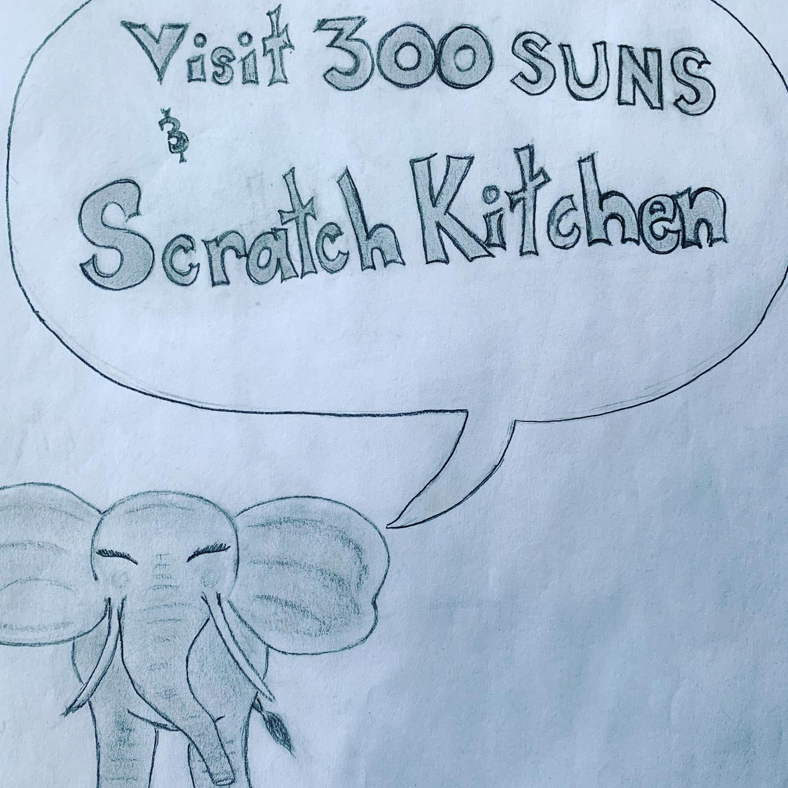

# Correspondence Part 5

> **Relationship:** Explicit satellite of [300 Suns Brewing Company](breweries/300-suns-brewing-company.html)
> **Source platform:** INSTAGRAM Export
> **Match Confidence:** 0.85 (via csv_hashtag)

### Caption / Correspondence Log:
```
@300sunsbrewing did a whole bunch of elephants and they were all super cute. This one gives shout-out to @scratch_truck which doesn't imply that the truck is scratched or that there is a DJ in the truck scratching records so much as it's not @applebees where you're just too lazy to make your own frozen food. #300sunsbrewing #scratchkitchenandtaproom #scratchkitchen #drawmeanelephant
```

### Artifact Scans & Drawings:




### Provenance & Audit:
* **Source Path:** `Unknown`
* **Original entity ID:** `instagram/post-7104743486394690933`
