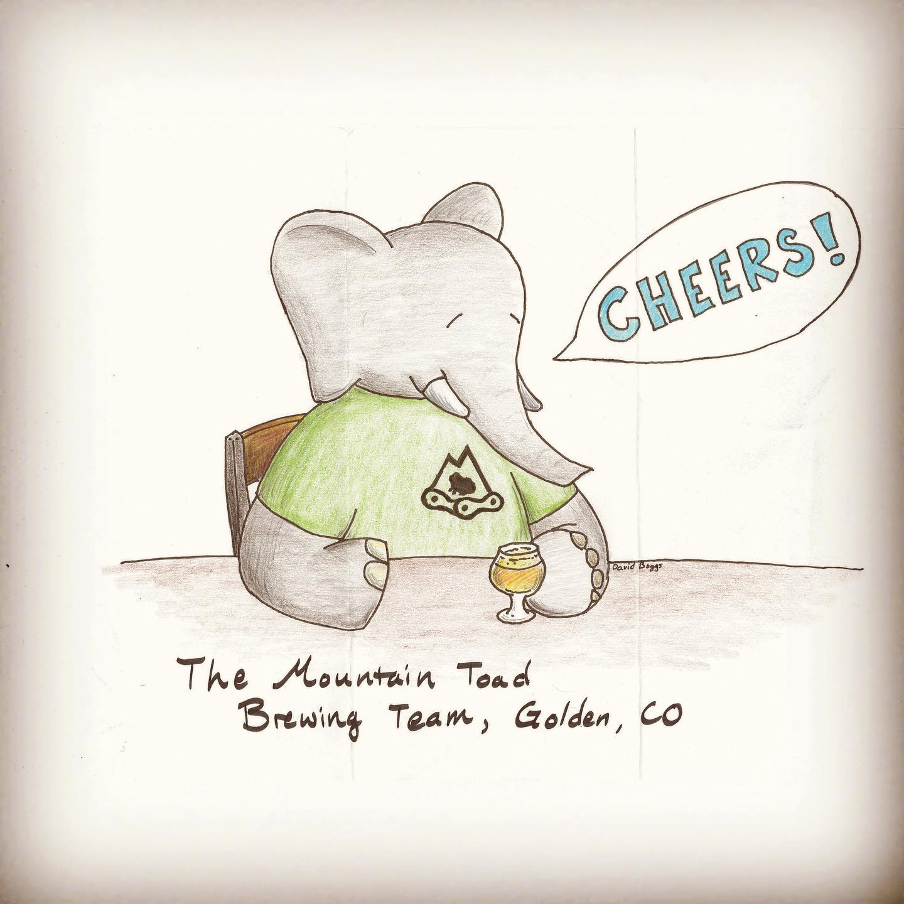
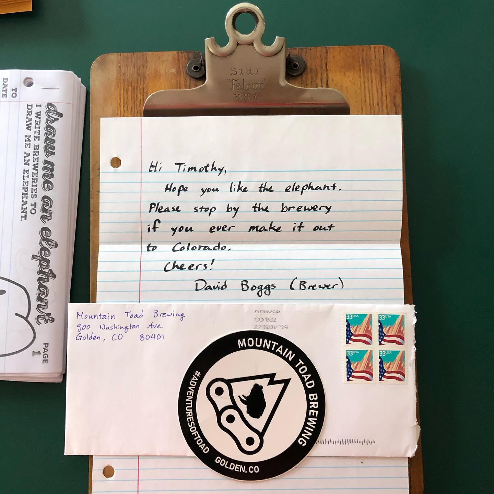

# Correspondence Part 2

> **Relationship:** Explicit satellite of [Adventure Brewing Co](/breweries/adventure-brewing-co.html)
> **Source platform:** INSTAGRAM Export
> **Match Confidence:** 0.8 (via csv_name_inference)

### Caption / Correspondence Log:
```
@mountaintoad set all phasers to kill on this one. I wrote the second half first and forgot to mention this is a really fantastically drawn elephant and though I usually ignore that part and focus on technical elements this is just a delightful elephant for me. 
It's legiterately everything: branded, beer (colored and clearly a glass of beer so no need to #automagically3xbetter ), sticker, note, vintage postage. Legiterately everything, though 3 stamps would have hit 99¢ and the most you can send in a standard envelope is 85¢ so even 3 would be too much and 2 was already too much. #adventuresoftoad #drawmeanelephant
```

### Artifact Scans & Drawings:





### Provenance & Audit:
* **Source Path:** `Unknown`
* **Original entity ID:** `instagram/post-425954177015712619`
