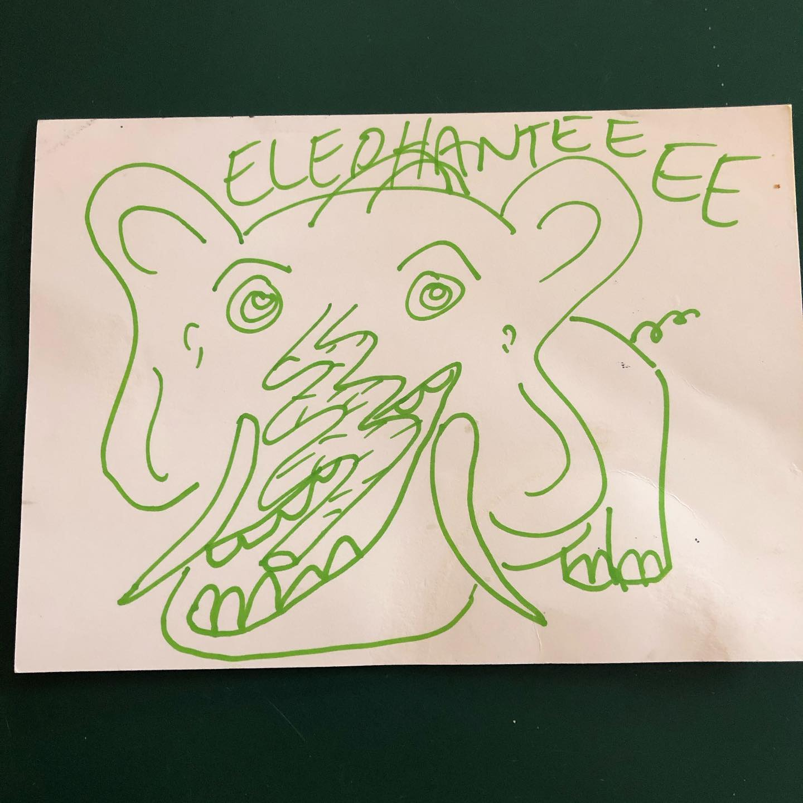
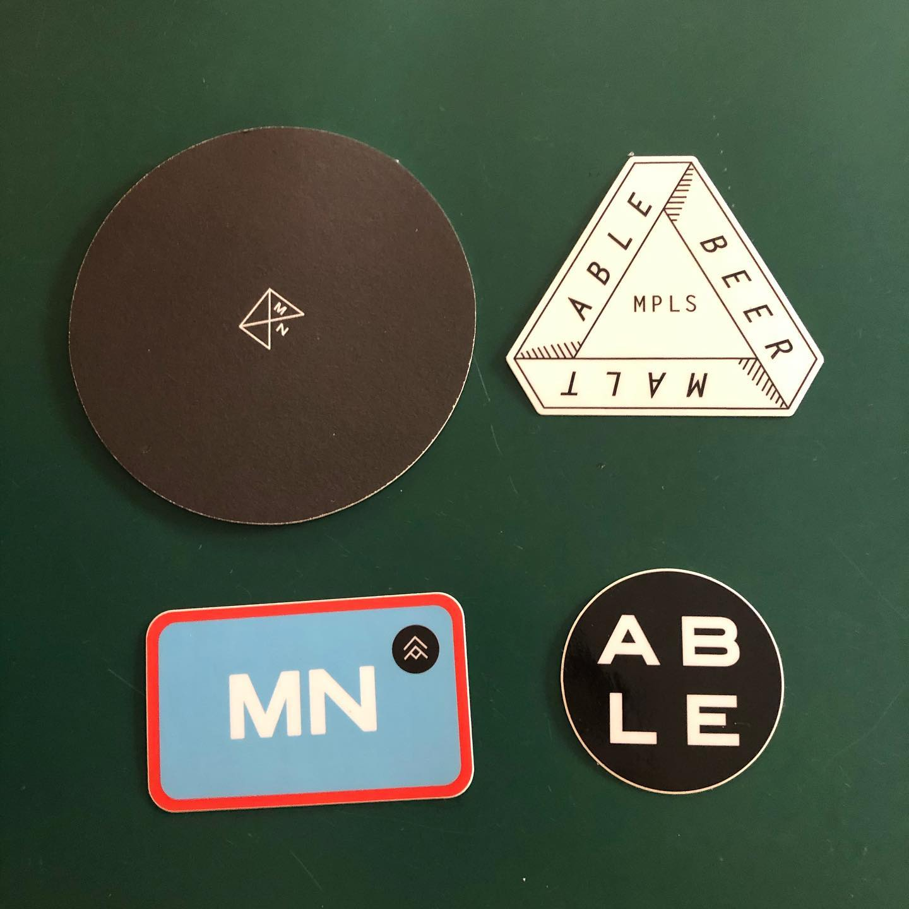
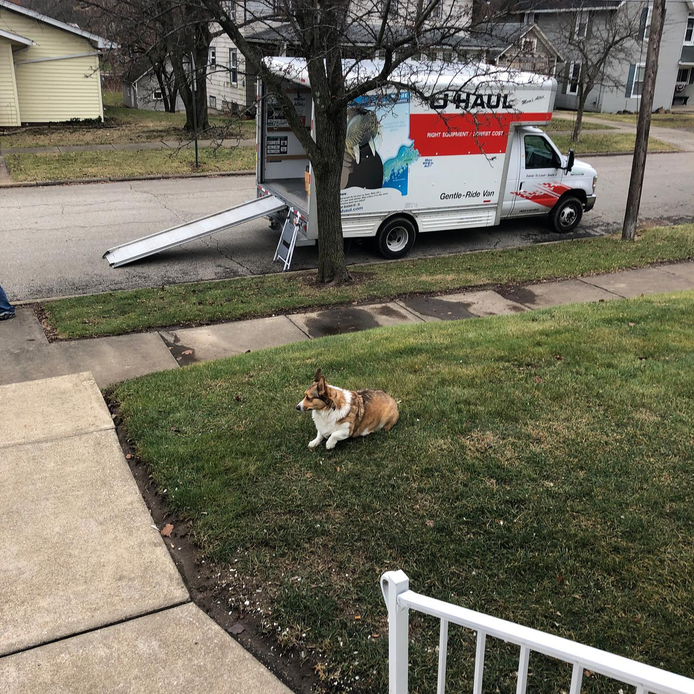

# Correspondence Part 1

> **Relationship:** Explicit satellite of [Alpha Brewing Co.](/breweries/alpha-brewing-co.html)
> **Source platform:** INSTAGRAM Export
> **Match Confidence:** 0.8 (via csv_name_inference)

### Caption / Correspondence Log:
```
Quite the trunk on this one. @ablebrewery wrote to my home address rather than mailing address. That's somewhat a long time as I switched to a PO Box awhile ago before I even planned to move. This showed up on moving day. Haven't had an elephant at my door in months. Will have to look when I wrote them but I think it was part of an alphabetical series that didn't pay off (aside from this one). #drawmeanelephant
```

### Artifact Scans & Drawings:







### Provenance & Audit:
* **Source Path:** `Unknown`
* **Original entity ID:** `instagram/post-7978337087309198567`
