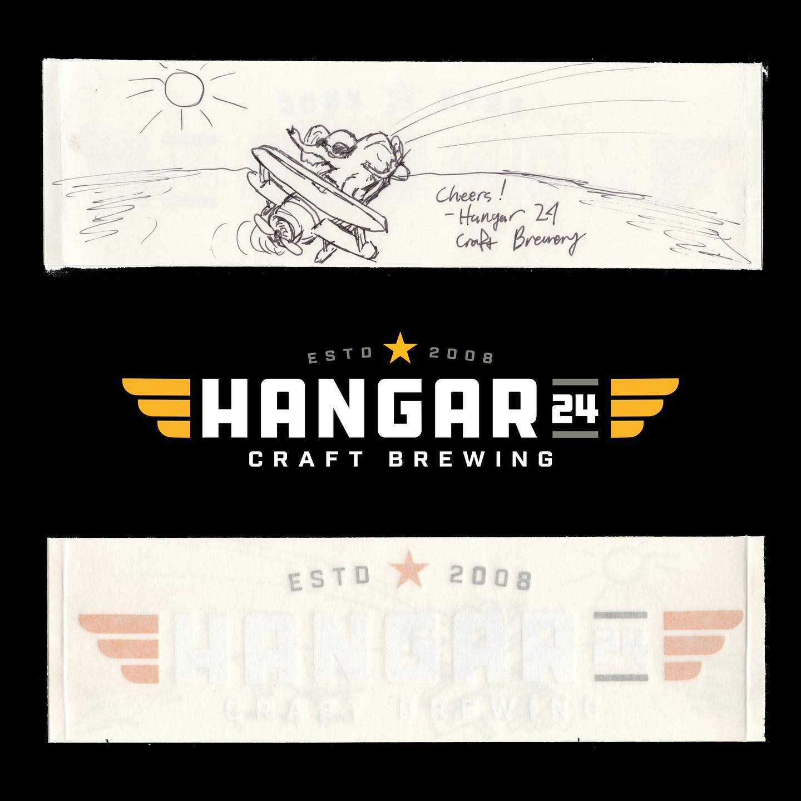
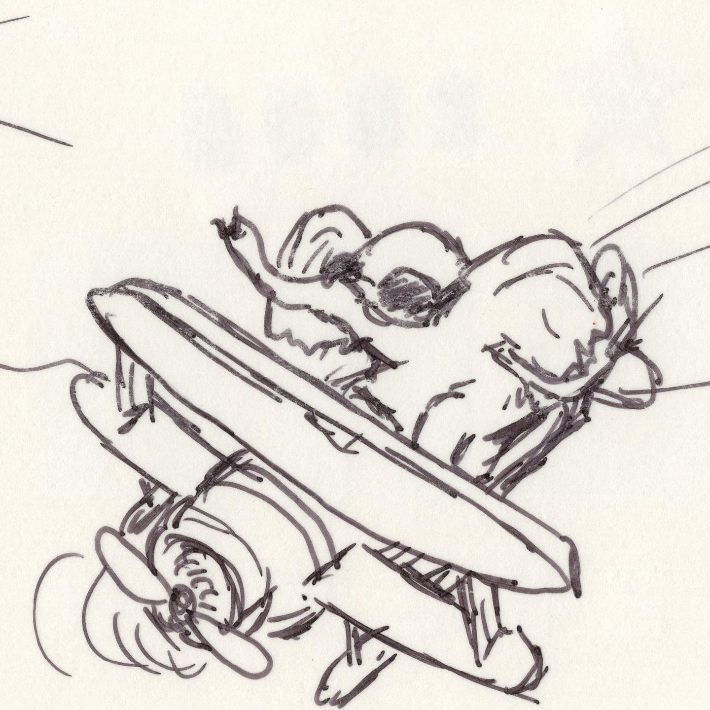

# Correspondence Part 1

> **Relationship:** Explicit satellite of [Atlantic Brewing Co](/breweries/atlantic-brewing-co.html)
> **Source platform:** INSTAGRAM Export
> **Match Confidence:** 0.8 (via csv_name_inference)

### Caption / Correspondence Log:
```
@hangar24brewing requires all elephants to complete a solo transatlantic flight in order to get free beers. As I've said numerous times elephants freeload booze and breweries come up with two tricks for elephants to pull to earn the beers. I think this elephant certainly earned their beer and is going to be in for a surprise when he finds out the nearest #hangar24brewery is in Arizona and the second trick required is #roadtripping coast to coast.  This elephant was done on the back of a sticker, which is huge bonus points for me like bar napkins, coasters, or cardboard from beer boxes. #drawmeanelephant  #hangar24 #nocluehowhashtagsworkandatthispointimtoaffraidtoask #beermoochingelephants
```

### Artifact Scans & Drawings:





### Provenance & Audit:
* **Source Path:** `Unknown`
* **Original entity ID:** `instagram/post-3041797665014134297`
