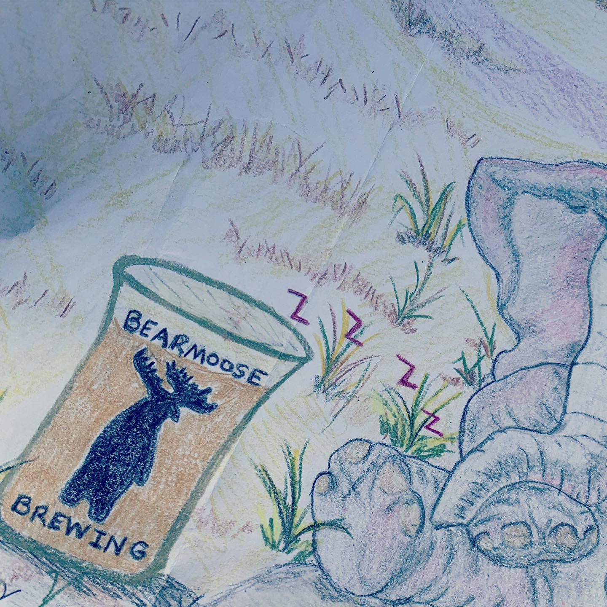
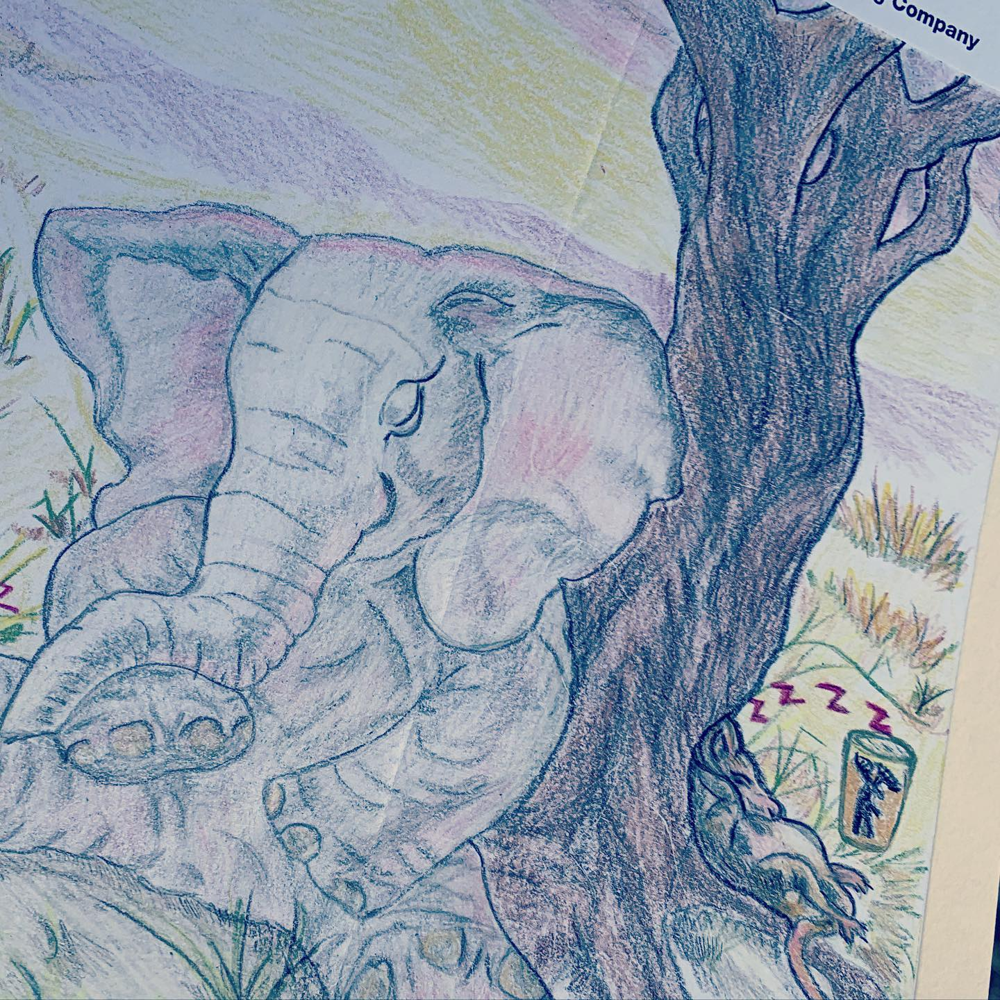
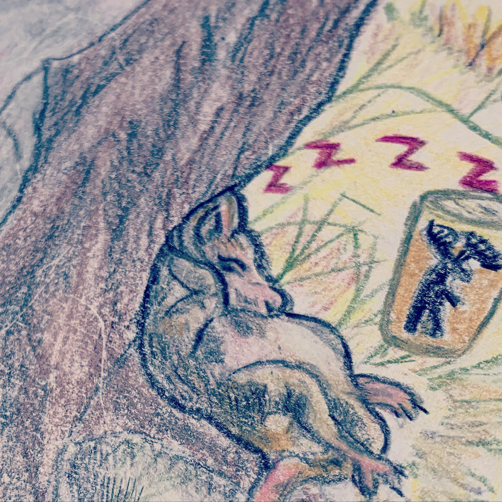

# Correspondence Part 2

> **Relationship:** Explicit satellite of [Bearmoose Brewing Company](/breweries/bearmoose-brewing-company.html)
> **Source platform:** INSTAGRAM Export
> **Match Confidence:** 0.8 (via csv_name_inference)

### Caption / Correspondence Log:
```
This @bearmoosebrewco elephant they sent me awhile back is amazing. I'm in the process of putting my unsorted and came across this one. It's edge to edge color and really shows the variety of #drinkingbuddies that elephants keep. Fun fact: no natural predator to the elephant drinks #bearmoosebeer so really anyone having their beer is a #drinkinbuddy to the #elephants #drawmeanelephant #repost
```

### Artifact Scans & Drawings:







### Provenance & Audit:
* **Source Path:** `Unknown`
* **Original entity ID:** `instagram/post-1999929799817139011`
