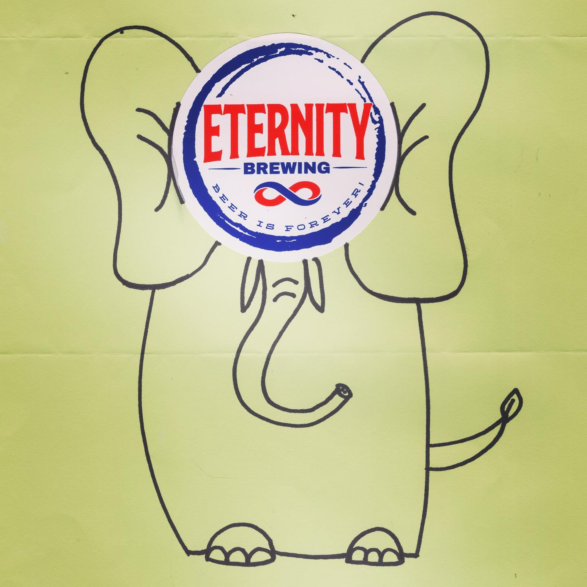
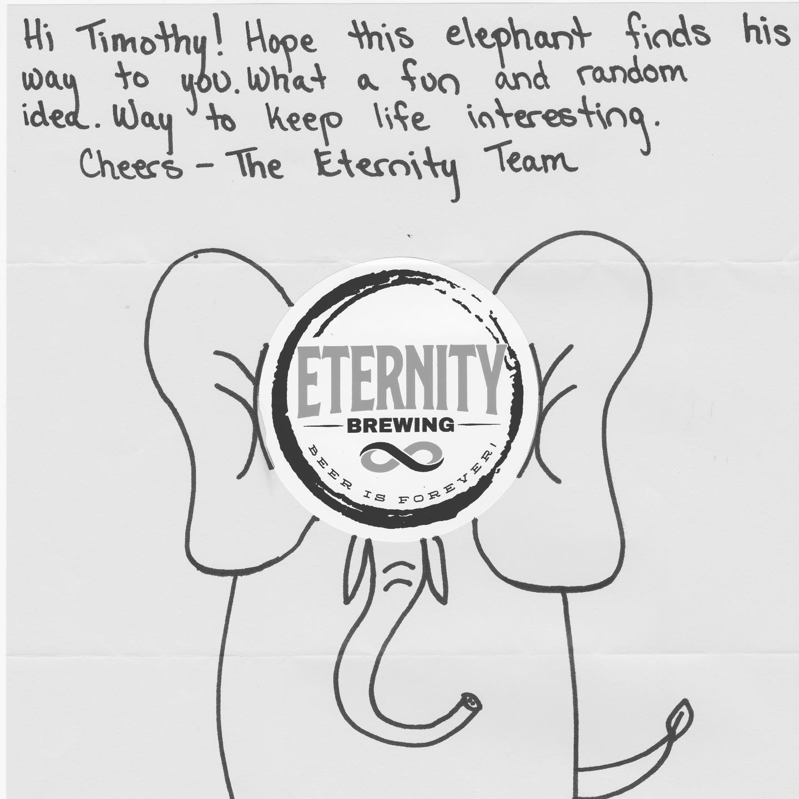

# Correspondence Part 6

> **Relationship:** Explicit satellite of [Bell's General Store (Bell's Brewery)](/breweries/bells-general-store.html)
> **Source platform:** INSTAGRAM Export
> **Match Confidence:** 1.0 (via curated_handle)

### Caption / Correspondence Log:
```
I always ask for stickers, but encourage the #breweries I write to stick them on their drawing for #lazybranding and @eternitybrewing are good readers! They did a great job with the elephant, but had no space when it was finished for the sticker other than over this elephant’s face. It’s a good thing as the elephant was making a really silly face. #eternitybrewing is a #michiganbrewery and joins @bellsbrewery @trafficjamdetroit and more from #michigan who actually answered when I asked them to #drawmeanelephant
```

### Artifact Scans & Drawings:





### Provenance & Audit:
* **Source Path:** `Unknown`
* **Original entity ID:** `instagram/post-772259175369062719`
