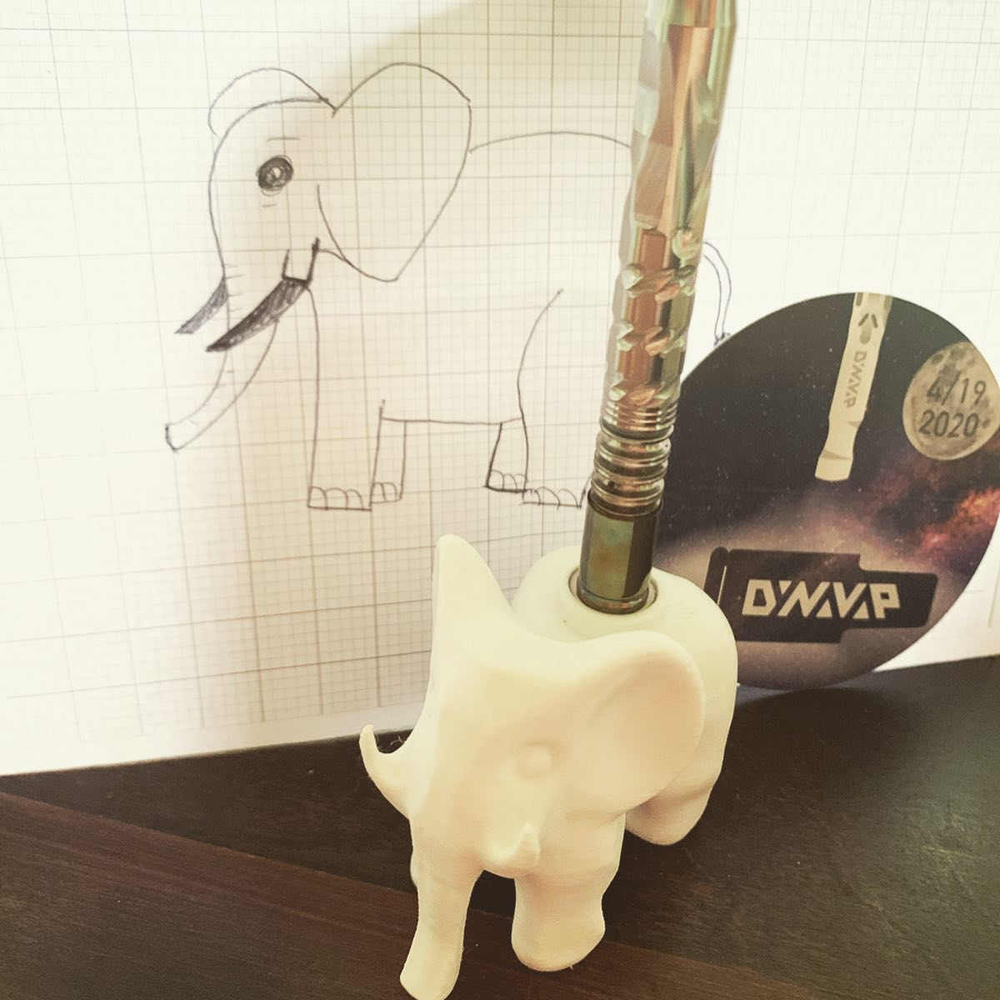
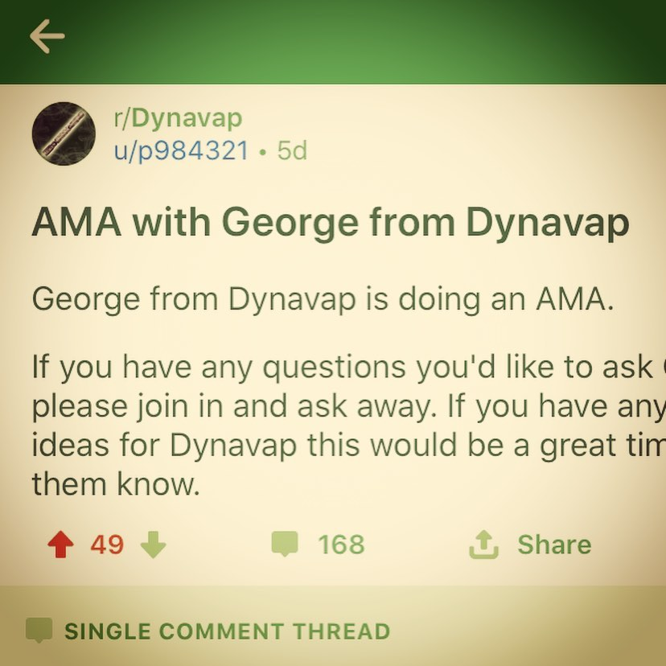
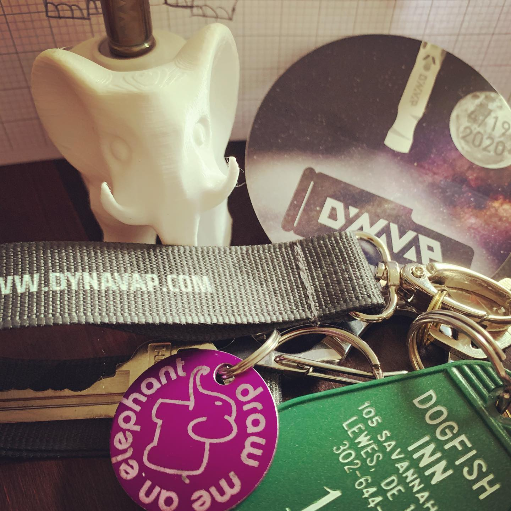

# Correspondence Part 1

> **Relationship:** Explicit satellite of [Bill’s Brewing Company](/breweries/bill-s-brewing-company.html)
> **Source platform:** INSTAGRAM Export
> **Match Confidence:** 0.8 (via csv_name_inference)

### Caption / Correspondence Log:
```
@dynavap regularly tries to engage various communities to educate or inform on new products or how to use them. As much as I respect that, like every brewery just gets randomly asked when they are bringing back some beer from five years ago I came out of left field and asked them to #drawmeanelephant and they not only did, but also 3D printed an elephant #vapcap holder that somehow attracts the metal to the elephant #howdomagnetswork 
Also, they earned a spot on my keyring with @dogfishhead and someone I don't know their Instagram handle. These photos incidentally have about 3/4 of my swag, which isn't a bad haul for thirty bills of postage. It is a ridiculously nice keychain and their stationery game is on the next level. Also, not that anyone reads this far but I didn't get a free #2020M as that was a @puffitup pre-order which came with another elephant and a #karmavap that @psychictshirt promised me an elephant for. For as much as it costs to get one brewery elephant in postage this is like getting three elephants with a free vape, though.
```

### Artifact Scans & Drawings:







### Provenance & Audit:
* **Source Path:** `Unknown`
* **Original entity ID:** `instagram/post-4914820167693439523`
