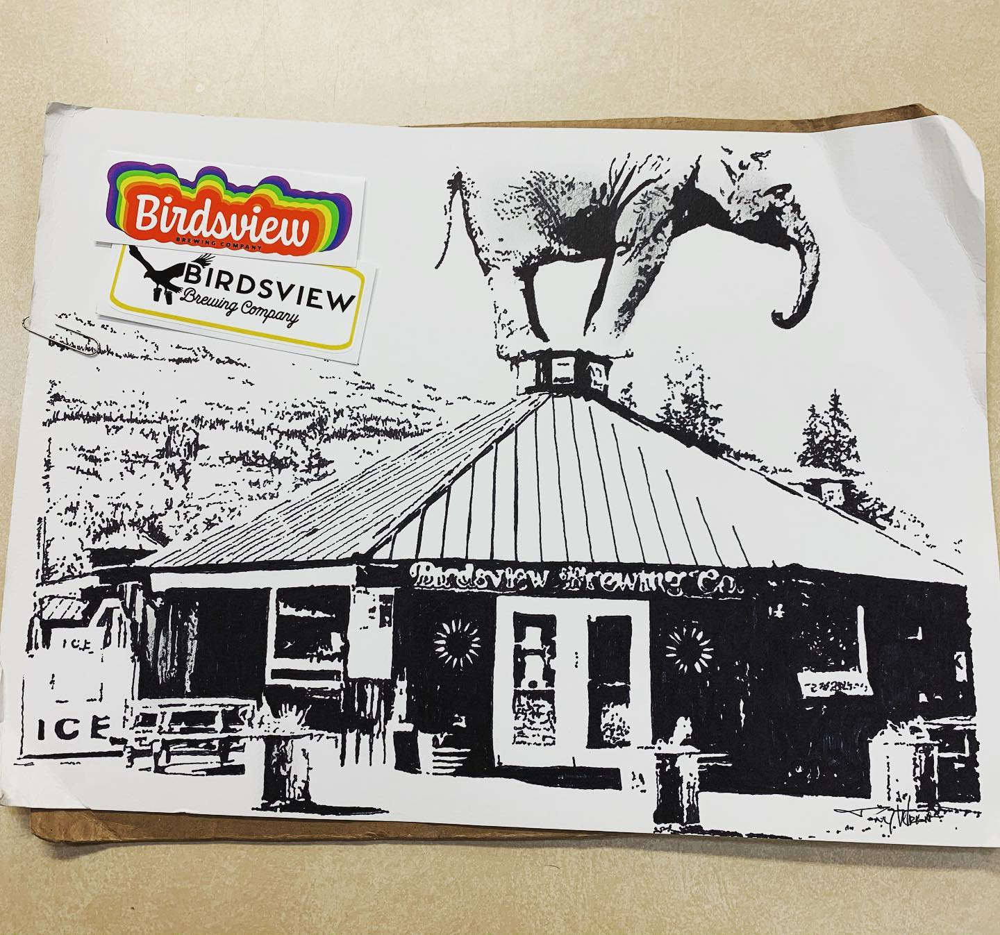
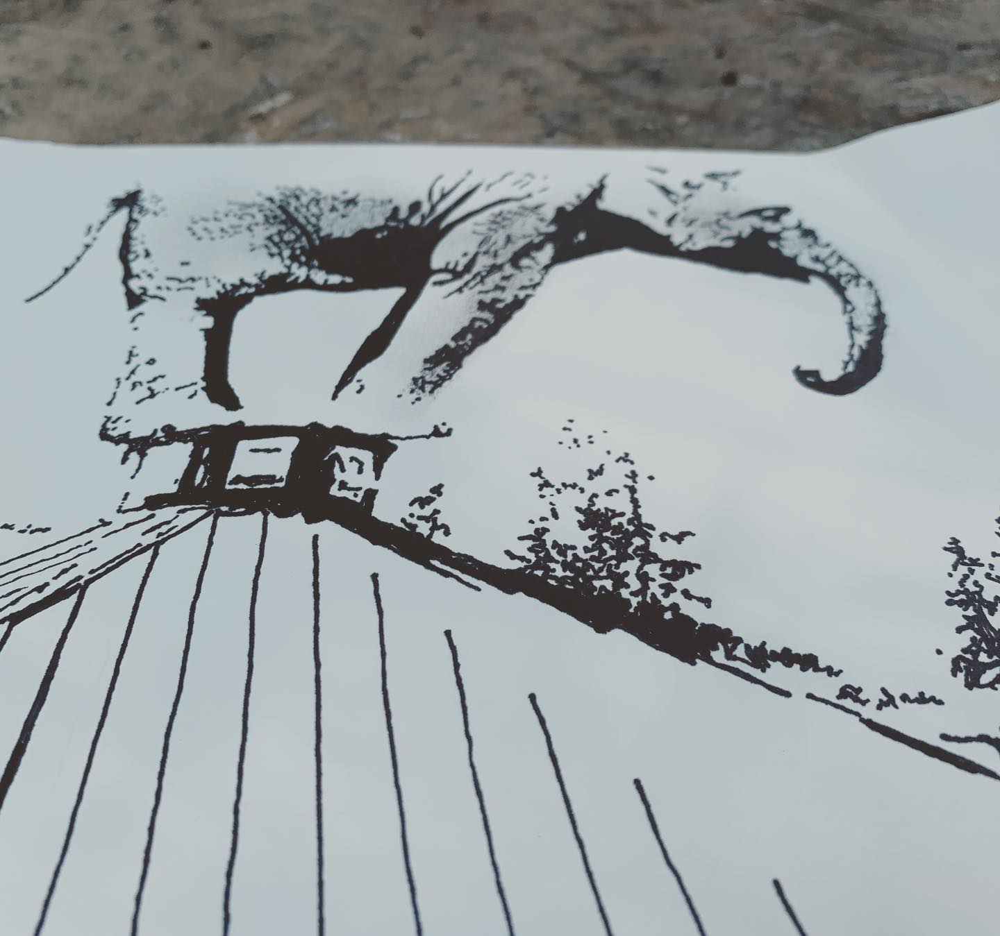
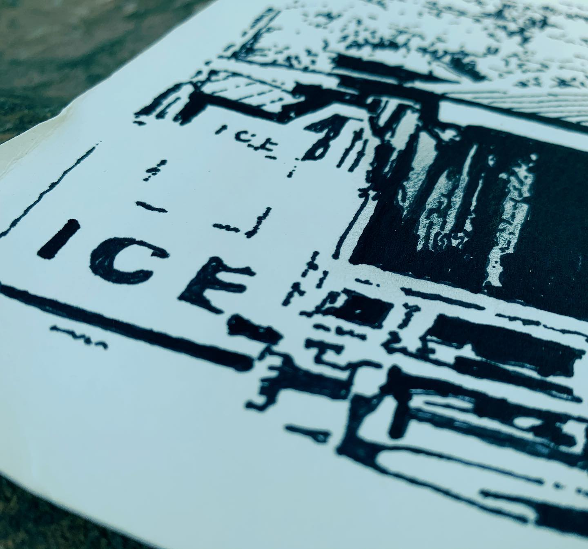

# Correspondence Part 1

> **Relationship:** Explicit satellite of [BirdsView Brewing Co](breweries/birdsview-brewing-co.html)
> **Source platform:** INSTAGRAM Export
> **Match Confidence:** 0.8 (via csv_name_inference)

### Caption / Correspondence Log:
```
@birdsviewbrewery showing how they handle #beermoochingelephants with this elephant pulling the old Grandioso Distracto on the roof while some patrons burn one behind the ice machine. Art by Tony Wright who I know has a great imagination, but I’m not sure about an Instagram handle. This is huge and required the largest priority mail flat I know of and done in marker and pencil it would appear on some thick nice stock. #birdsviewbrewery #drawmeanelephant #nocluehowhashtagsworkandatthispointimtoaffraidtoask
```

### Artifact Scans & Drawings:







### Provenance & Audit:
* **Source Path:** `Unknown`
* **Original entity ID:** `instagram/post-1283771080532198647`
