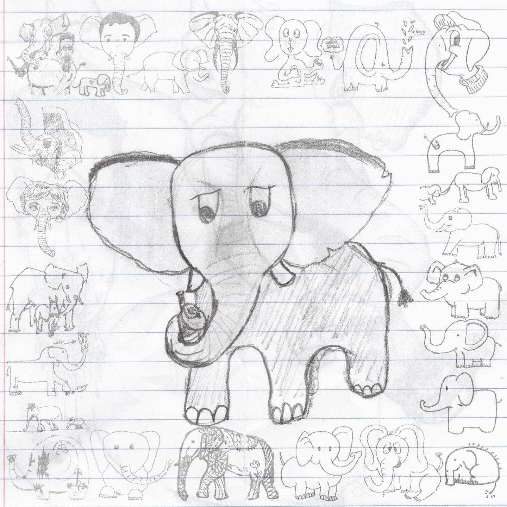
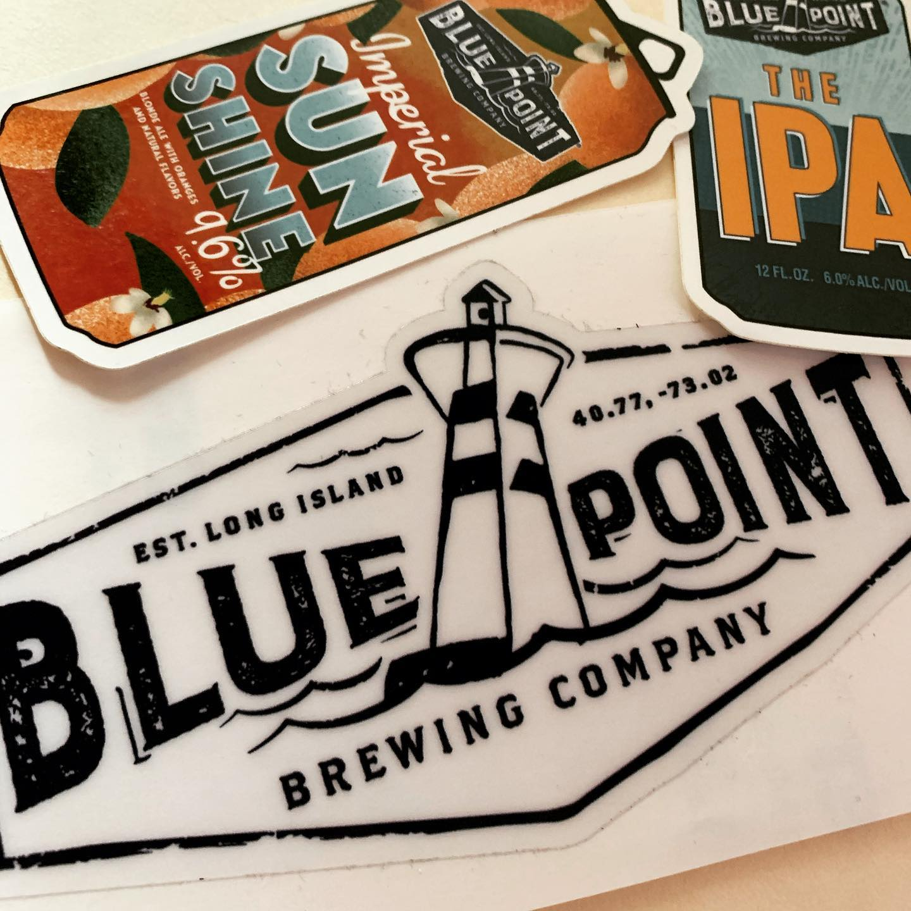
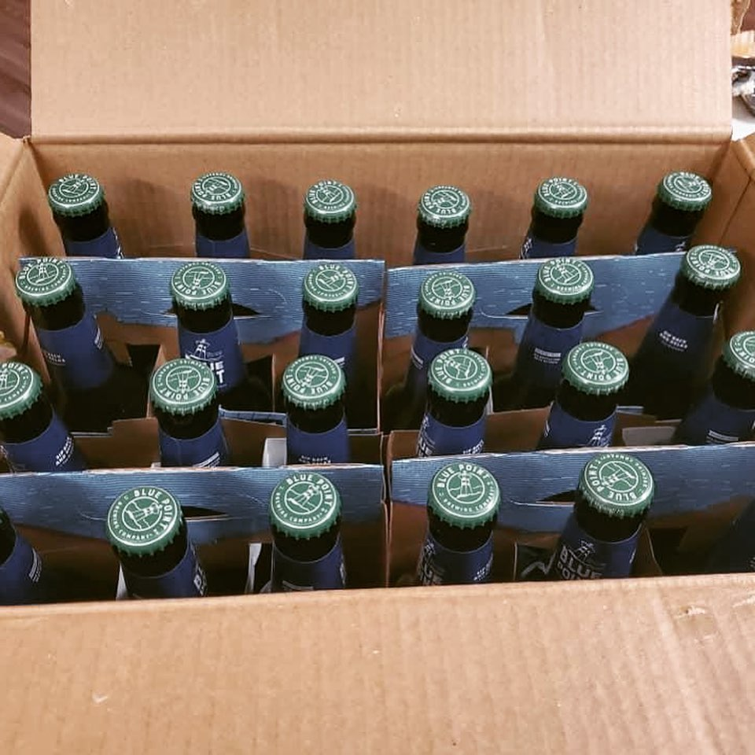
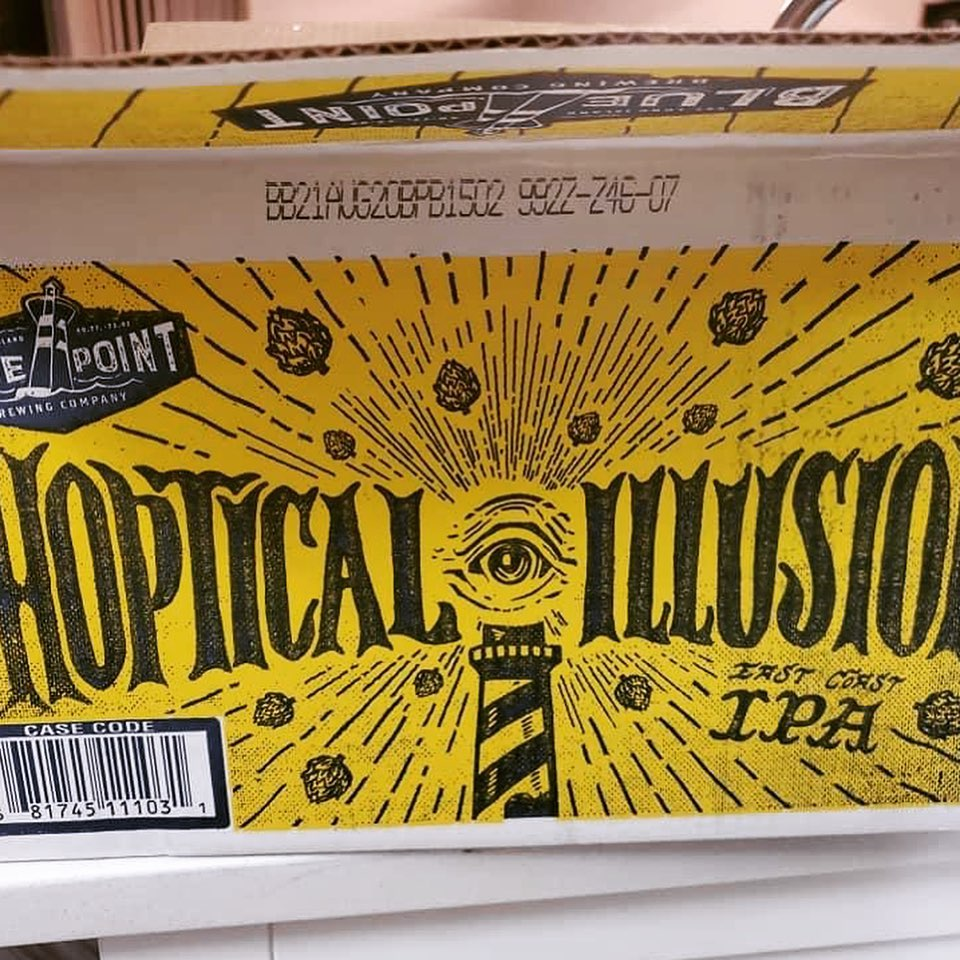

# Correspondence Part 1

> **Relationship:** Explicit satellite of [Blue Point Brewing Co](/breweries/blue-point-brewing-co.html)
> **Source platform:** INSTAGRAM Export
> **Match Confidence:** 0.85 (via csv_hashtag)

### Caption / Correspondence Log:
```
Okay so this was sort of an odd one in that I saw someone on the #soundslikeromanticizedalcoholismbutok group with @bluepointbrewing beers he got a case of on sale and thought it was a small world as one of my new followers had #bluepointbrewery stuff in the background of their photos. Well the world got smaller as I now own an elephant from the very same brewery. That #imperialsunshineblonde  sounds like it would take the edge off and put some noise on. Sometimes you need that #200grit #drawmeanelephant
```

### Artifact Scans & Drawings:









### Provenance & Audit:
* **Source Path:** `Unknown`
* **Original entity ID:** `instagram/post-907752538604727162`
