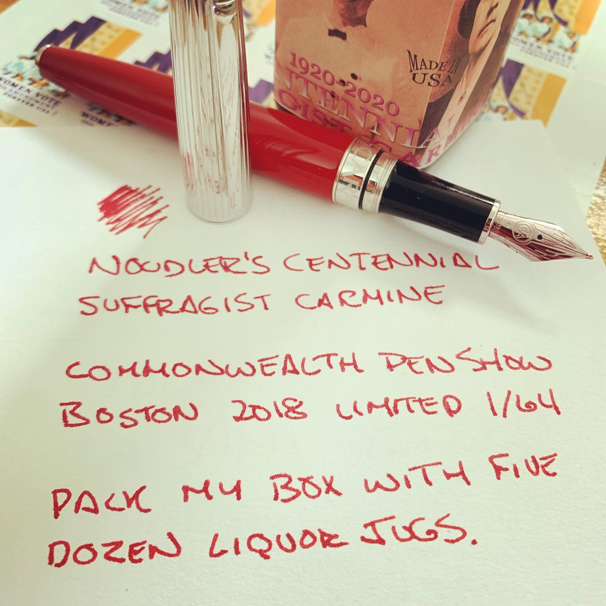
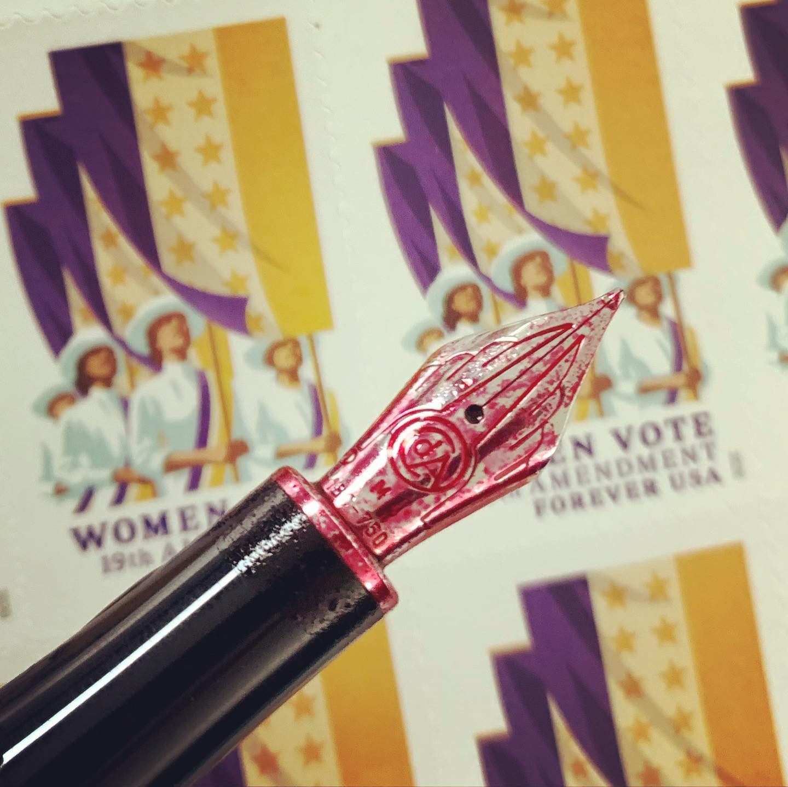

# Correspondence Part 1

> **Relationship:** Explicit satellite of [Channel Brewing Co.](/breweries/channel-brewing-co.html)
> **Source platform:** INSTAGRAM Export
> **Match Confidence:** 0.8 (via csv_name_inference)

### Caption / Correspondence Log:
```
New stamps, who dis? I'm trying to channel my inner cringey mom and since women get to celebrate being able to vote rather than an anniversary for the #airingofgrievances for how oppressive and terrible it used to be. Thanks for not rubbing my nose in that one and here's a photo of the stamps and a bottle of @noodlersink #centennialsuffrage themed ink along with a red @carandache Léman. Statistically most people of all genders don't give a shit about voting, but ultimately equality is probably a good idea and I think there are already books that say that so I won't type one. #govote #noodlersink #carandacheléman #fountainpens #postagestamps #nocluehowhashtagsworkandatthispointimtoaffraidtoask #nibporn #freshlyinked
```

### Artifact Scans & Drawings:





### Provenance & Audit:
* **Source Path:** `Unknown`
* **Original entity ID:** `instagram/post-4584497232815572040`
