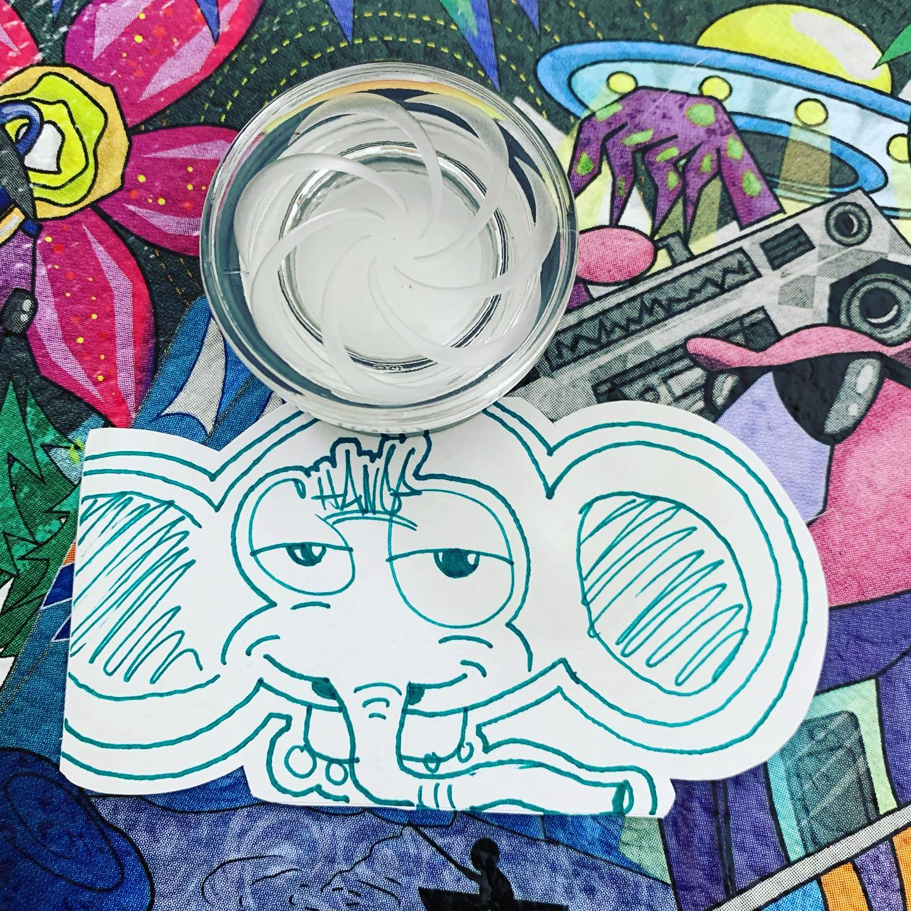
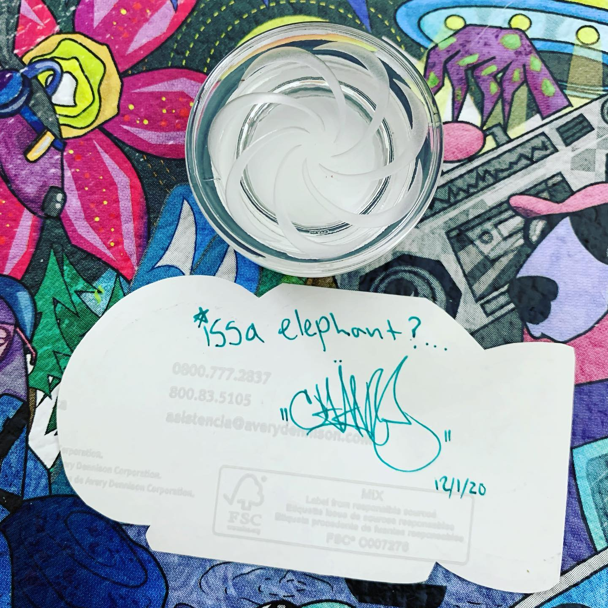
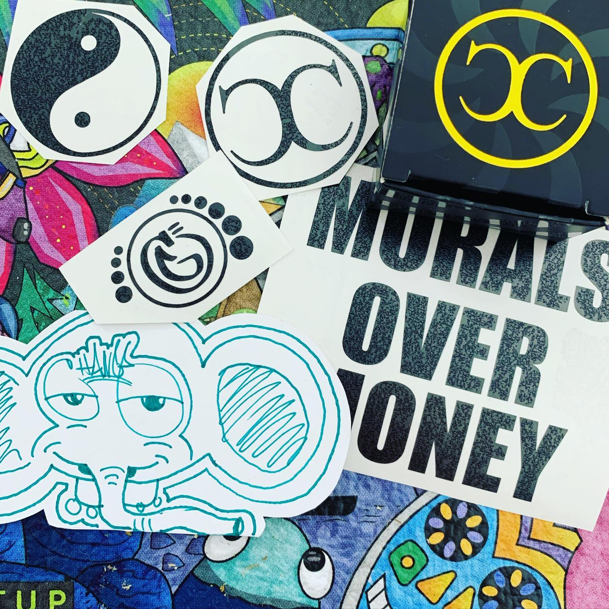

# Correspondence Part 2

> **Relationship:** Explicit satellite of [Channel Brewing Co.](breweries/channel-brewing-co.html)
> **Source platform:** INSTAGRAM Export
> **Match Confidence:** 0.8 (via csv_name_inference)

### Caption / Correspondence Log:
```
@change_glass or maybe @channel_caps drew this elephant and did a ridiculously good job. They had some jar you can use as a carb cap. The elephant drawing wasn’t expected and way better than I’d ever have expected. #drawmeanelephant
```

### Artifact Scans & Drawings:







### Provenance & Audit:
* **Source Path:** `Unknown`
* **Original entity ID:** `instagram/post-6314690437632157920`
