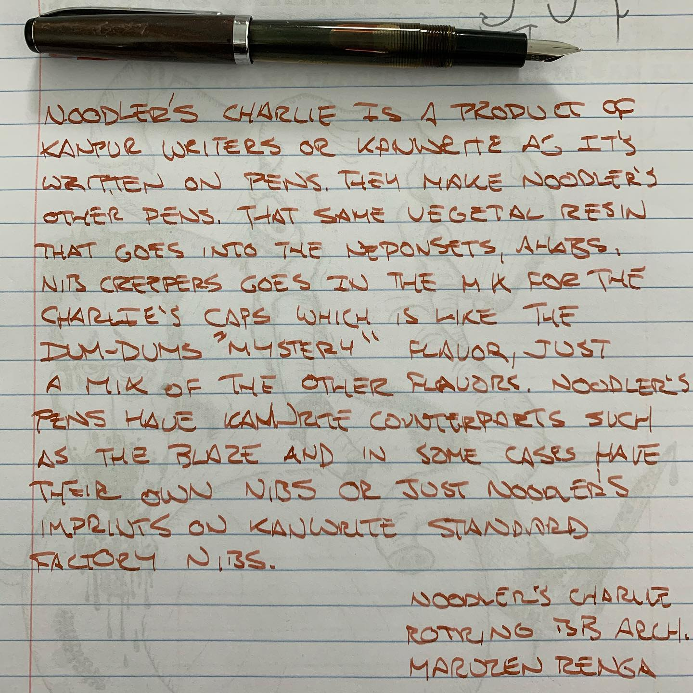
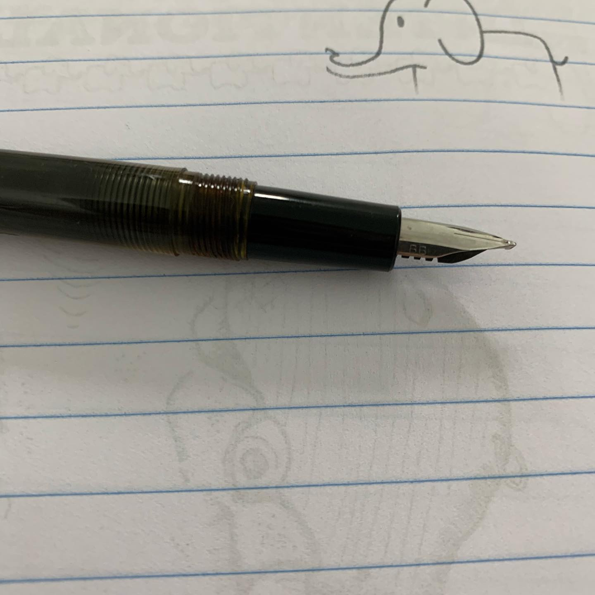
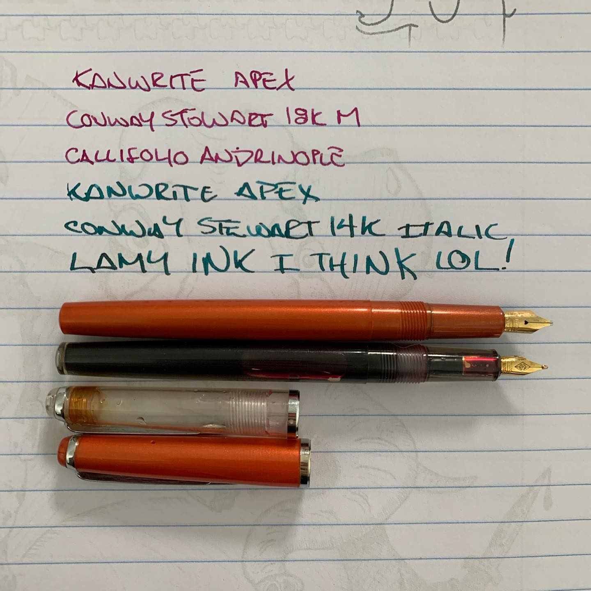
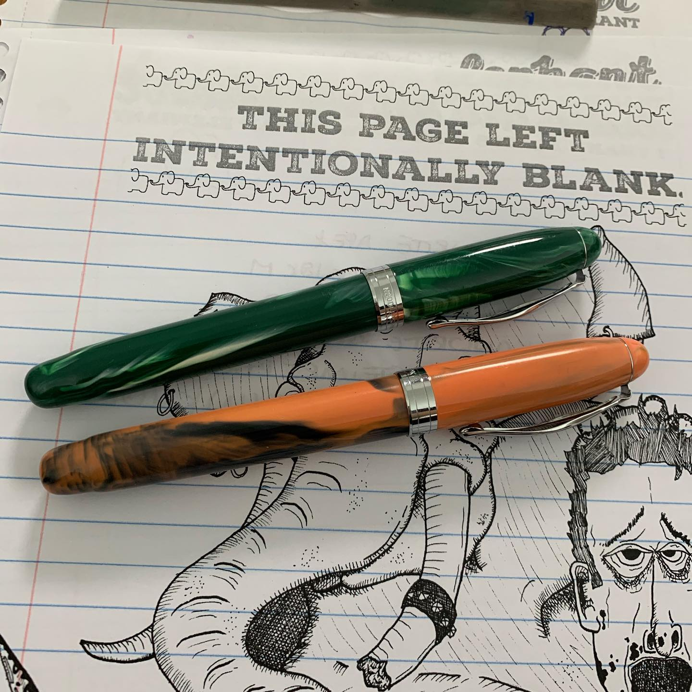
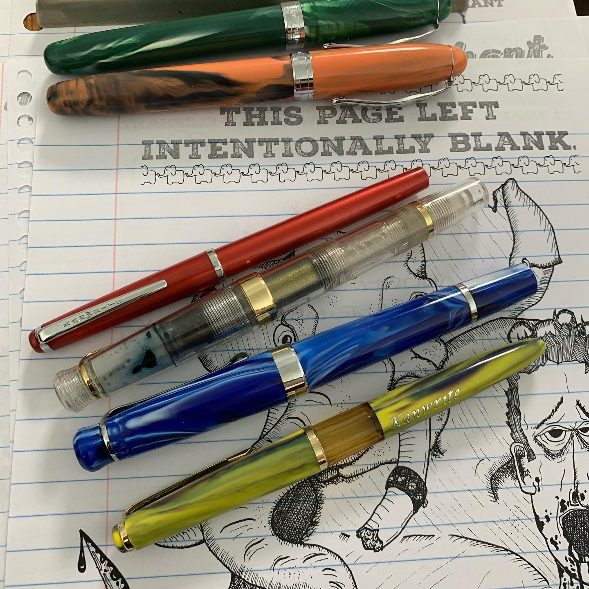
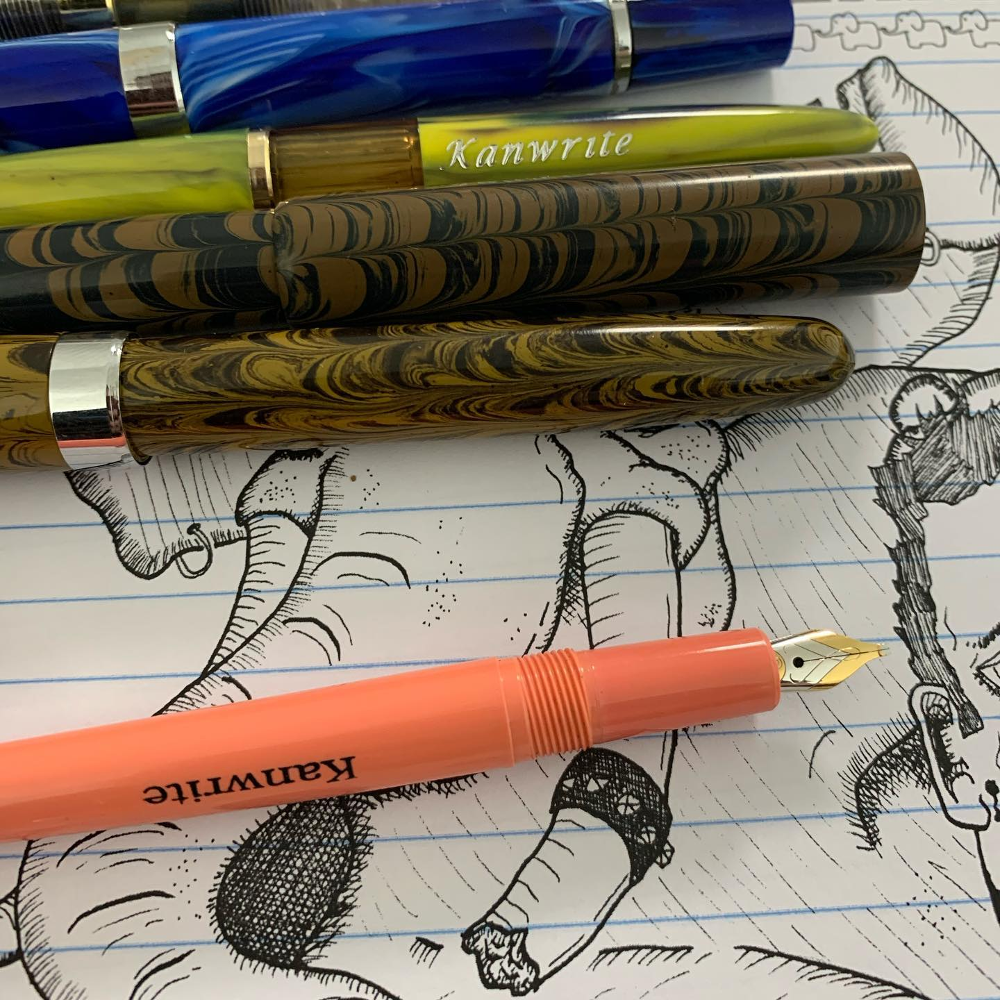
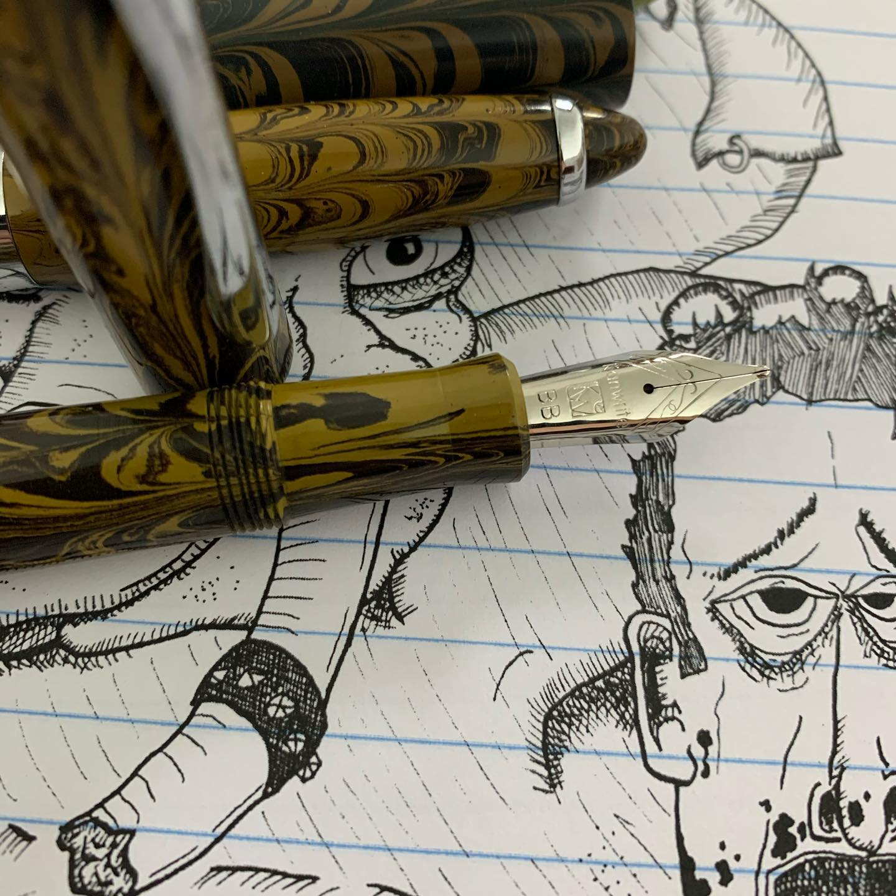
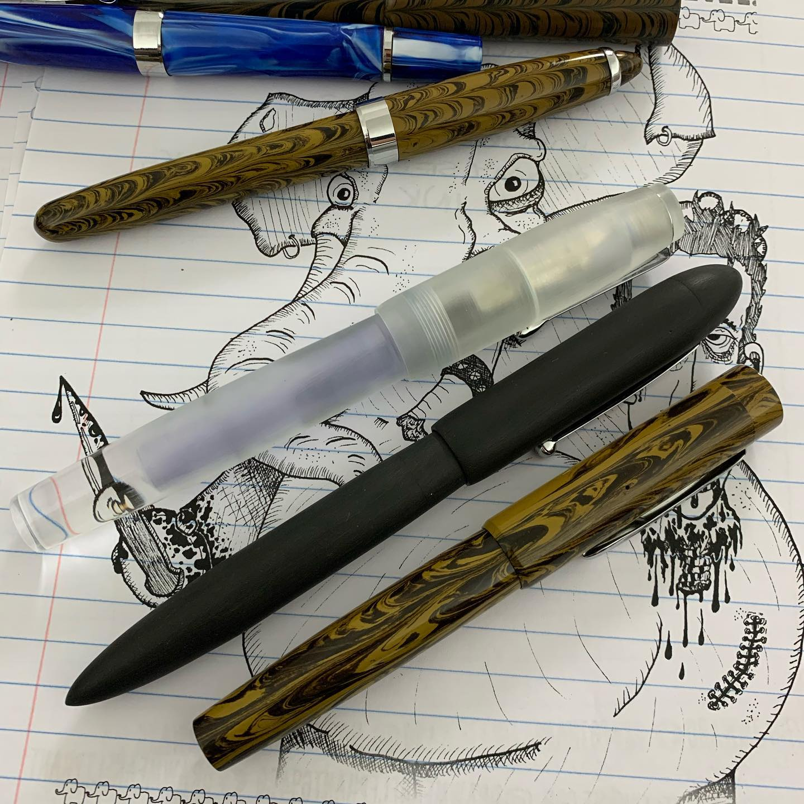

# Correspondence Part 2

> **Relationship:** Explicit satellite of [True Terpenes (Charlie & Stella)](/breweries/charlie-and-stella.html)
> **Source platform:** INSTAGRAM Export
> **Match Confidence:** 0.9 (via curated_keyword)

### Caption / Correspondence Log:
```
Okay so I don't know how the internet works but @brian.goulet had a thing on @youtube and it was for @gouletpens for the #noodlerscharliepen which I love and own a lot of. @penaddict follows me and does actual review stuff, so follow him for something serious. I wrote some words in the Charlie and HOLY HELL HERE'S A LOT OF INDIAN PENS SO BUCKLE UP. After the Charlies are two Kanwrite Apex with @conway_stewart nibs in them and yes two 70¢ pens with these nibs are probably my favorite pens. Next are @noodlersink #ahab pens followed by @kanwrite_kanpurwriters Heritage (piston filler, sorry the demo is full of @jherbininks Emeril da Chauffeur) and some more Kanwrite. Another Kanwrite with a @pelikan_usa nib from a mid 1990s trainwreck that all the sections rotted and no other pen is compatible from Pelikan. Rounded off with some @asapens and a @ranga_pens mixed in. This is a ton of Indian kit and these are all great pens, even if they look odd. Friction fit Indian made feeds. Natural materials honor crafted by people who care. #fountainpens #asapens #rangapens #kanwriteheritage #kanwritepens #penaddict #nocluehowhashtagsworkandatthispointimtoaffraidtoask
```

### Artifact Scans & Drawings:

















### Provenance & Audit:
* **Source Path:** `Unknown`
* **Original entity ID:** `instagram/post-3872882407537935054`
