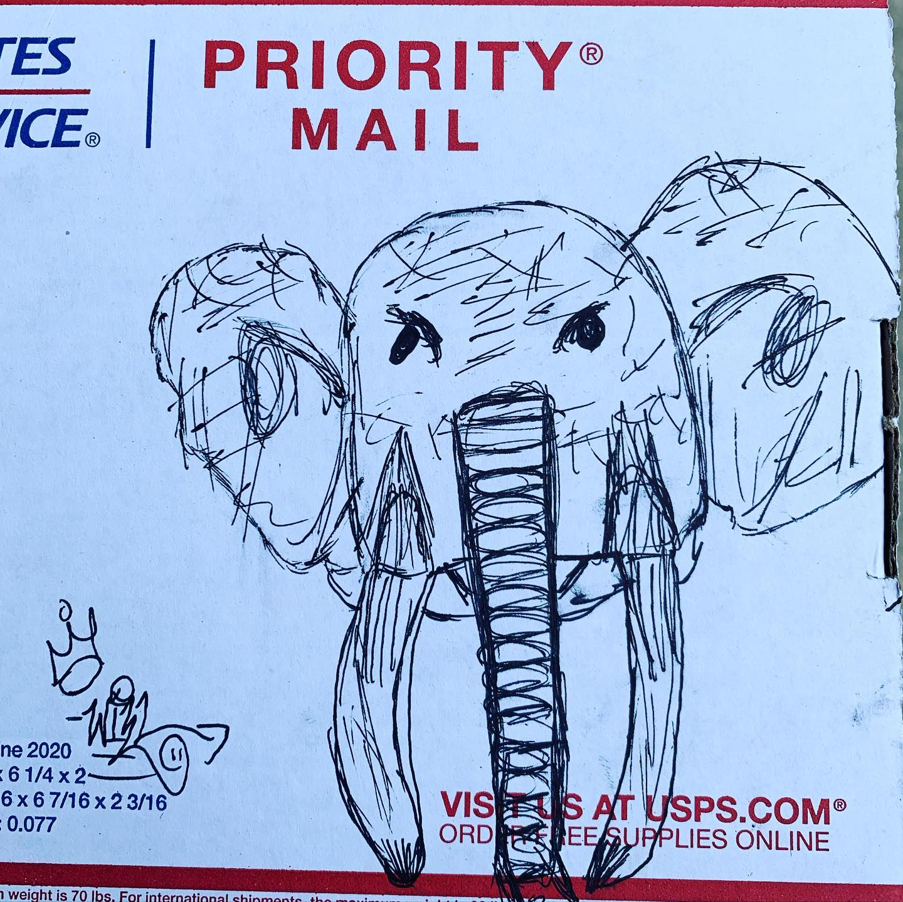
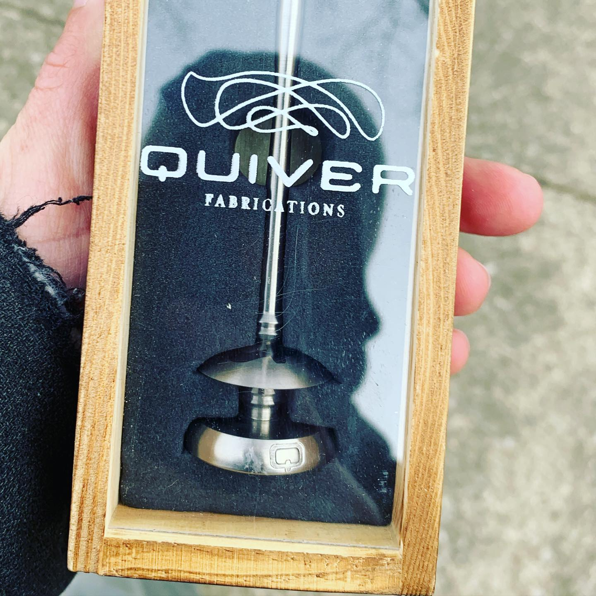
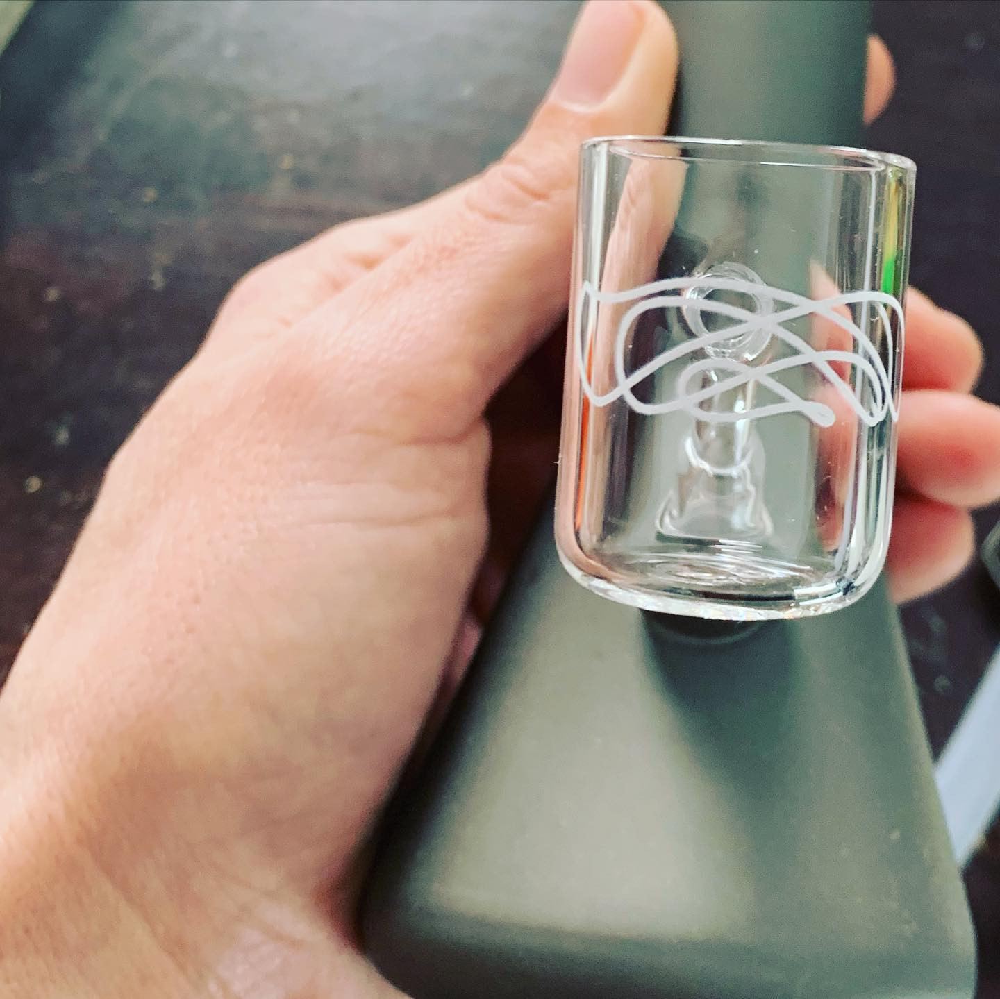

# Correspondence Part 1

> **Relationship:** Explicit satellite of [Denali Brewing Company](breweries/denali-brewing-company.html)
> **Source platform:** INSTAGRAM Export
> **Match Confidence:** 0.8 (via csv_name_inference)

### Caption / Correspondence Log:
```
@puffitup came through with a pretty good elephant from Will there, who has done several. @tahoe_toker turned me on to @quiverfabrications stuff and I own the Merapi, Summit, Denali, Safety Meeting, and The People's Banger. Important thing is the elephant, great work Will. Still hoping Quiver draws me an elephant someday. I've been super good all year and never call my Summit simply a Quiver like everyone on the in internet.
```

### Artifact Scans & Drawings:







### Provenance & Audit:
* **Source Path:** `Unknown`
* **Original entity ID:** `instagram/post-8936451173589329534`
