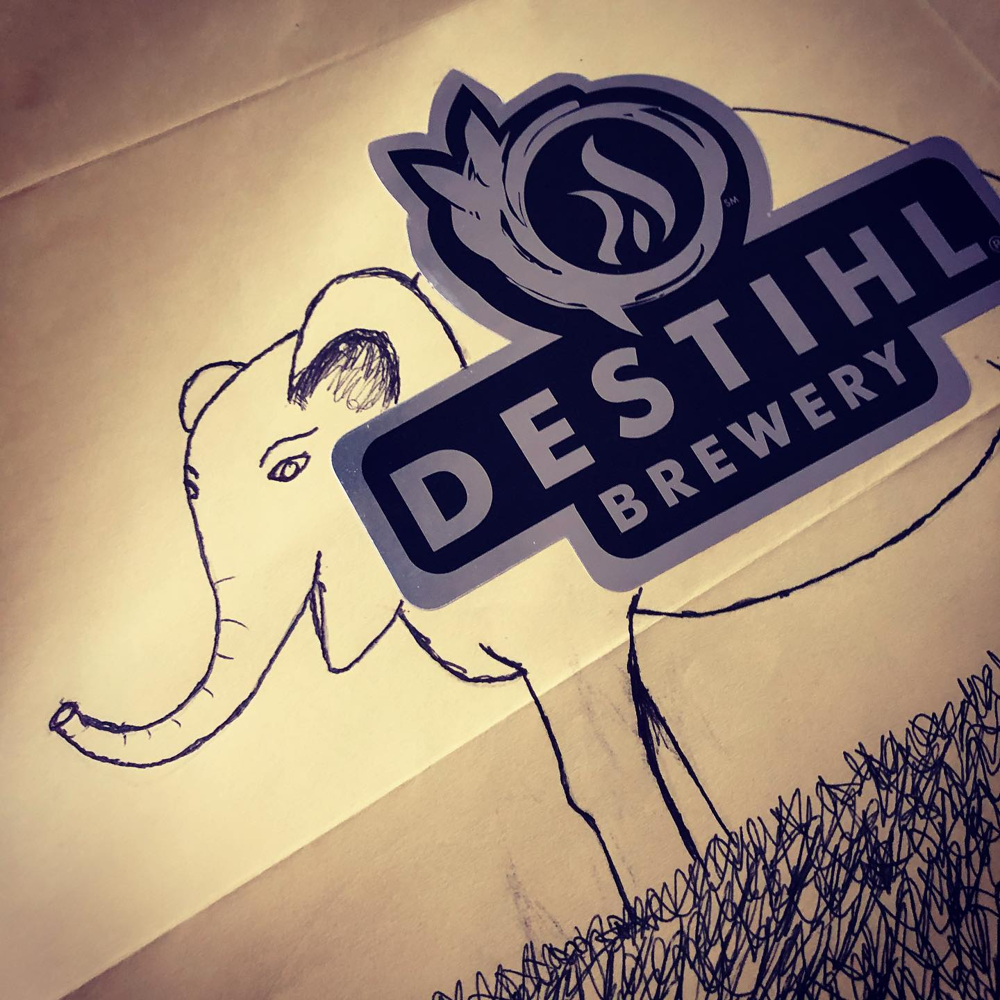
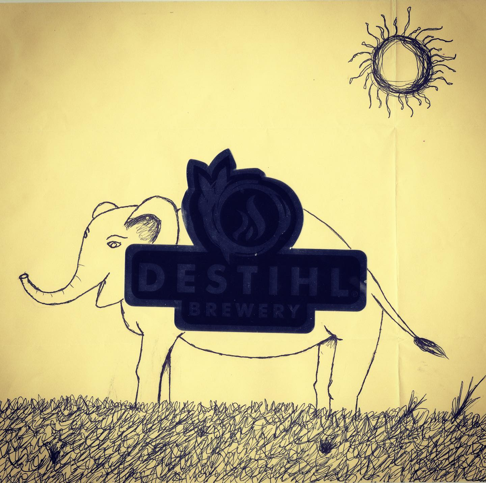

# Correspondence Part 1

> **Relationship:** Explicit satellite of [DESTIHL Brewery](/breweries/destihl-brewery.html)
> **Source platform:** INSTAGRAM Export
> **Match Confidence:** 0.8 (via csv_name_inference)

### Caption / Correspondence Log:
```
@destihlbrewery also put the sticker right on top of the elephant, which I kind of half-ass forgot I suggest until getting another one with a sticker from @wileyrootsbrewing the same day. It was shiny and my scanner didn't do too swift. 
Pretty great elephant. Hoping the other @destihlbrewery places also draw me one. I think I wrote a bunch but they start to blur together. #drawmeanelephant
```

### Artifact Scans & Drawings:





### Provenance & Audit:
* **Source Path:** `Unknown`
* **Original entity ID:** `instagram/post-8052641398671419704`
