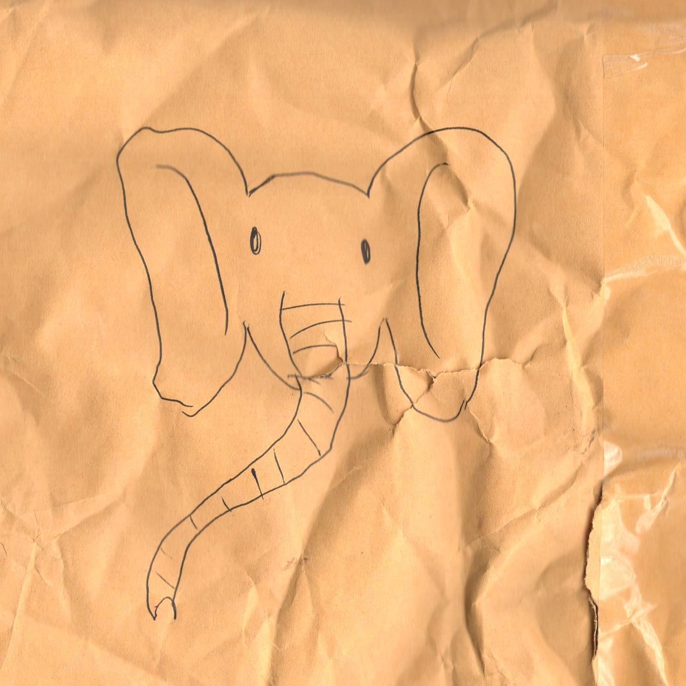
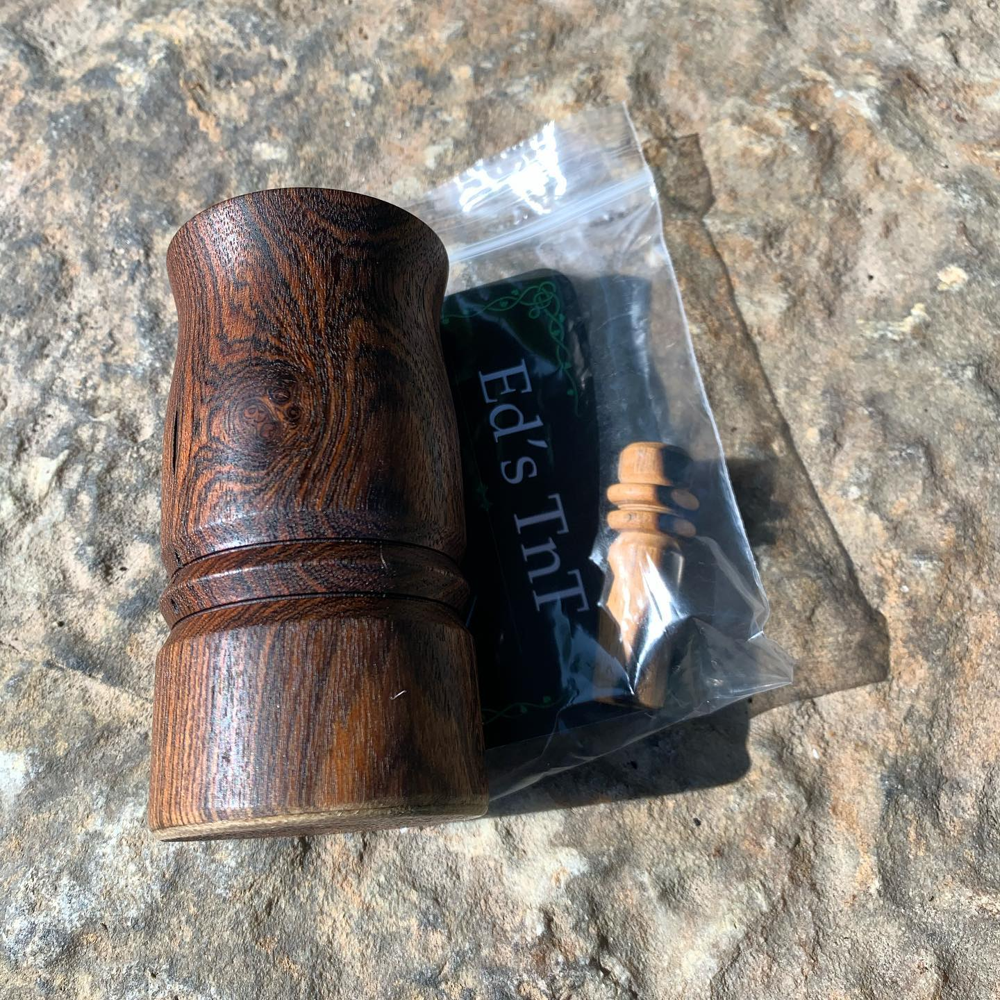

# Correspondence Part 3

> **Relationship:** Explicit satellite of [Device Brewing Company](/breweries/device-brewing-company.html)
> **Source platform:** INSTAGRAM Export
> **Match Confidence:** 0.8 (via csv_name_inference)

### Caption / Correspondence Log:
```
Mail was late so #woodscentswednesday got moved to a Thursday for me. Ed of @eds_tnt_ seemed to ignore my requests for elephant until now and included this elephant with my rebuilt #woodscents that's an absolute champion of a device. Ed takes mostly rare woods from all over the world and makes little things to make people's lives better. It's an interesting concept doing what you actually love for a living and finding enough people who enjoy it to put steaks on the table. He makes it work and the new peice of wood that isn't #bocote is a black and white Asian Ebony that has curves in all the right places. I'm not talking about my old roommate in college, she attaches to the other end of the bong. #drawmeanelephant #vaporents #edstnt #wpa
```

### Artifact Scans & Drawings:





### Provenance & Audit:
* **Source Path:** `Unknown`
* **Original entity ID:** `instagram/post-3929736519075234783`
