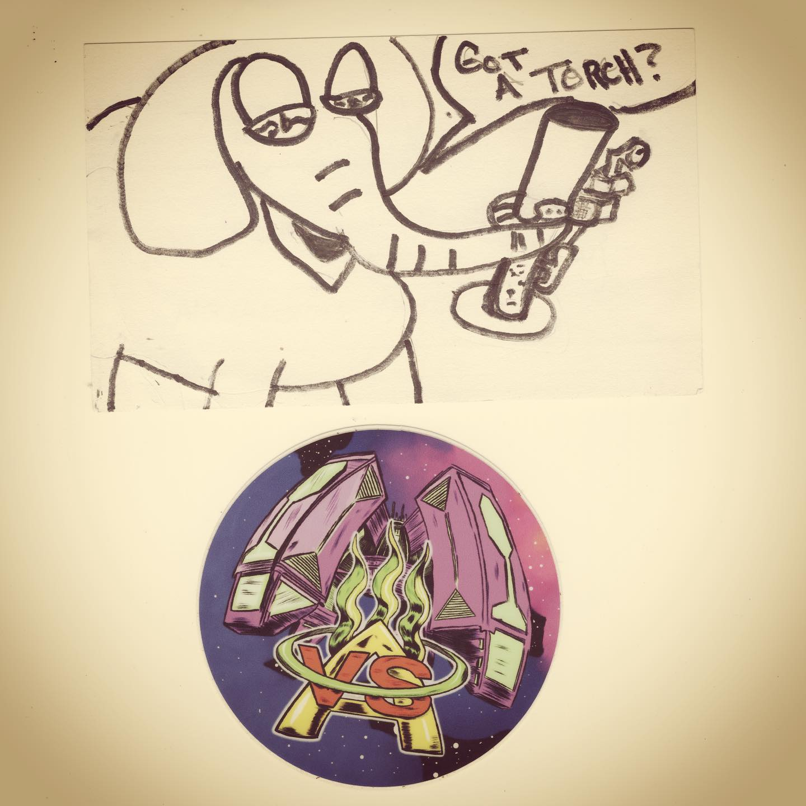
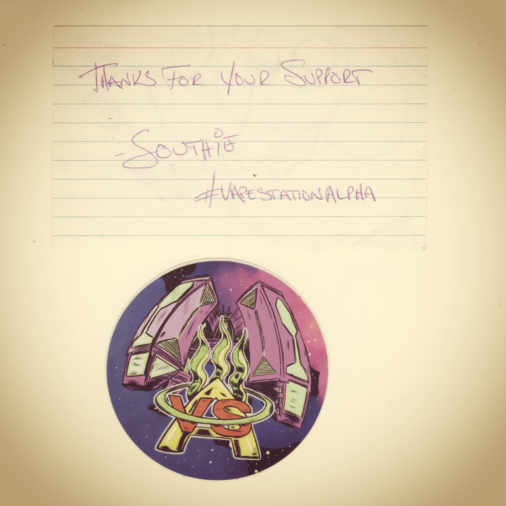

# Correspondence Part 4

> **Relationship:** Explicit satellite of [Device Brewing Company](/breweries/device-brewing-company.html)
> **Source platform:** INSTAGRAM Export
> **Match Confidence:** 0.8 (via csv_name_inference)

### Caption / Correspondence Log:
```
This isn’t my first elephant hitting a #waterbong or smoking, but I think a first for one vaping! This is from @vapestationalpha and appears to feature an elephant hitting a @stickybricklabs #flipbrick or perhaps one of those @lamart.ch #lamartpiro or another #butanevape 

Either way, great job mostly on bong and #penmanship as I’m a huge fan of #blockprint #allcaps in my writing and did about a thousand letters for this project in ALL CAPS. I think #vapestationalpha does reviews of personal aromatherapy devices and generally has pretty good taste. Probably won’t see him review garbage, but I’d expect some painful brutal honesty. Either way, good choice of ink colors to complement the sticker and a pretty top notch effort from Southie. #drawmeanelephant
```

### Artifact Scans & Drawings:





### Provenance & Audit:
* **Source Path:** `Unknown`
* **Original entity ID:** `instagram/post-4724734402728188209`
