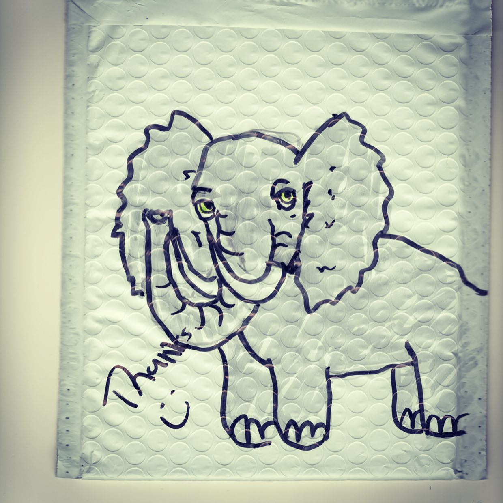
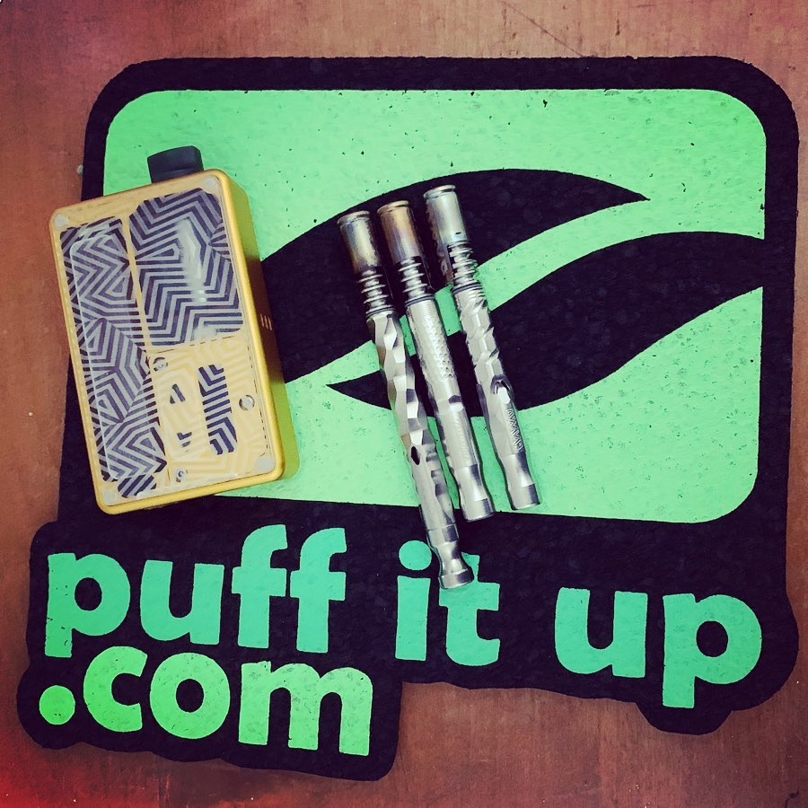
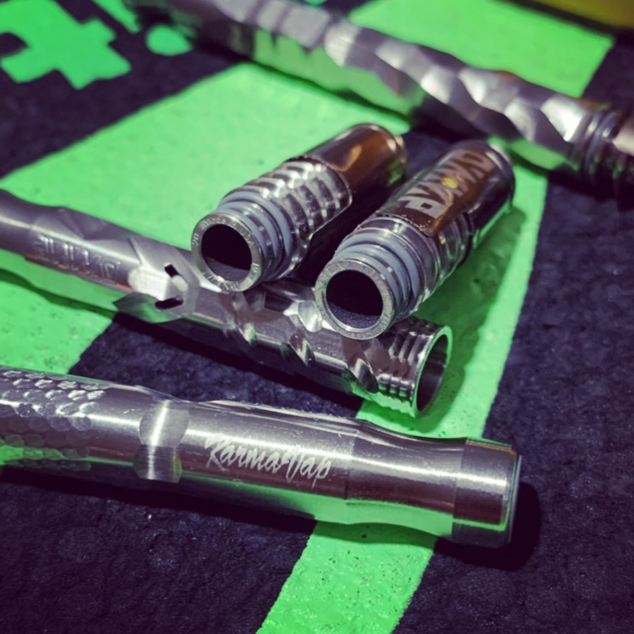
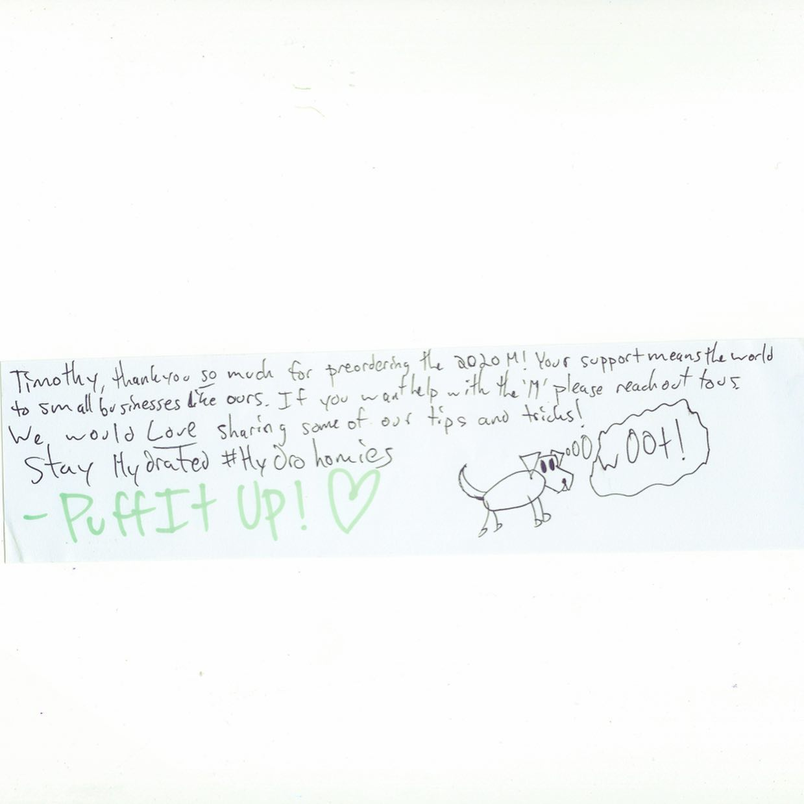

# Correspondence Part 1

> **Relationship:** Explicit satellite of [Dynavap](/breweries/dynavap.html)
> **Source platform:** INSTAGRAM Export
> **Match Confidence:** 0.8 (via csv_name_inference)

### Caption / Correspondence Log:
```
@puffitup pretty much always delivers on elephants. In one of their videos they said they promoted Allyson to just do more QA and draw shit on packages. Another drawing in here referenced #hydrohomies which is more of a Reddit thing. New @dynavap #2020M with #chiral ports and all sorts of new nice stuff on it. I thought the 2019M was too hot and my friend's mom described it as "I really like that one. You boys have all these toys and I don't know we just had joints when I was a kid". Also got a #karmavap which my friend described as "too much air" and "I wouldn't use it". If someone with a brewery Instagram wants the KarmaVap I'd mail that free. Probably a long shot anyone reads this much. #drawmeanelephant
```

### Artifact Scans & Drawings:









### Provenance & Audit:
* **Source Path:** `Unknown`
* **Original entity ID:** `instagram/post-1445539722572662809`
