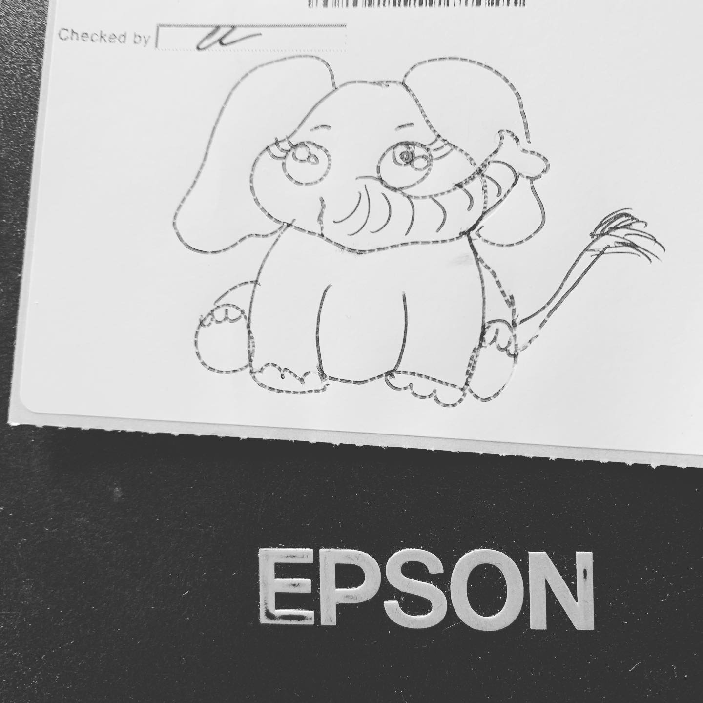
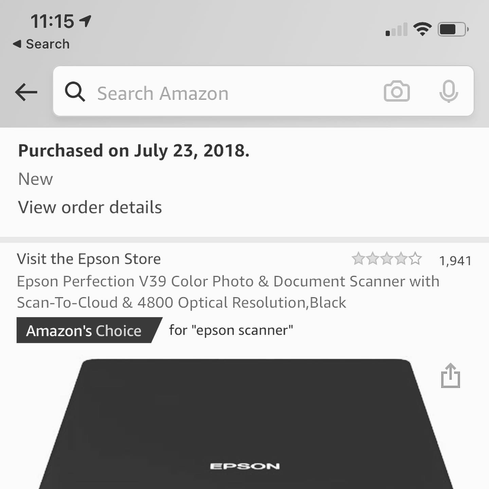
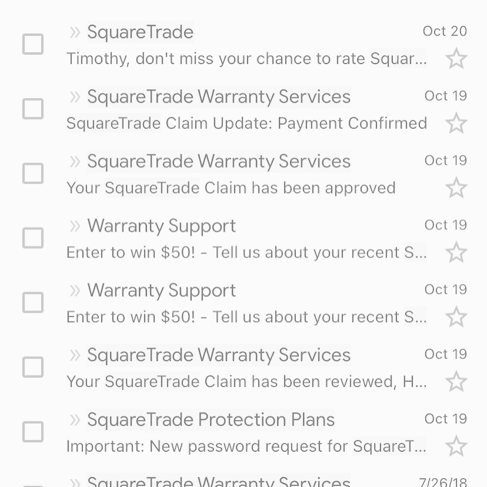

# Correspondence Part 2

> **Relationship:** Explicit satellite of [Dynavap](/breweries/dynavap.html)
> **Source platform:** INSTAGRAM Export
> **Match Confidence:** 0.8 (via csv_name_inference)

### Caption / Correspondence Log:
```
Good news first or bad news first? Good news: @dynavap drew me an elephant and has #2020m now in #Azurium #RosiuM and PhantoM. Bad news: My scanner puked and much like last year when my scooter was stolen, @squaretrade paid 70% of it. Better than nothing, but the concept of having a replacement isn't really there and honestly pissed me off I bothered with the warranty despite it being a lot better than nothing. The @epsonamerica #V39 did pretty decent, but is dead now. #saddays #drawmeanelephant #epsonscanner #squaretrade
```

### Artifact Scans & Drawings:







### Provenance & Audit:
* **Source Path:** `Unknown`
* **Original entity ID:** `instagram/post-1748460866719206829`
