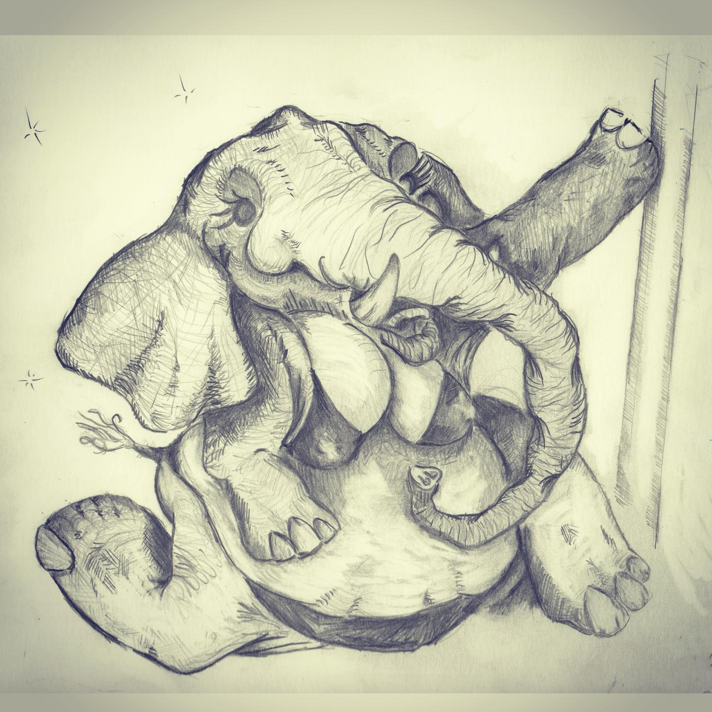
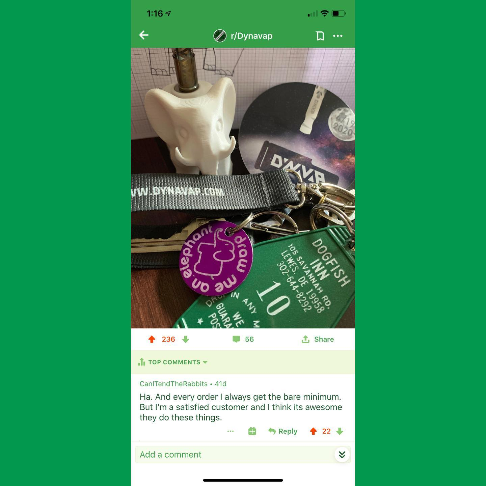

# Correspondence Part 5

> **Relationship:** Explicit satellite of [Dynavap](breweries/dynavap.html)
> **Source platform:** INSTAGRAM Export
> **Match Confidence:** 0.8 (via csv_name_inference)

### Caption / Correspondence Log:
```
Okay so for @dynavap annual launch of the #2020M they did a #karmavap thing and I got an elephant drawing and 3D printed elephant. The top comment on my thread was @reddit user u/CanITendTheRabbits who taught me that elephants have two tiddies like humans and illustrated it with this elephant pole dancing for some spare bucks. Elephant has to earn a living too! #dynavap #drawmeanelephant #beermoochingelephants #elephanttiddies
```

### Artifact Scans & Drawings:





### Provenance & Audit:
* **Source Path:** `Unknown`
* **Original entity ID:** `instagram/post-5299414508920593209`
