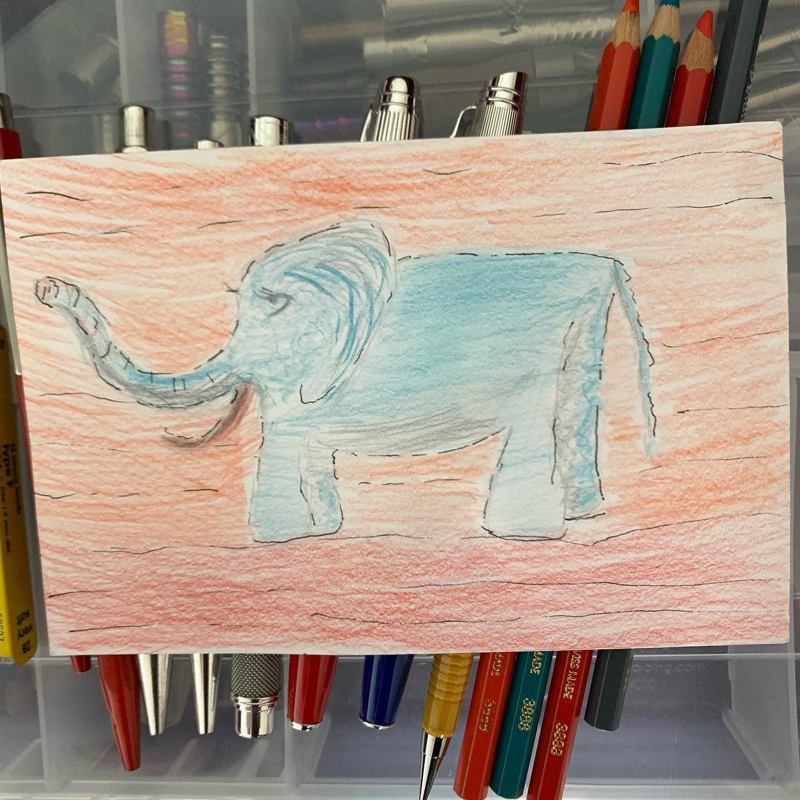
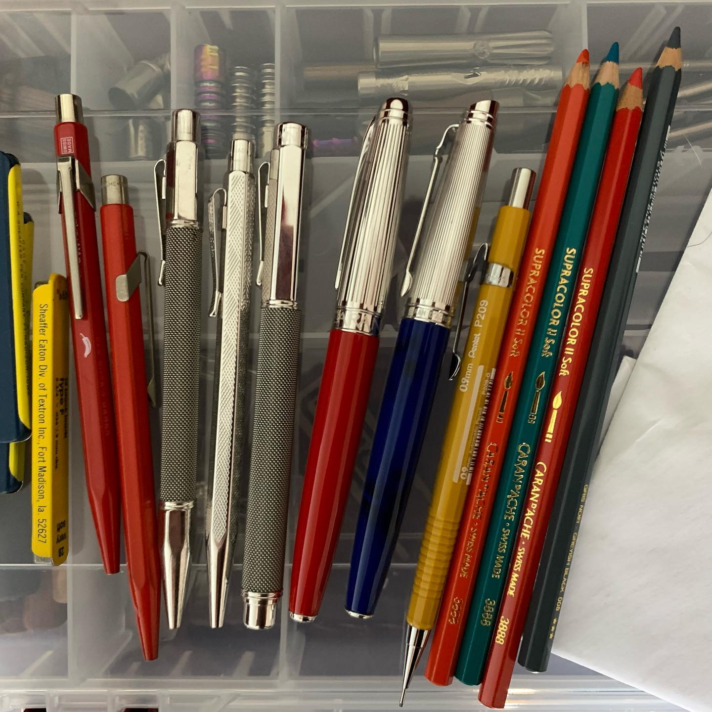

# Correspondence Part 6

> **Relationship:** Explicit satellite of [Dynavap](breweries/dynavap.html)
> **Source platform:** INSTAGRAM Export
> **Match Confidence:** 0.8 (via csv_name_inference)

### Caption / Correspondence Log:
```
This elephant came from @machine.wash.cold who got a free #VonG from @dynatography which had a midsection break. I replaced their midsection with one from a free #VonG that I got from Will of @dynavap fame along with some pencils. Six months later, some @carandache #supracolorsoft and a drawing of an elephant shows. Great pencil and nice way for me to give away my old @sheafferpen lead from the @textron days. #drawmeanelephant
```

### Artifact Scans & Drawings:





### Provenance & Audit:
* **Source Path:** `Unknown`
* **Original entity ID:** `instagram/post-7024576048035669896`
