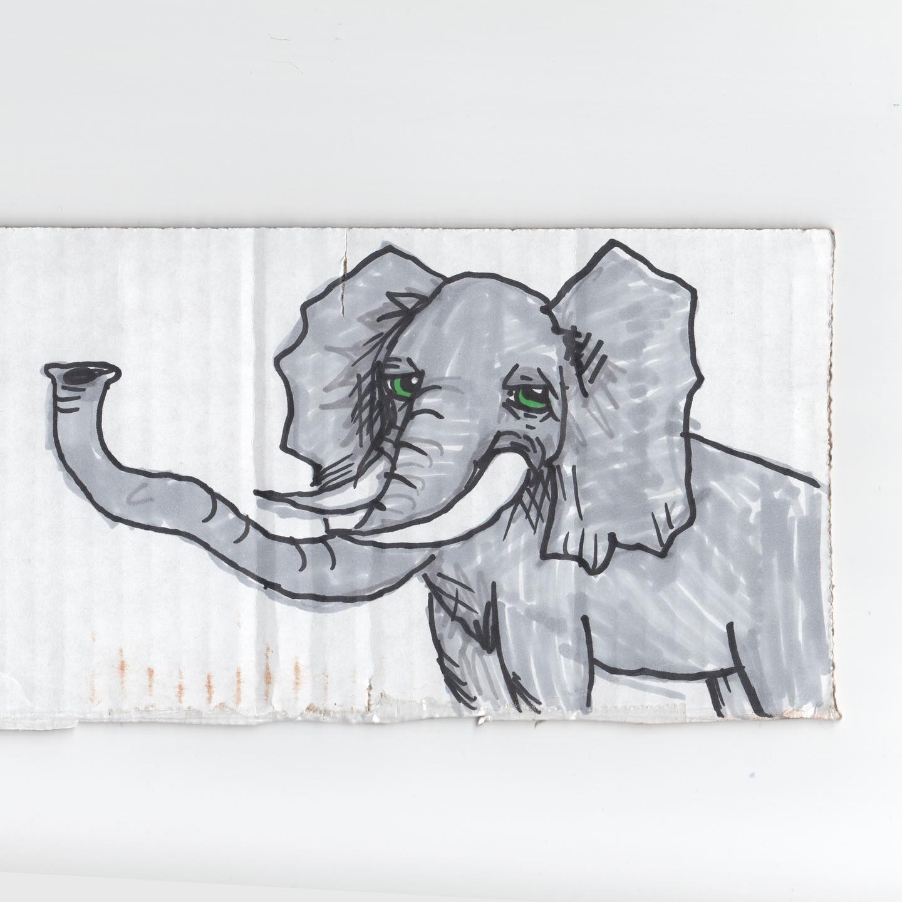
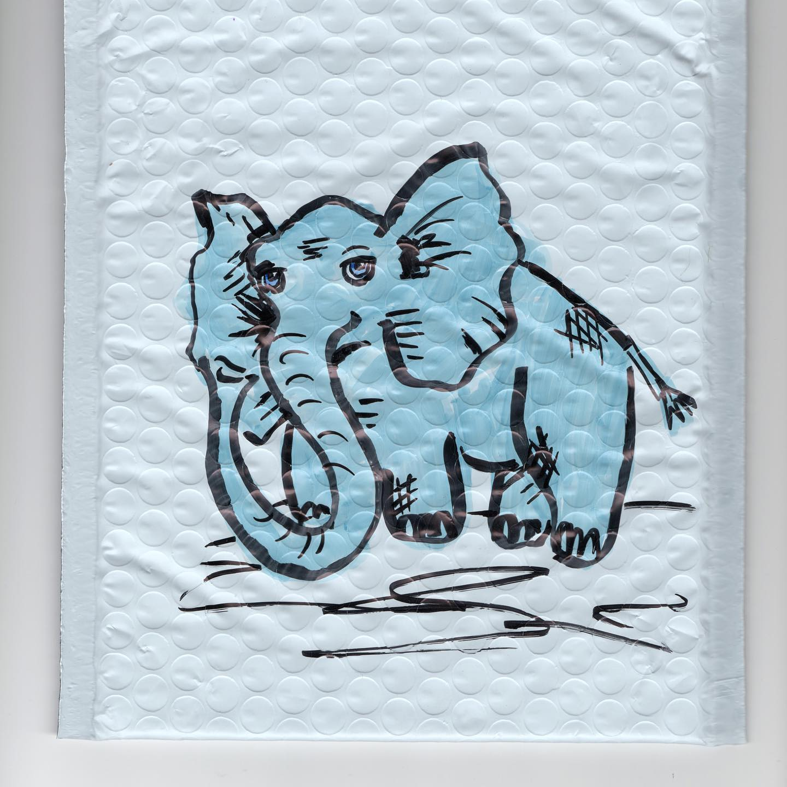
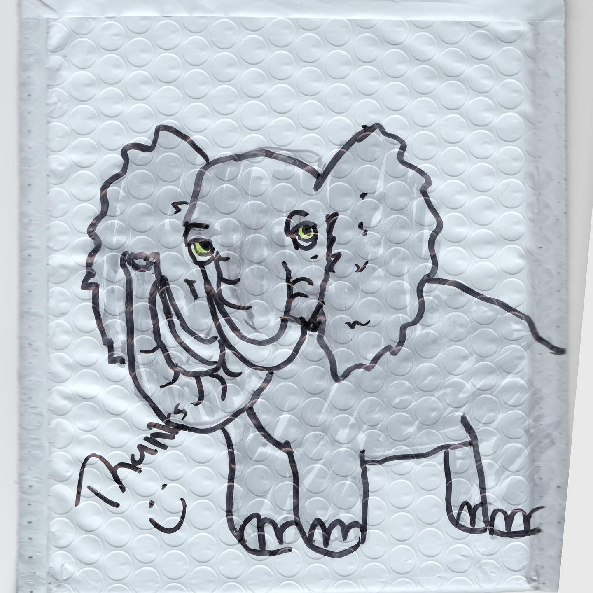
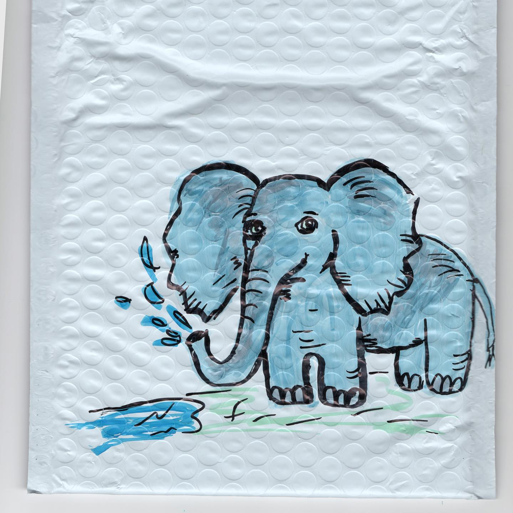
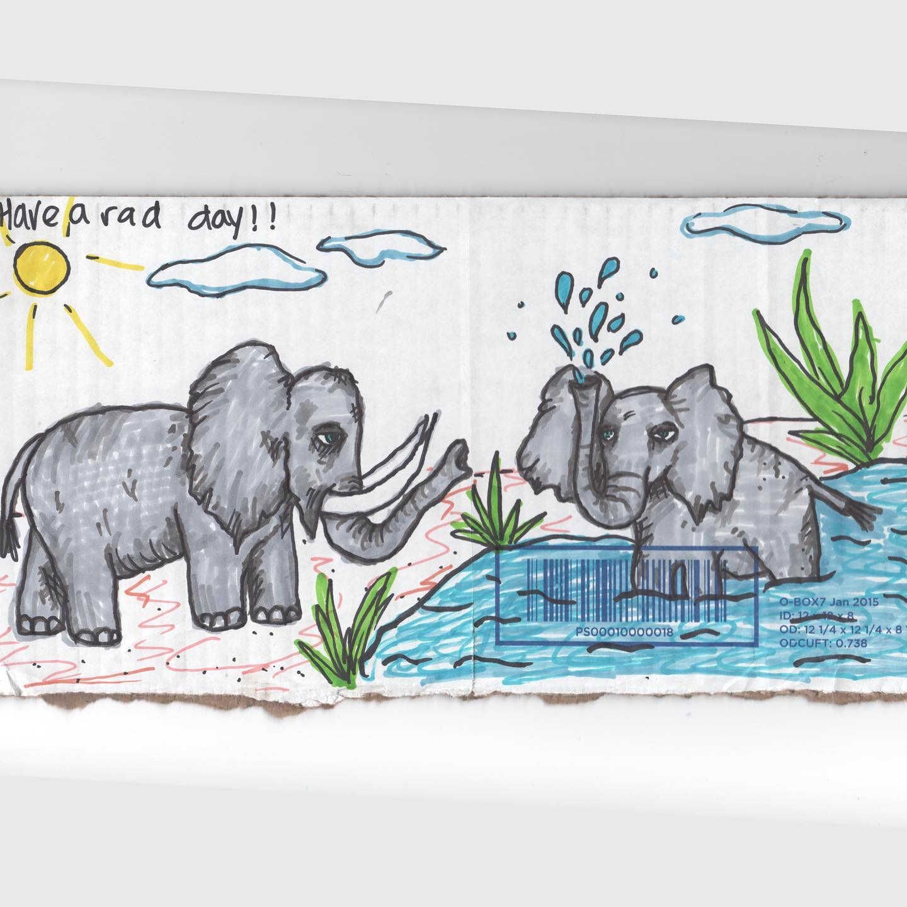
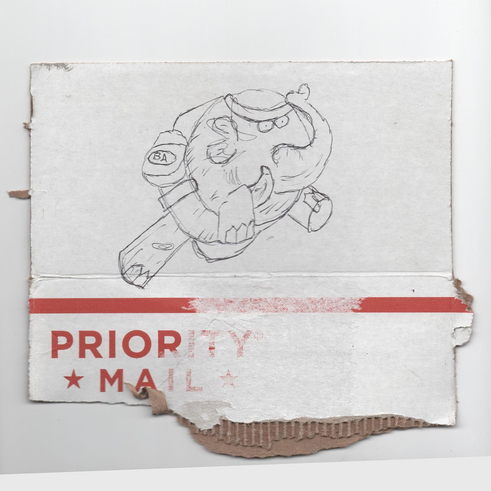
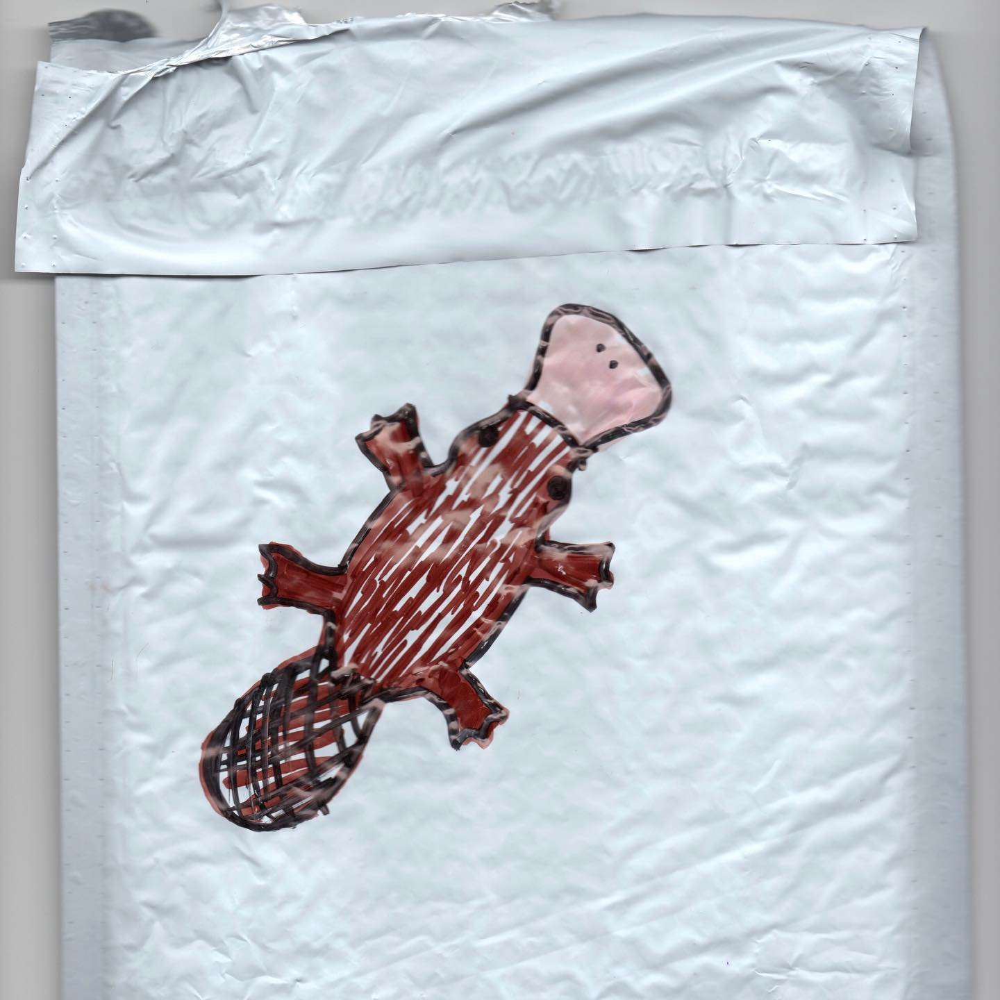

# Correspondence Part 7

> **Relationship:** Explicit satellite of [Dynavap](breweries/dynavap.html)
> **Source platform:** INSTAGRAM Export
> **Match Confidence:** 0.8 (via csv_name_inference)

### Caption / Correspondence Log:
```
Happy 4/20!! @puffitup has drawn me loads of elephants and these are most of them. Allyson there draws awesome and sometimes other people try. Obviously since it is #420 they have #DynaVap and #ditanium and #stickybricklabs on sale. Put draw me an elephant in the comment and then mail me the elephant. It’s like a free elephant. #drawmeanelephant #420allmonth #puffit #vaporents
```

### Artifact Scans & Drawings:
















### Provenance & Audit:
* **Source Path:** `Unknown`
* **Original entity ID:** `instagram/post-7437756378450797256`
