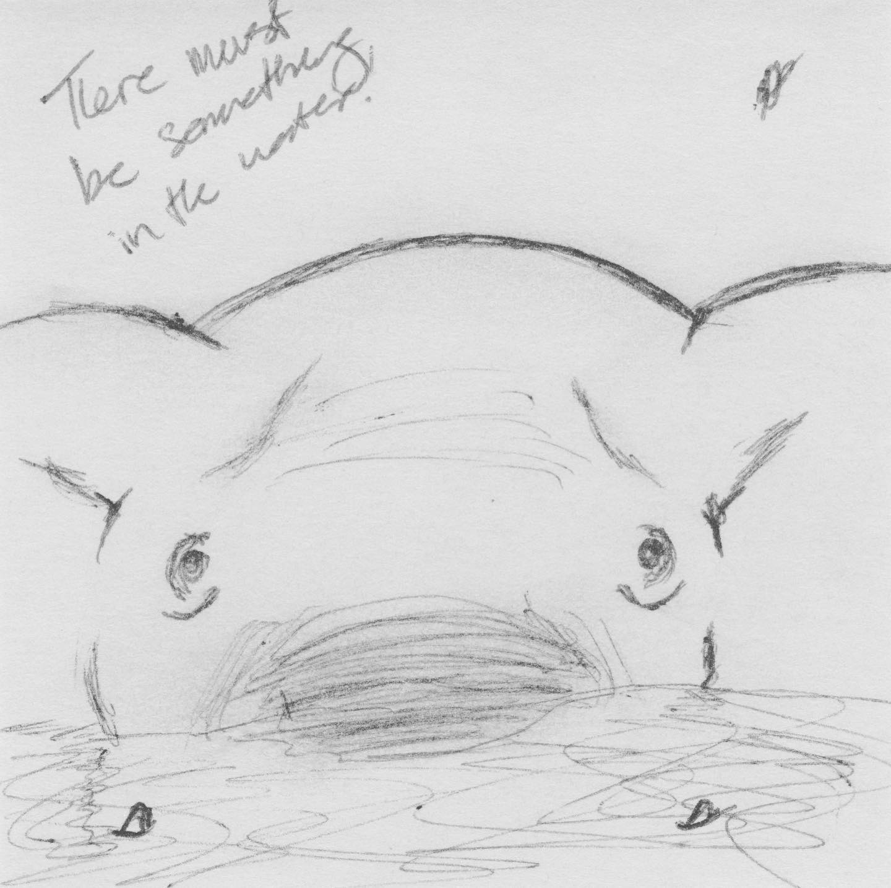
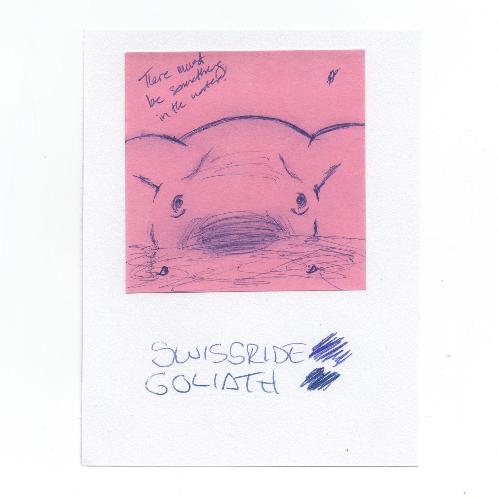
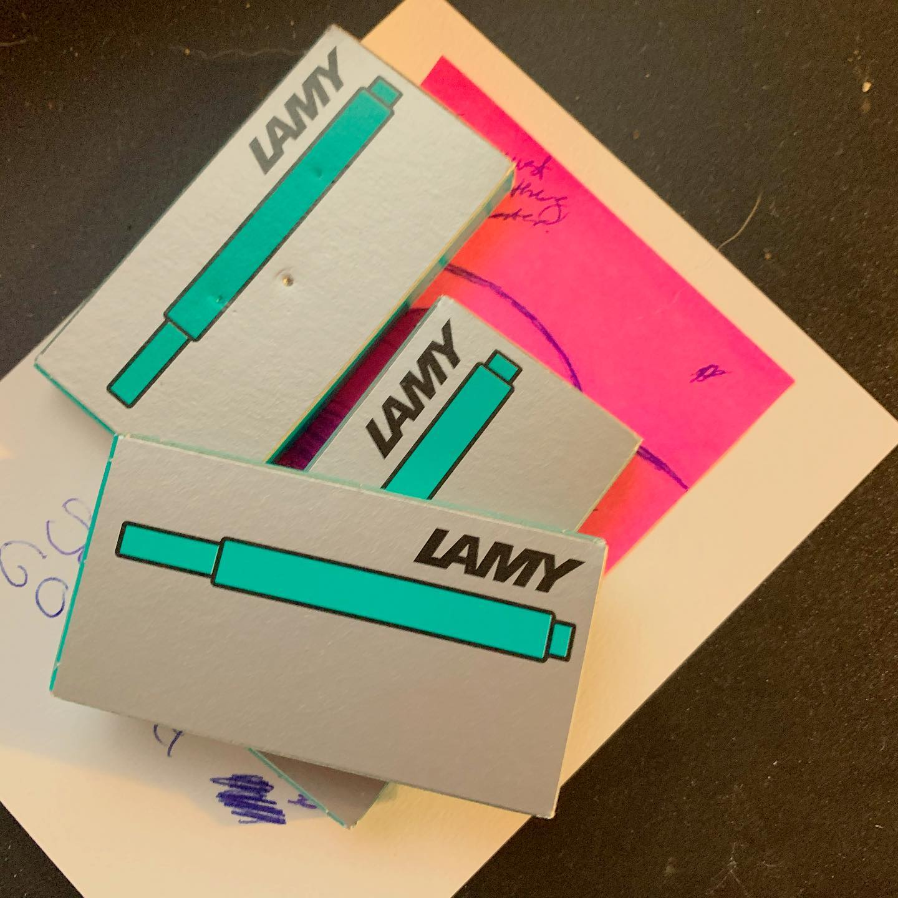

# Correspondence Part 2

> **Relationship:** Explicit satellite of [Endless Pens](breweries/endless-pens.html)
> **Source platform:** INSTAGRAM Export
> **Match Confidence:** 0.85 (via csv_hashtag)

### Caption / Correspondence Log:
```
Okay so Instagram ate my first draft which was more sincere. @endlesspens for their third elephant shows why I do business with them. They switched it up with this super close elephant and I got some pen stuff too, also pictured. I feel like they are due for a new sticky note color and did the hero shot greyscale as a result. That may be grayscale in the United States and I’m just low key trying to come off worldly. #endlesspens #carandache #swissride #drawmeanelephant #nocluehowhashtagsworkandatthispointimtoaffraidtoask
```

### Artifact Scans & Drawings:







### Provenance & Audit:
* **Source Path:** `Unknown`
* **Original entity ID:** `instagram/post-5960766049500134548`
