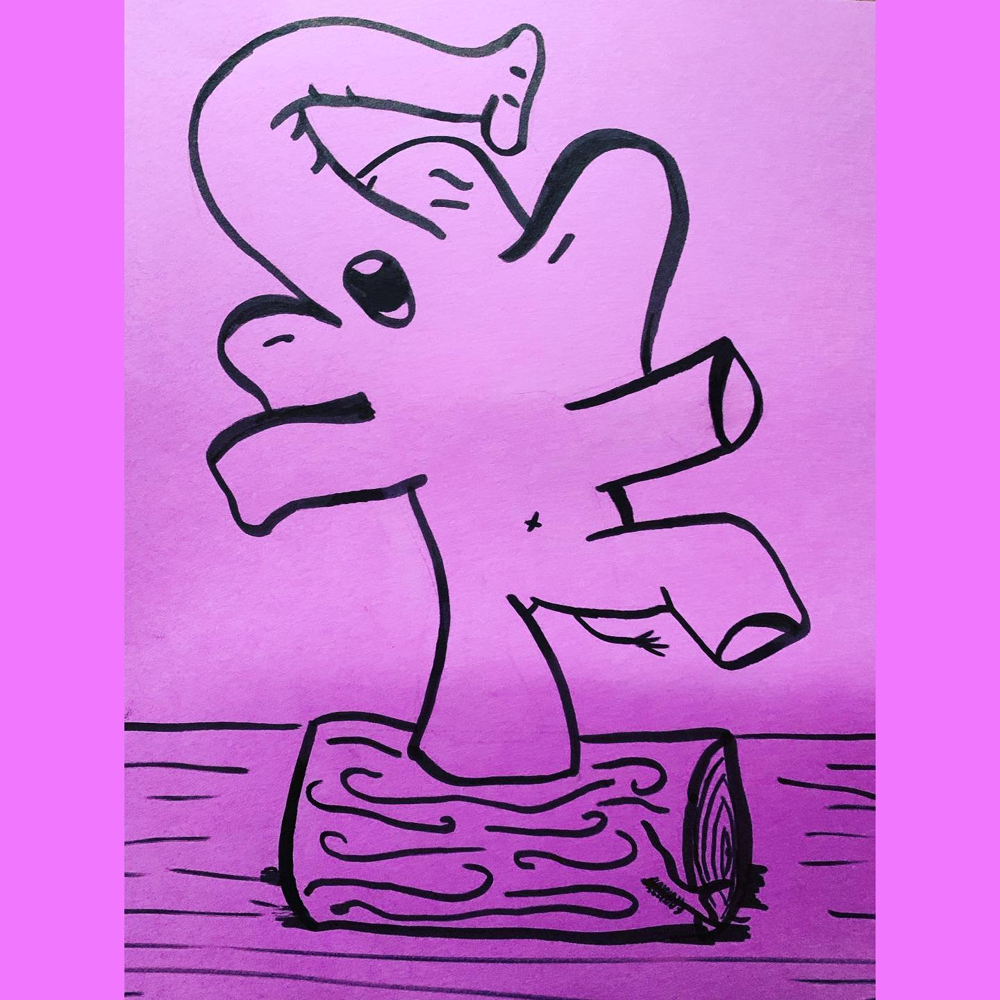
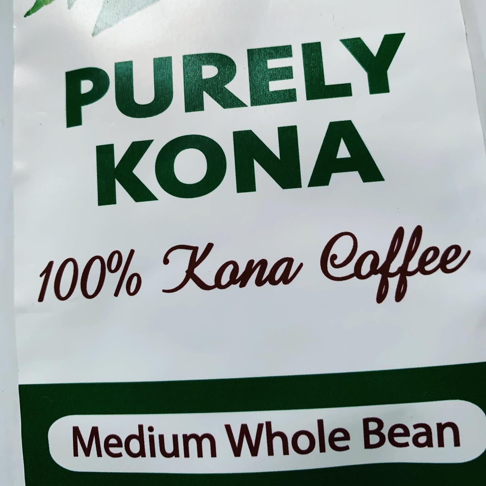
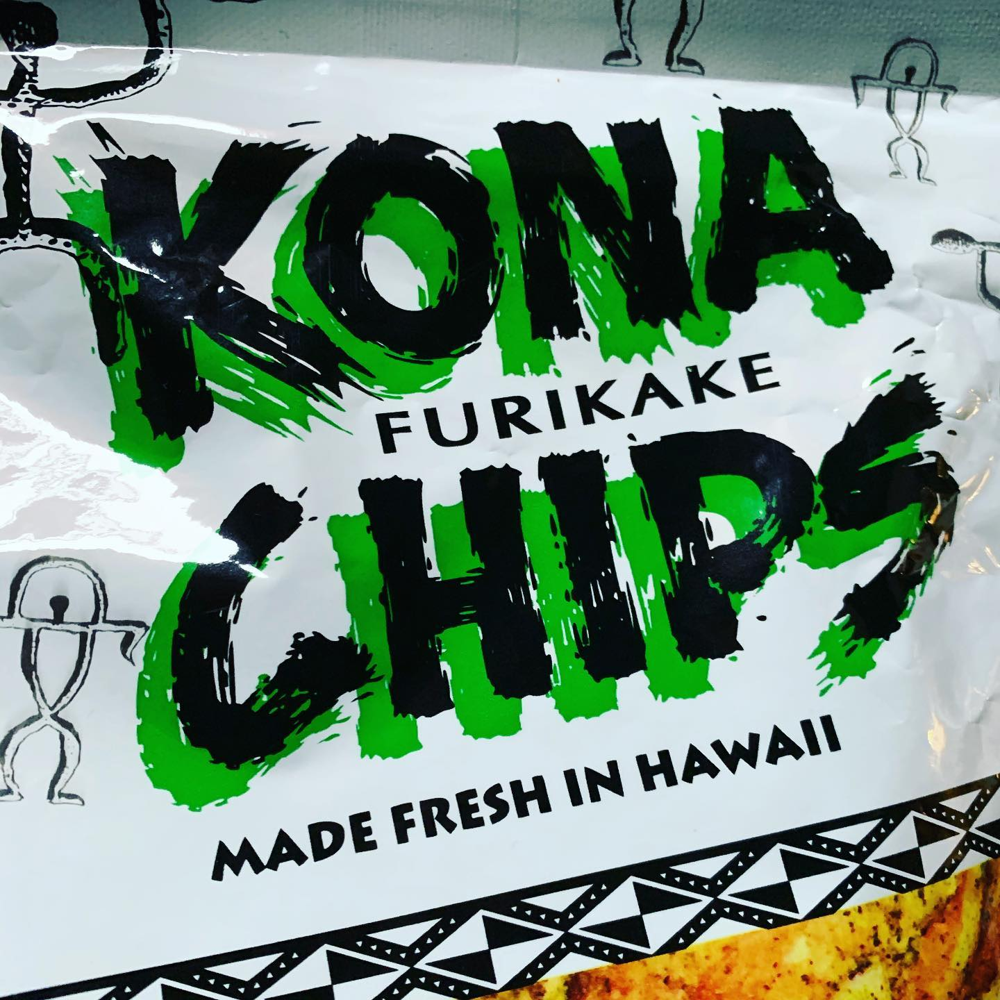
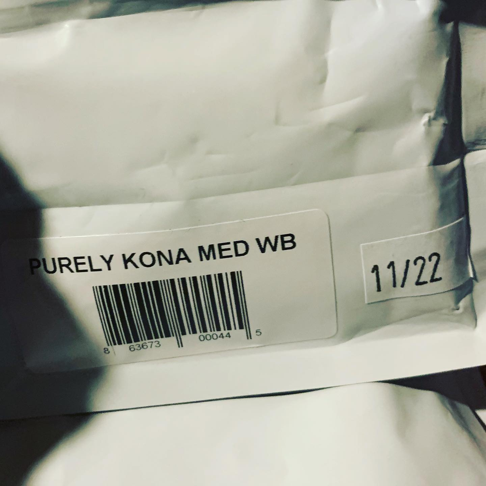

# Correspondence Part 4

> **Relationship:** Explicit satellite of [Excel Brewing Co](breweries/excel-brewing-co.html)
> **Source platform:** INSTAGRAM Export
> **Match Confidence:** 0.8 (via csv_name_inference)

### Caption / Correspondence Log:
```
I was super excited about #konacoffee only to get an elephant from @thehawaiijohnny that really stole the show here. The coffee is beyond excellent and I went for 16g coffee to 300g of 98° water. I always brew my coffee in Celsius since it takes less than half as many degrees as Fahrenheit. #drawmeanelephant
```

### Artifact Scans & Drawings:











### Provenance & Audit:
* **Source Path:** `Unknown`
* **Original entity ID:** `instagram/post-2190107038289966089`
