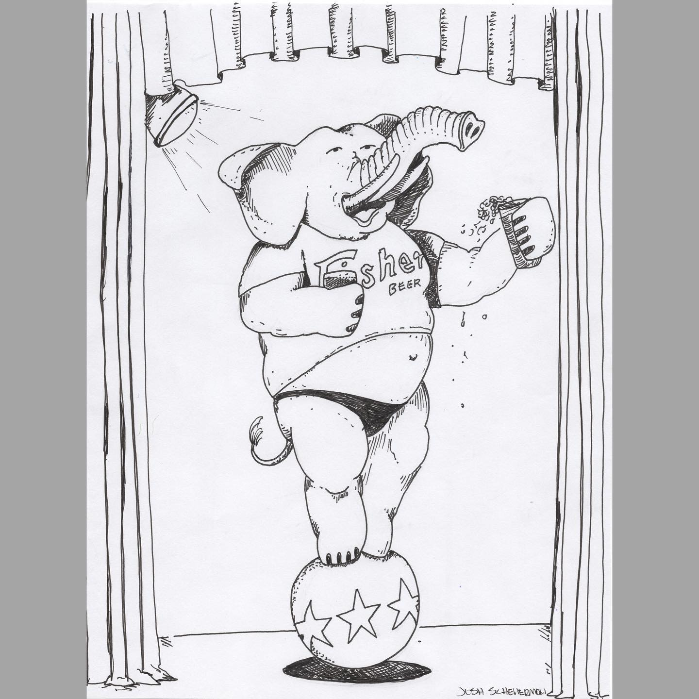
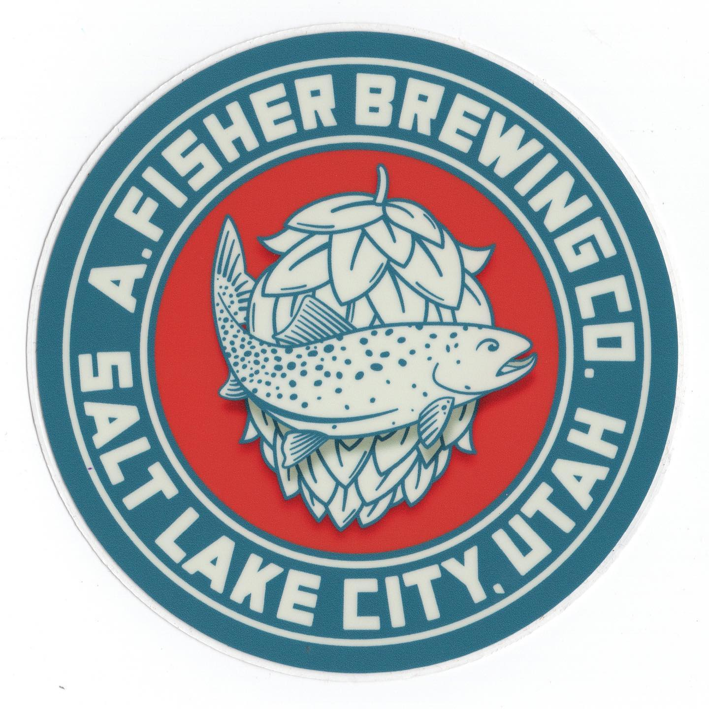
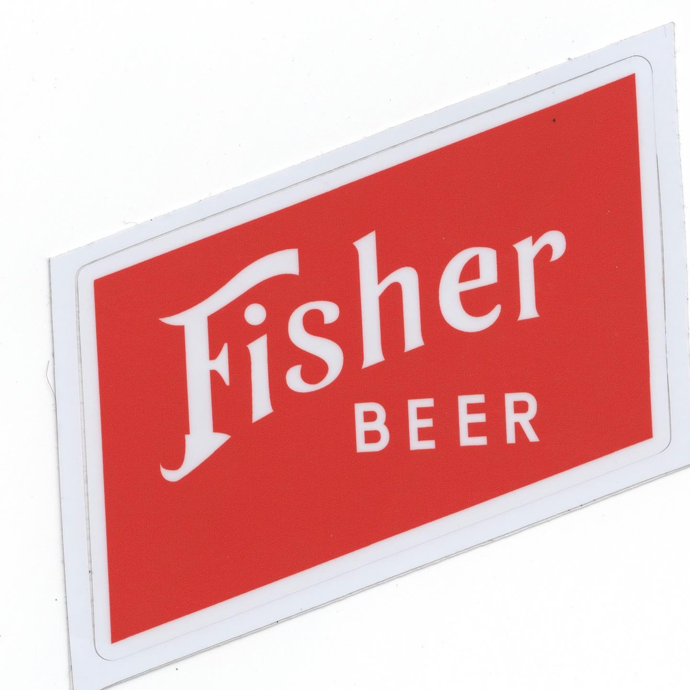

# Correspondence Part 2

> **Relationship:** Explicit satellite of [Fisher Brewing Company](/breweries/fisher-brewing-company.html)
> **Source platform:** INSTAGRAM Export
> **Match Confidence:** 0.8 (via csv_name_inference)

### Caption / Correspondence Log:
```
Okay so I said @fisherbrewing sent some other stuff and I think that’s called foreshadowing, which makes the rest of this shadowing. The sticker has a drop shadow on the whole hop and fish, which for some reason looks really good. I’m hoping they got “Drop-shadows. A Guide by Martin Buchanan”. The elephant is on some next level stuff and it’s kind of hard to describe. I will say that the shadows aren’t really aiming for realism even though this elephant is setting a much more reasonable standard of beauty compared to some of these model elephant types. This is thoroughly fine and you can all see that. 
Last sticker has that old old school vibe not done on a computer. Not sure who did the logo but I’d imagine them telling me they were cutting frisket while I was still in diapers. #drawmeanelephant #frisket #27bslash6 #beermoochingelephants
```

### Artifact Scans & Drawings:







### Provenance & Audit:
* **Source Path:** `Unknown`
* **Original entity ID:** `instagram/post-7908536401459378309`
