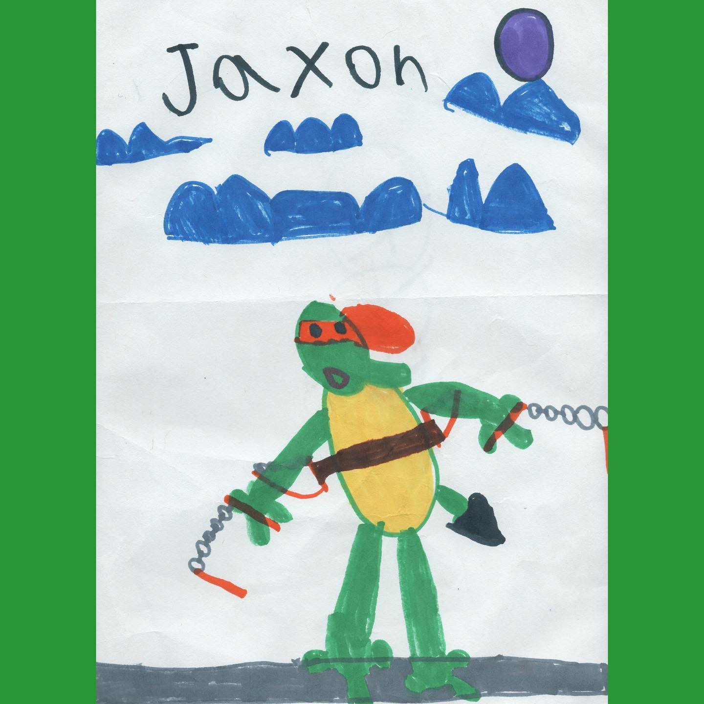
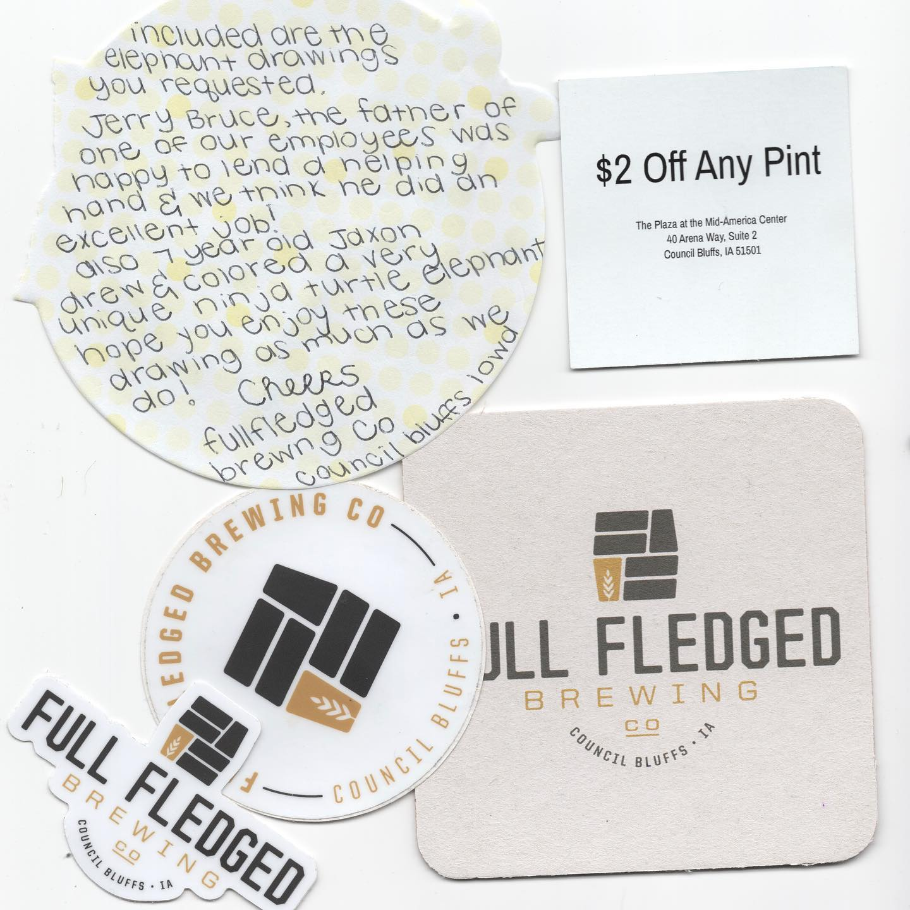

# Correspondence Part 1

> **Relationship:** Explicit satellite of [Full Fledged Brewing Company](breweries/full-fledged-brewing-company.html)
> **Source platform:** INSTAGRAM Export
> **Match Confidence:** 0.85 (via csv_hashtag)

### Caption / Correspondence Log:
```
I absolutely love that Jaxon was able to get an elephant in out of a ninja turtle. I am always super excited when the #brewerykids drawings come in. Also this had an awesome note that I think was a pad that had maybe @minniemouse or @hellokitty on it by the die cut, a $2 off of a beer, and some stickers. The whole thing came with 2 $1 stamps on it. Definitely an 11/10 effort and I didn't piece together until after that the one person who kept asking if I got the @fullfledgedbeer elephants and I kind of brushed them off like if they don't show no biggie. Totally would have been pissed to miss out on a Jaxon 2020 original. Thanks again #fullfledgedbrewing or #fullfledgedbeer or #whatevertheheckitis and Jaxon. #brewerykidsrock #drawmeanelephant
```

### Artifact Scans & Drawings:





### Provenance & Audit:
* **Source Path:** `Unknown`
* **Original entity ID:** `instagram/post-2830279036565935442`
