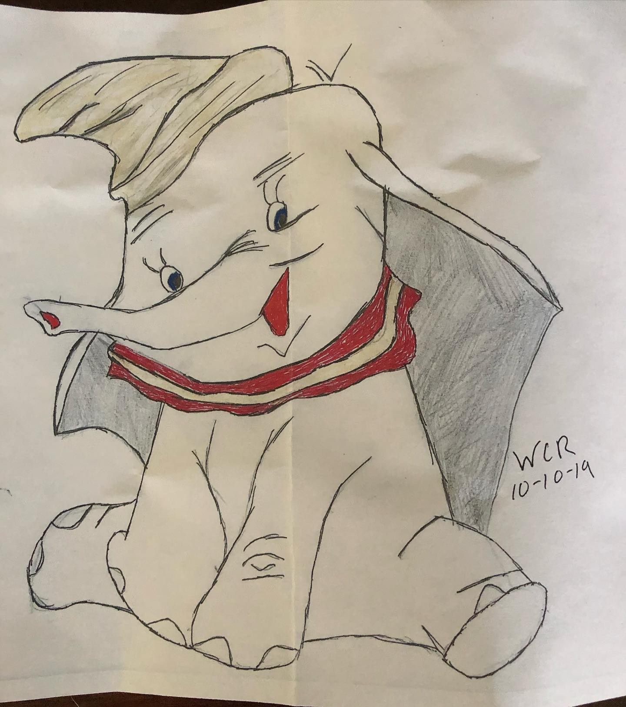
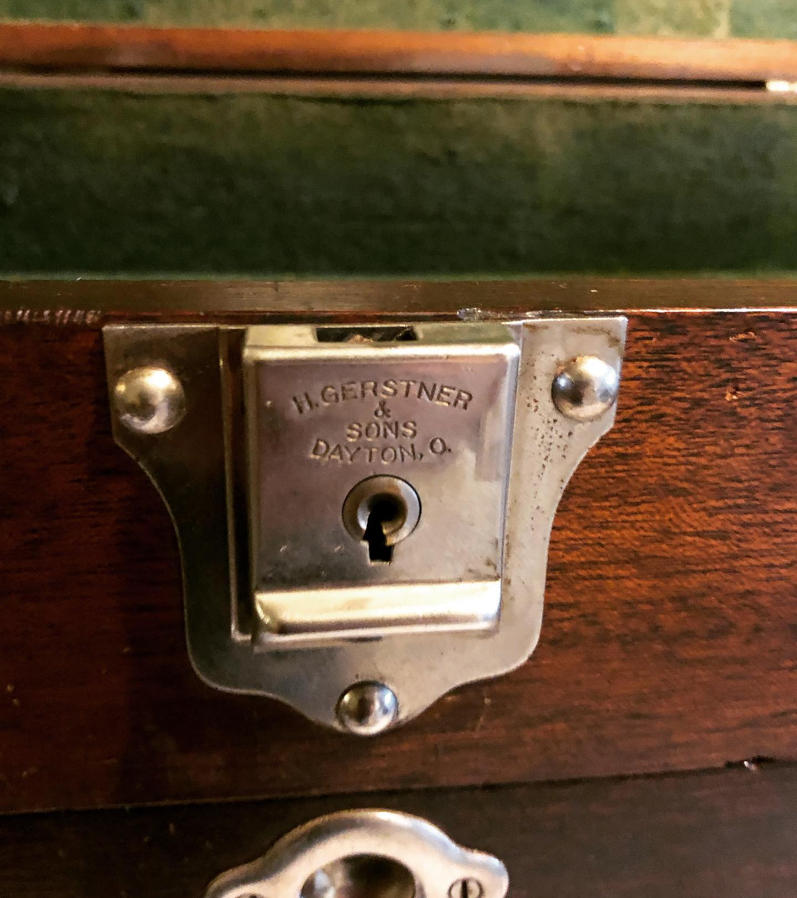

# Correspondence Part 1

> **Relationship:** Explicit satellite of [Hardware Brewing Co](breweries/hardware-brewing-co.html)
> **Source platform:** INSTAGRAM Export
> **Match Confidence:** 0.8 (via csv_name_inference)

### Caption / Correspondence Log:
```
Okay so I got a @gerstnerusa walnut machinist’s tool chest to hold my fountain pens and needed felt. They had a comment form that I of course put draw me an elephant. 
This is a photocopy of an elephant they drew so I don’t know if just getting felt is only good for a photocopy and I’d have to get a complete hardware set or have to mail for the original. Slightly confused. It would appear they drew themselves an elephant and sent me a copy at a cursory glance. #drawmeanelephant #gerstner
```

### Artifact Scans & Drawings:





### Provenance & Audit:
* **Source Path:** `Unknown`
* **Original entity ID:** `instagram/post-3720529502580201869`
