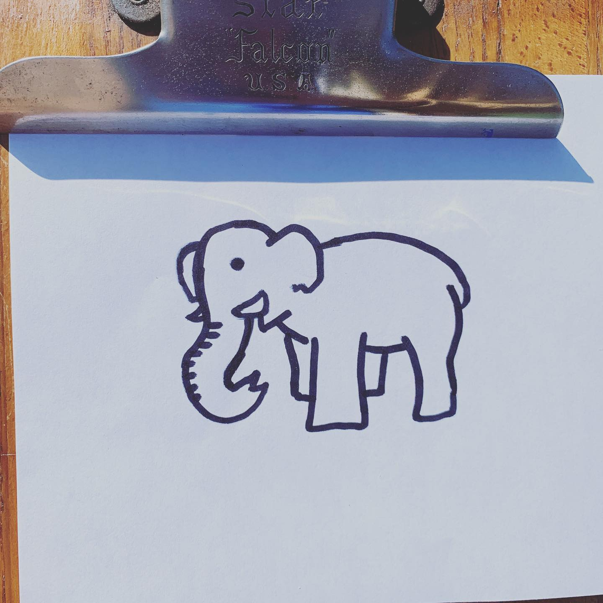
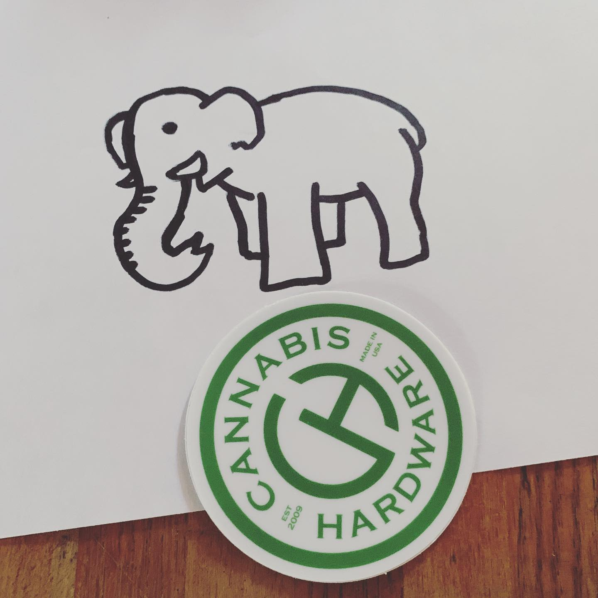
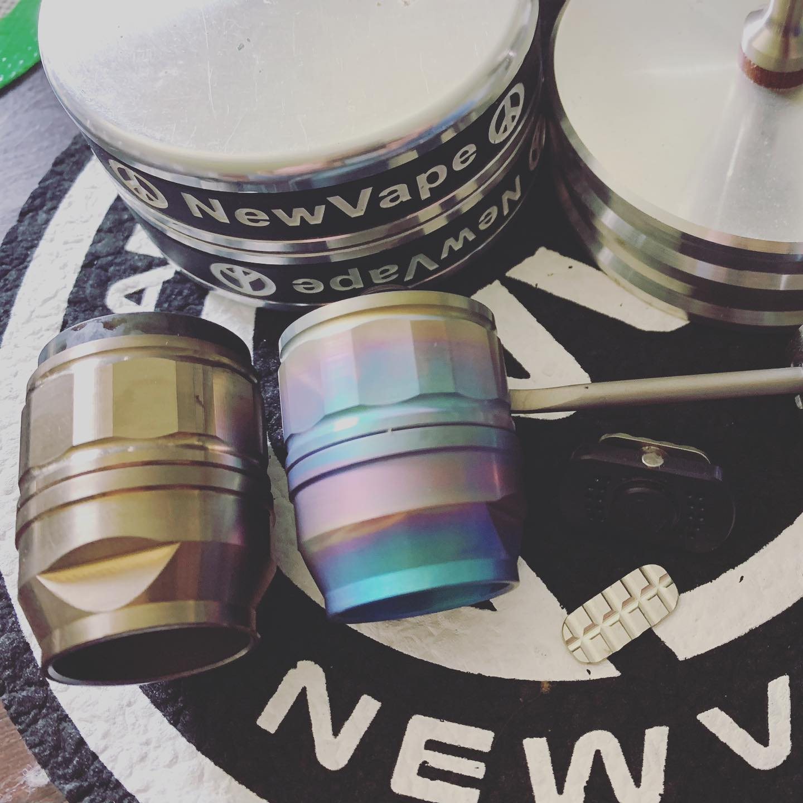
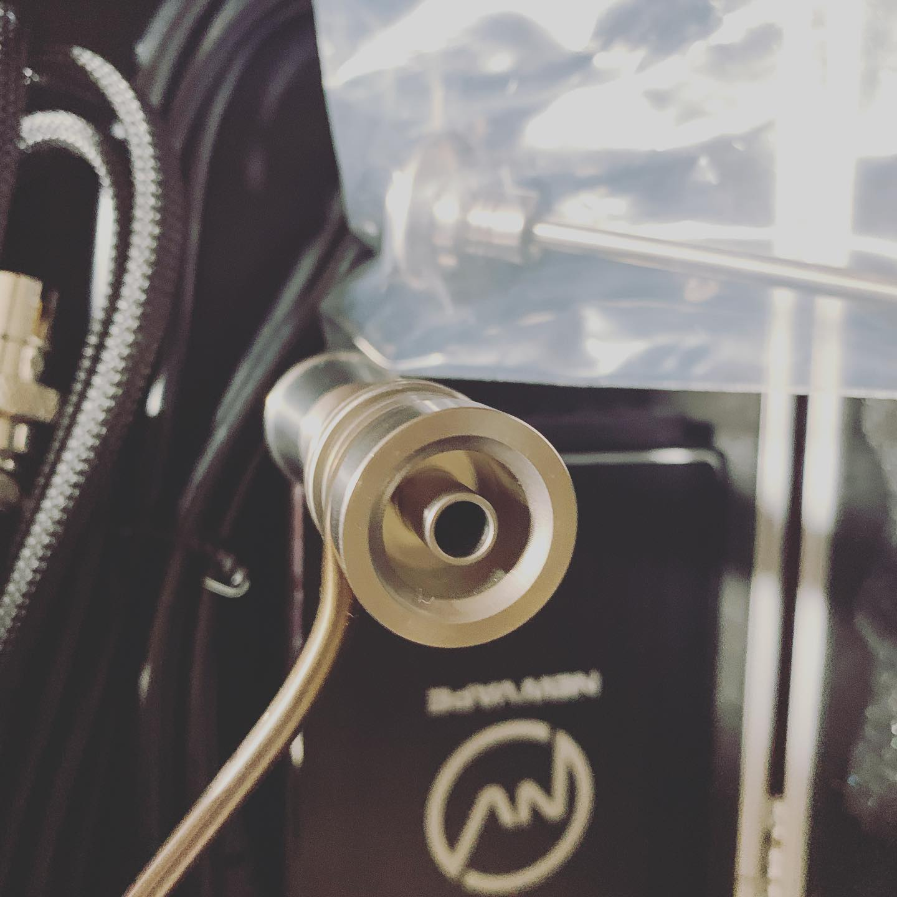
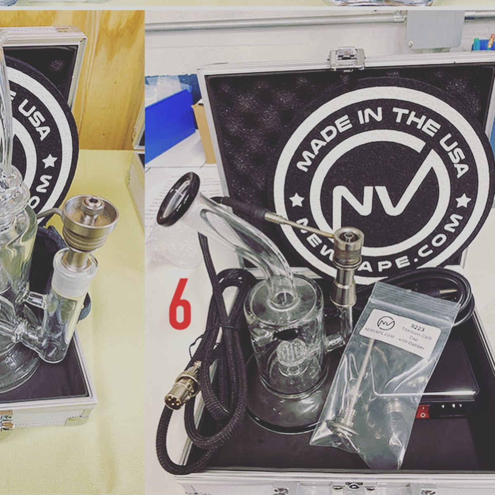
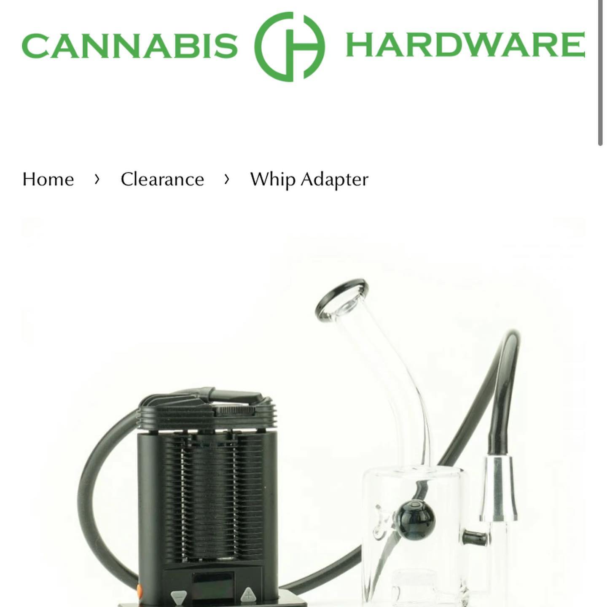

# Correspondence Part 2

> **Relationship:** Explicit satellite of [Hardware Brewing Co](/breweries/hardware-brewing-co.html)
> **Source platform:** INSTAGRAM Export
> **Match Confidence:** 0.8 (via csv_name_inference)

### Caption / Correspondence Log:
```
This is my favorite @cannabis.hardware elephant and it's got kind of a perspective thing that's just working for me. This would be like the Max Vapor Tsunami of elephants. I got this elephant with a bundle that didn't sell at a Florida thing for 4/20 on the cheap. The waterpiece that they sent was a former @newvape710 model for some of their products, such as this whip adapter if you're sliding between photos. It's almost sort of famous. #cannabishardware #newvape #drawmeanelephant
```

### Artifact Scans & Drawings:













### Provenance & Audit:
* **Source Path:** `Unknown`
* **Original entity ID:** `instagram/post-4558819159713070294`
