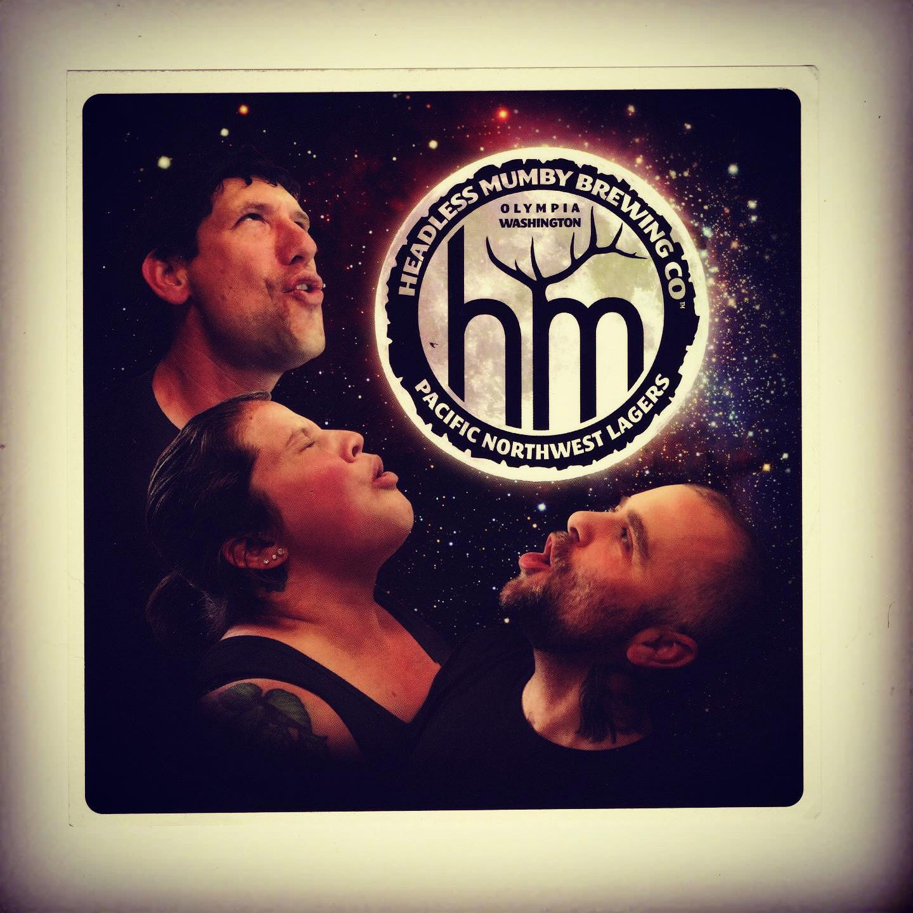
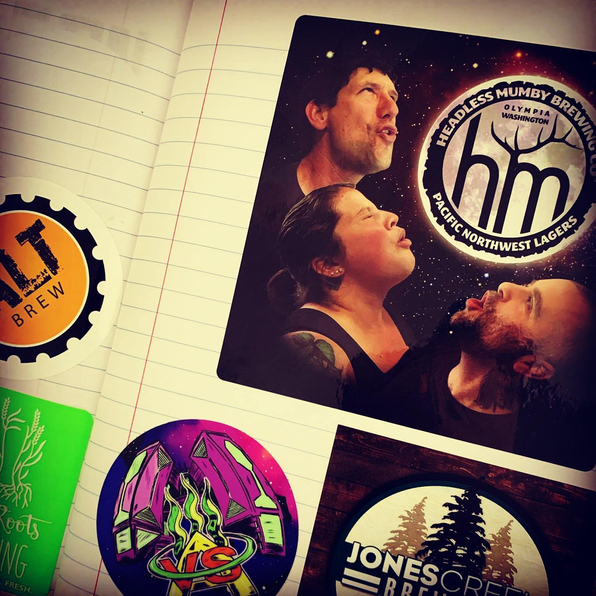

# Correspondence Part 2

> **Relationship:** Explicit satellite of [Headless Mumby Brewing Co.](breweries/headless-mumby-brewing-co.html)
> **Source platform:** INSTAGRAM Export
> **Match Confidence:** 0.85 (via csv_hashtag)

### Caption / Correspondence Log:
```
@headlessmumbybrewing sent in a bunch of elephants and also this #threewolfmoon themed sticker that is enormous! I’ll get to the elephants, but this this is enormous. Also, it’s really shiny and if you put your reflection in it right you can look like a 4th wolf, thereby increasing coolness. #headlessmumby #headlessmumbybrewing
```

### Artifact Scans & Drawings:





### Provenance & Audit:
* **Source Path:** `Unknown`
* **Original entity ID:** `instagram/post-4048412961876487076`
