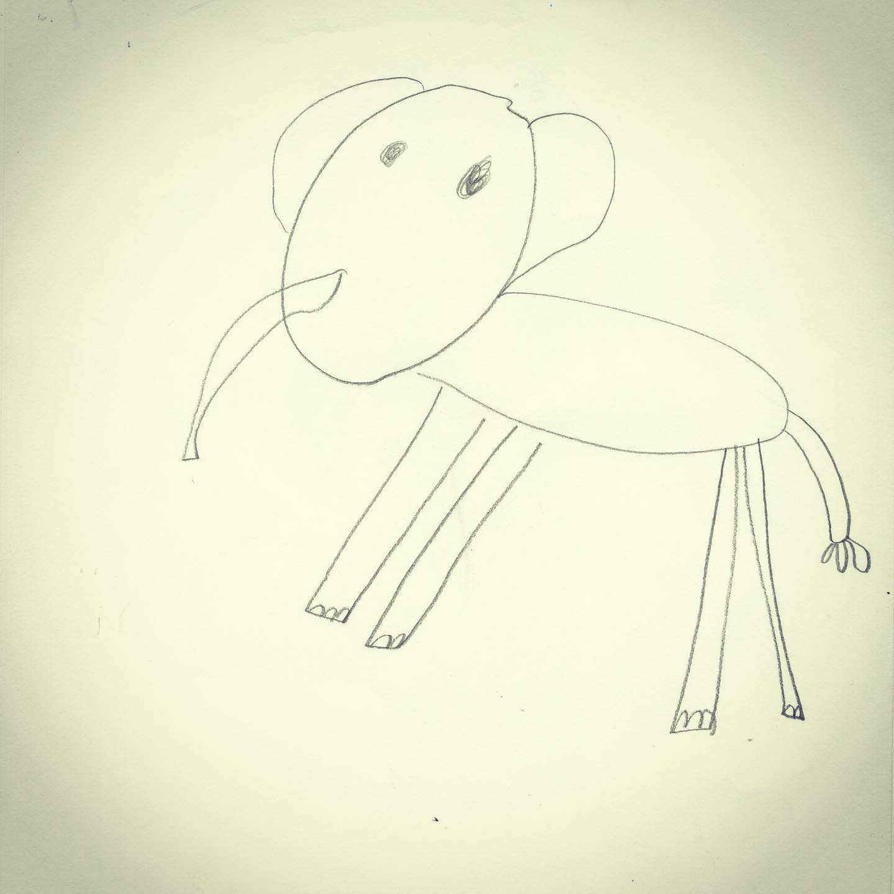
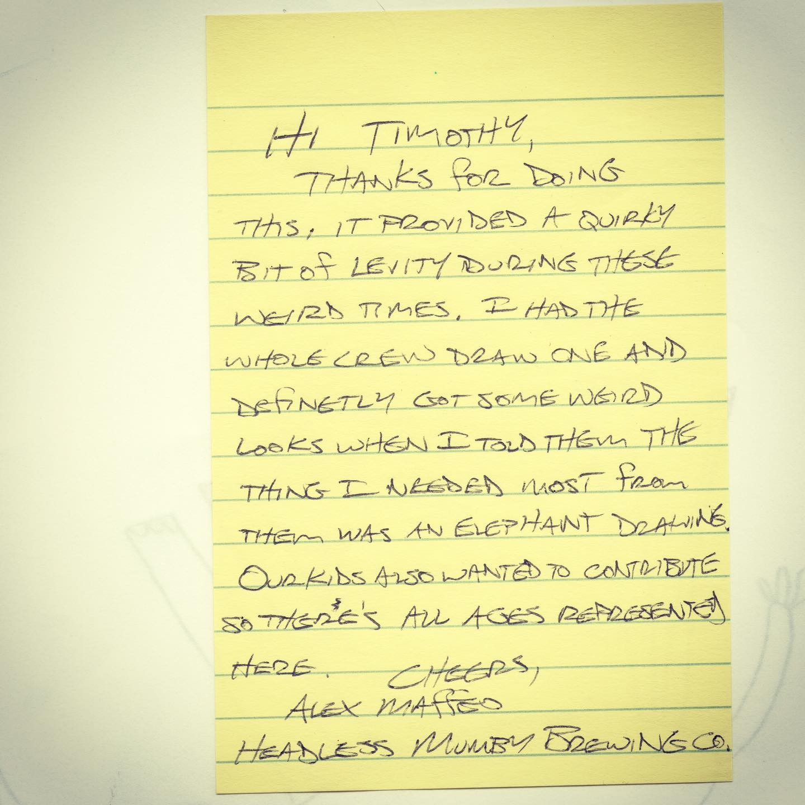

# Correspondence Part 4

> **Relationship:** Explicit satellite of [Headless Mumby Brewing Co.](/breweries/headless-mumby-brewing-co.html)
> **Source platform:** INSTAGRAM Export
> **Match Confidence:** 0.85 (via csv_hashtag)

### Caption / Correspondence Log:
```
Okay this was from Alex at @headlessmumbybrewing and I believe represents the Mumby portion of their business. Since this elephant was on the top of the stack and had the note I’ll assume this is Alex’s work. I think maybe some eyebrows would help this, but when someone goes #onetakejake on it all no eraser like it is hard to nitpick an otherwise perfect elephant . Love the #penmanship and especially #allcaps which is how I like to write #allcapsalldayeveryday and really the first thing I think when I see something not in all caps is “should I even bother?” #drawmeanelephant #headlessmumbybrewing
```

### Artifact Scans & Drawings:





### Provenance & Audit:
* **Source Path:** `Unknown`
* **Original entity ID:** `instagram/post-5380043345932090706`
