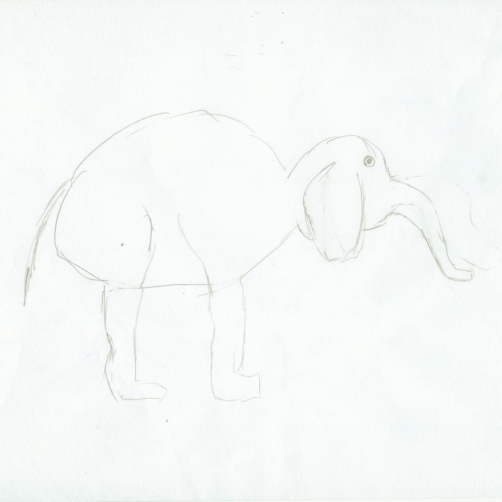
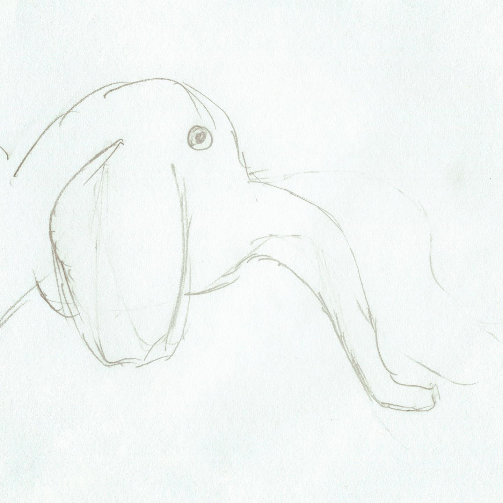

# Correspondence Part 5

> **Relationship:** Explicit satellite of [Headless Mumby Brewing Co.](breweries/headless-mumby-brewing-co.html)
> **Source platform:** INSTAGRAM Export
> **Match Confidence:** 0.85 (via csv_hashtag)

### Caption / Correspondence Log:
```
Another @headlessmumbybrewing piece that really shows they didn't settle on getting these elephants just perfect even if it took a little eraser work. It really paid off. At first I thought the line in the center was the elephant's belly, but I think that's how an elephant wears a miniskirt sort of like #ifadogworepantswouldhewearthem #drawmeanelephant #headlessmumby #headlessmumbybrewing
```

### Artifact Scans & Drawings:





### Provenance & Audit:
* **Source Path:** `Unknown`
* **Original entity ID:** `instagram/post-8257333499352295355`
