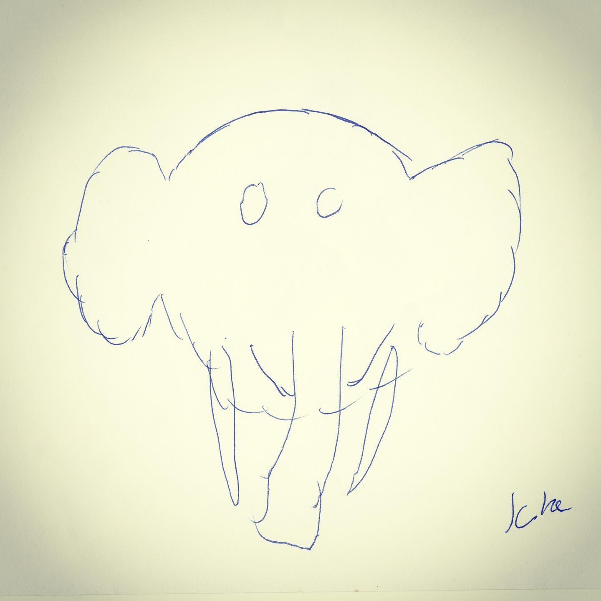
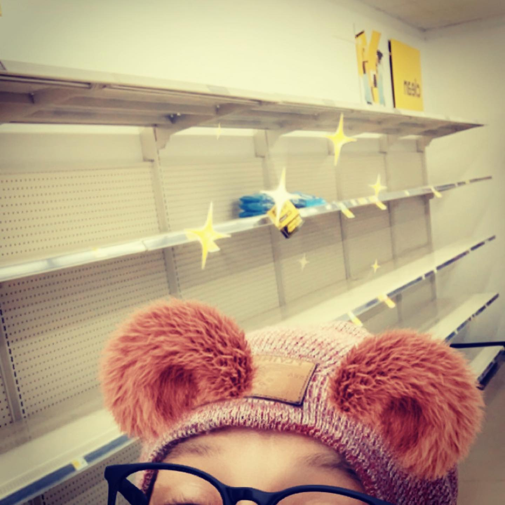

# Correspondence Part 9

> **Relationship:** Explicit satellite of [Hopkinsville Brewing Company](/breweries/hopkinsville-brewing-company.html)
> **Source platform:** INSTAGRAM Export
> **Match Confidence:** 0.8 (via csv_name_inference)

### Caption / Correspondence Log:
```
I'm sure whoever drew this one didn't expect it to make the cut. Fortunately @hopkinsvillebrewingcompany didn't have a cut. If they had used toilet paper instead of regular paper that may have improved the value of the art as apparently the only thing anyone in three counties of me is worried about is pooping. #drawmeanelephant
```

### Artifact Scans & Drawings:





### Provenance & Audit:
* **Source Path:** `Unknown`
* **Original entity ID:** `instagram/post-8587598835063598292`
