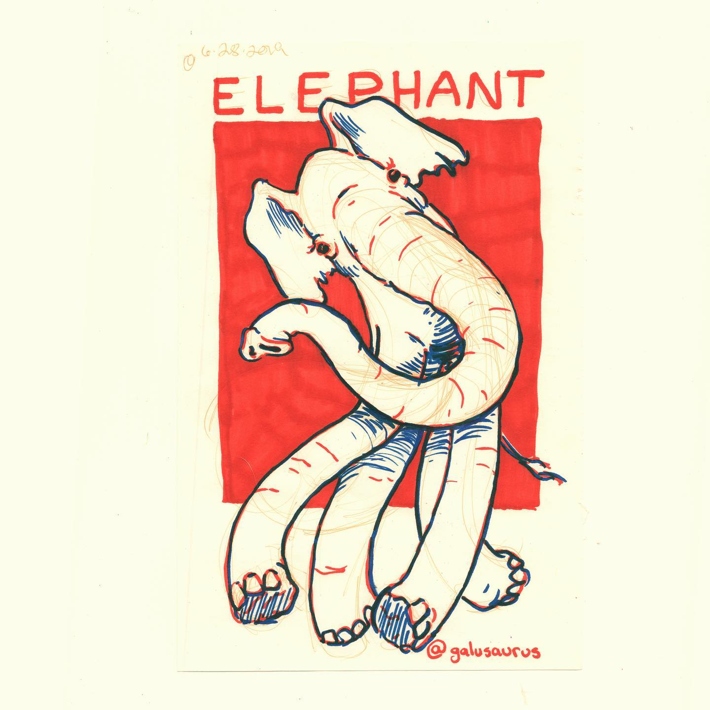
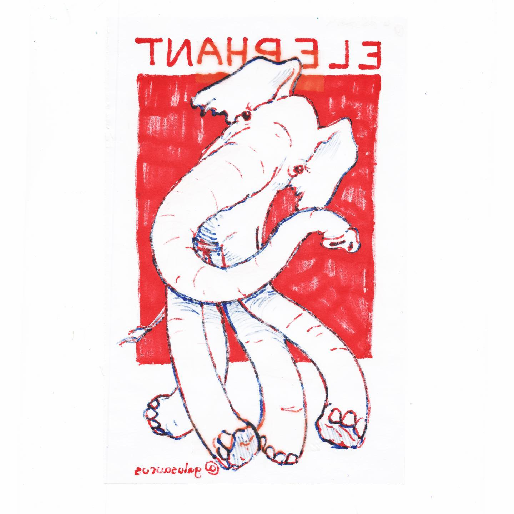
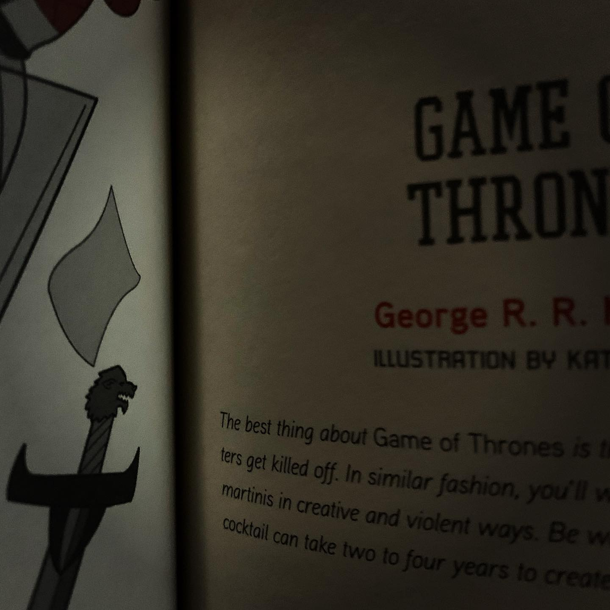
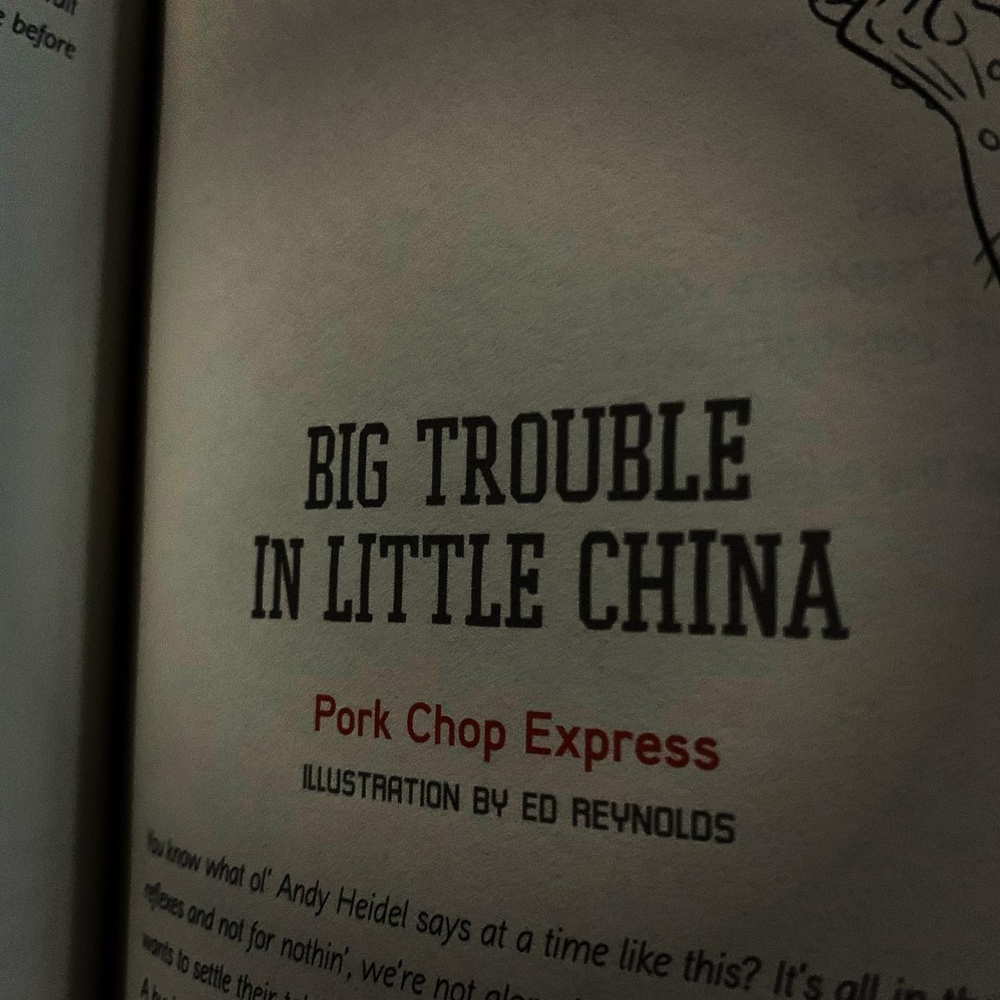
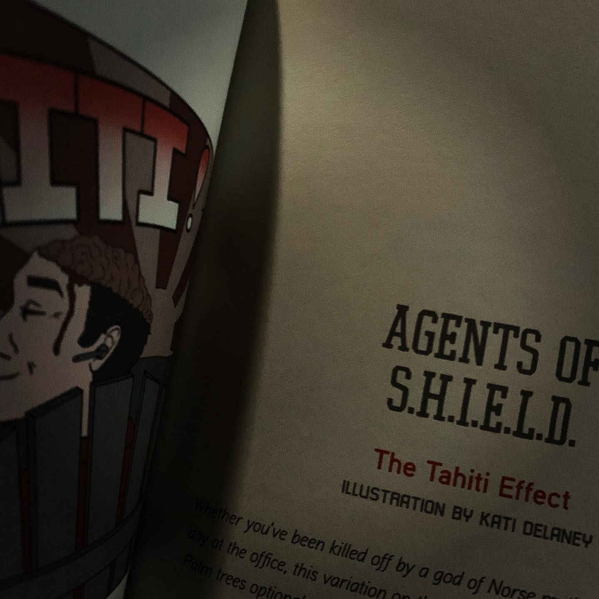
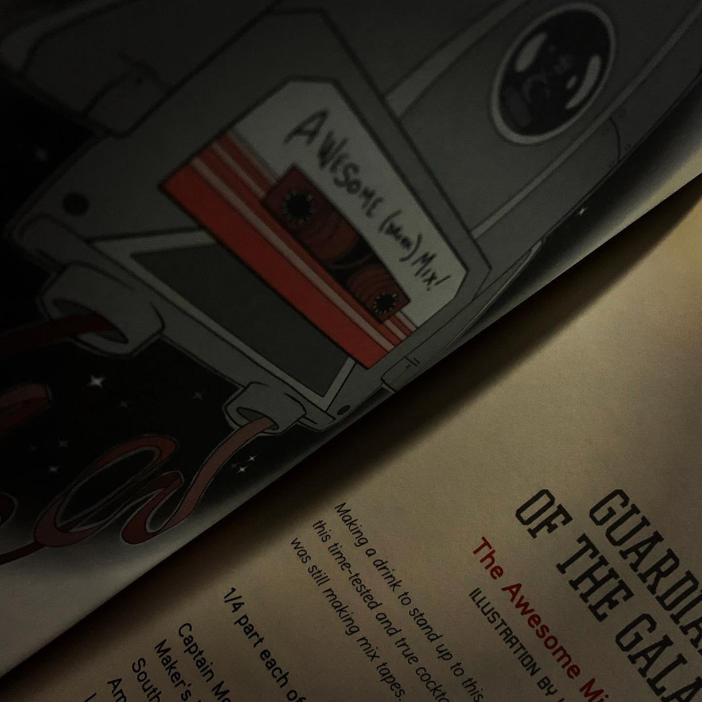
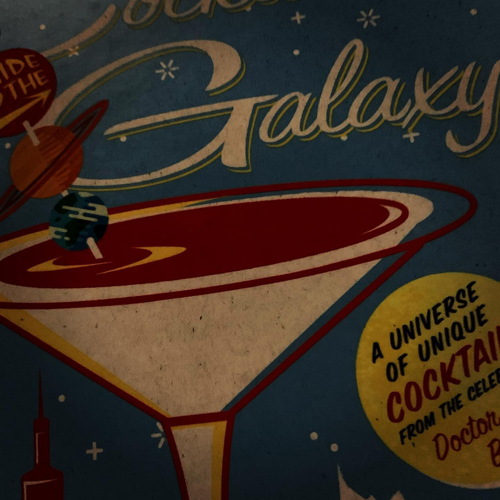
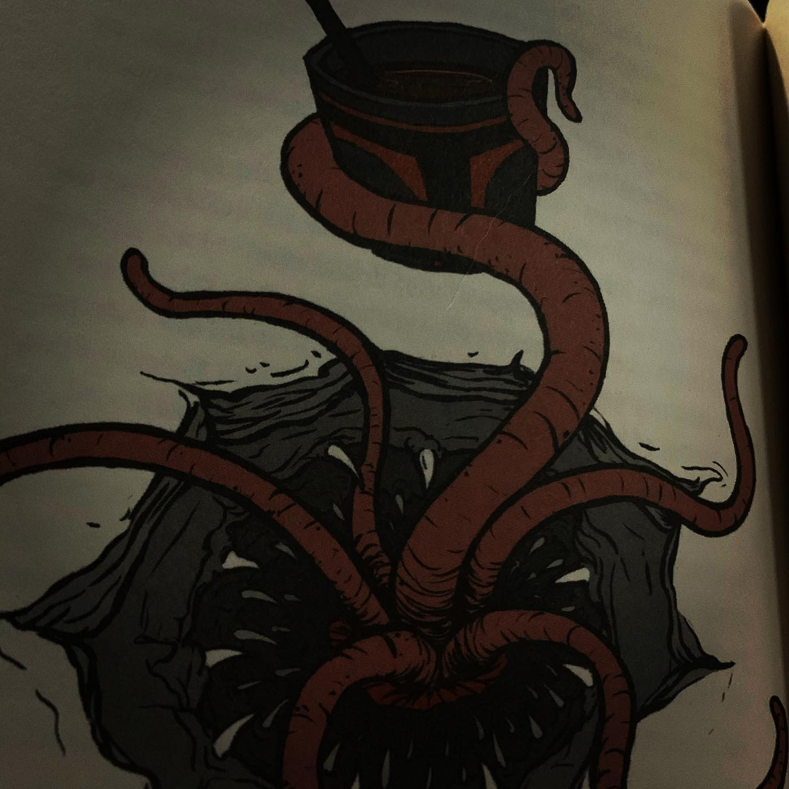

# Correspondence Part 1

> **Relationship:** Explicit satellite of [Ike & Oak Brewing Company](/breweries/ike-oak-brewing-company.html)
> **Source platform:** INSTAGRAM Export
> **Match Confidence:** 0.8 (via csv_name_inference)

### Caption / Correspondence Log:
```
Okay so this is the prized piece I think of all @thewaystation  elephants 🐘 This #TheWayStationDayStation is a #twofertuesday on a Saturday as both day 22 for the front and day 26 for the back. The artist is @galusaurus who is just amazing. This one is in the showdown for the top three best I have in my collection and I'm truly honored to own this one. It's really the prize of my collection, though sentimentally I like others more (including a trunk only piece she also did). She did some art including the #starwars #sarlacczerac illustration from #cocktailguidetothegalaxy which is pretty close to a drink that was popular at @grendels_den when I went there ages ago and is a #gentlemanscocktail aka #shitton of #booze which are charming if you want all the frill and fuss of a girlie drink but more like oak candy. Also the book showed up and here's some terrible photos that prove I own it but don't spoil the content. It's actually a fantastic book and pretty much the exact same thing as #mulesandmore book in style but actually good. It's not the first shot by any means at a drink recipe book but it's kind of holy hell out there good. I looked through their Instagram or something from when they were finishing the book up and I failed to realize the thing is an insanely professional book. In the course of thumbing through that I saw they also closed down due to COVID-19 permanently as that shit's unworkable for where they are in Brooklyn for a long time. That was kind of a bummer and if anyone notices I try to keep things not serious this sort of thing is really a reminder of the crippling effect COVID-19 has had on my potential elephant artists. #drawmeanelephant #walloftext
```

### Artifact Scans & Drawings:

















### Provenance & Audit:
* **Source Path:** `Unknown`
* **Original entity ID:** `instagram/post-6549867856468155844`
