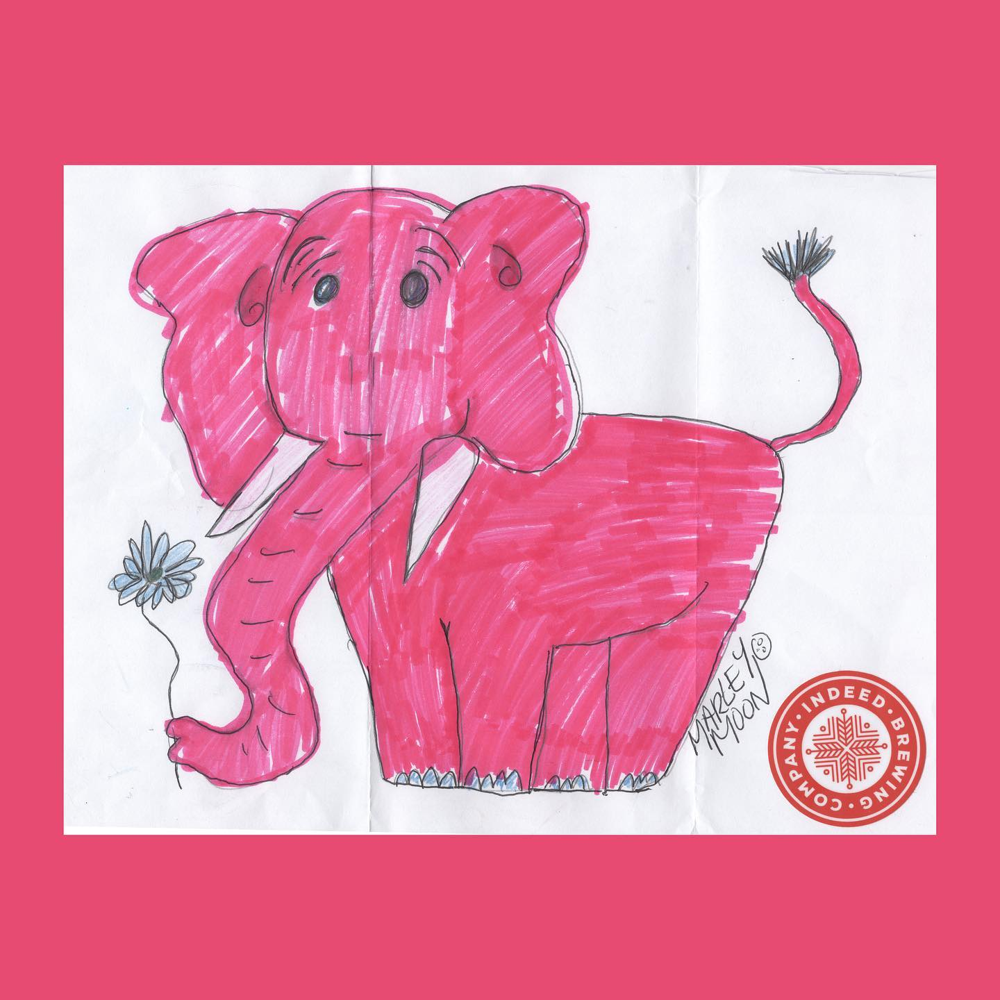
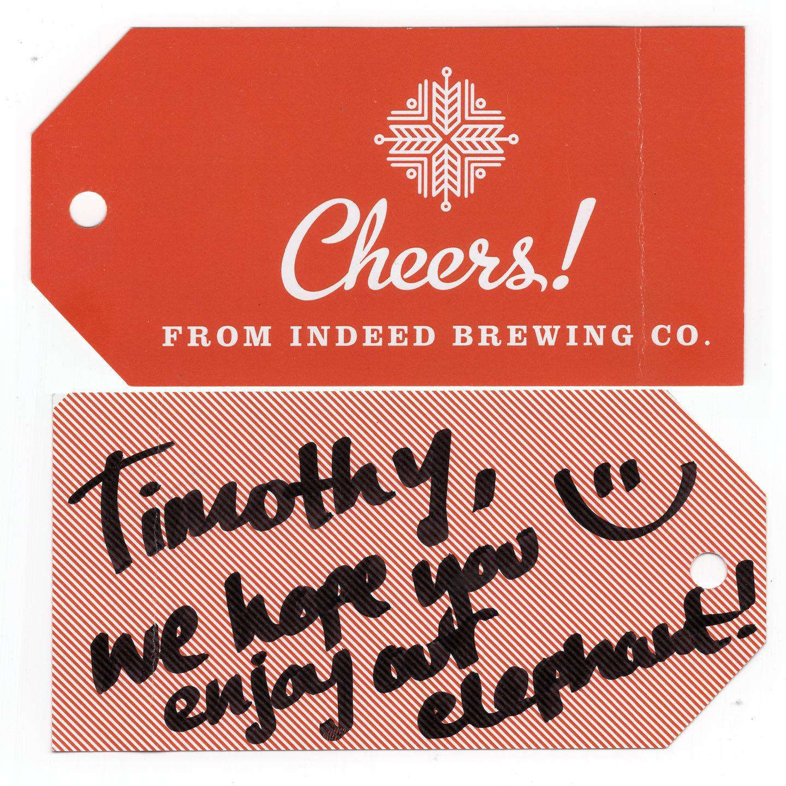
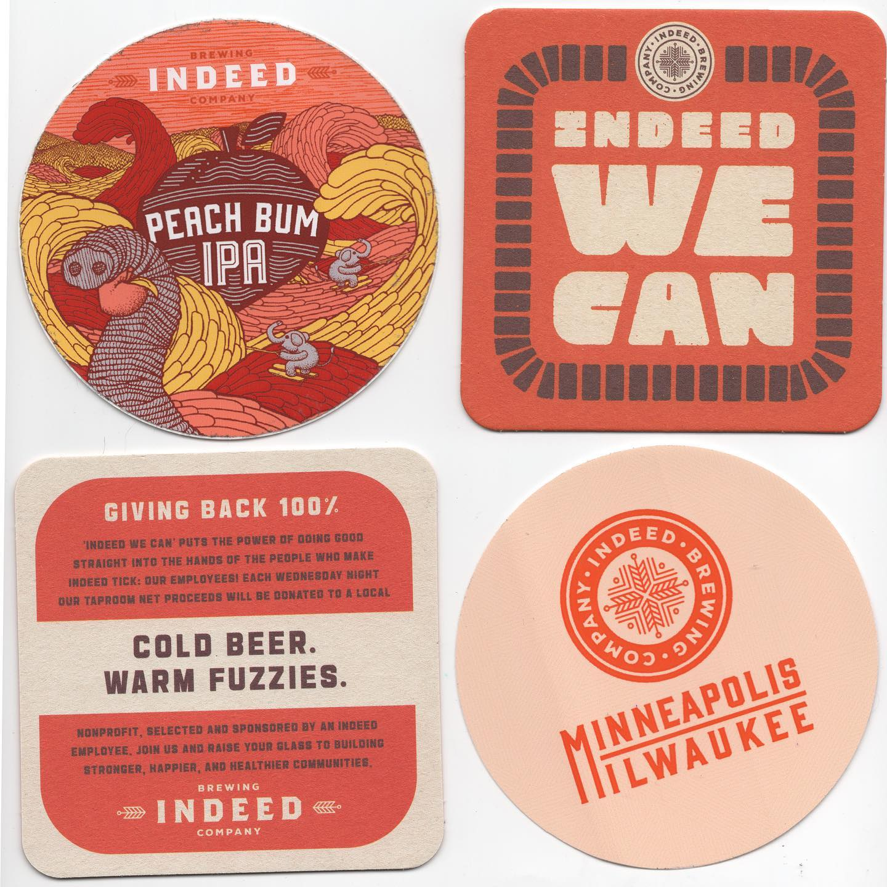

# Correspondence Part 1

> **Relationship:** Explicit satellite of [Indeed Brewing Co](breweries/indeed-brewing-co.html)
> **Source platform:** INSTAGRAM Export
> **Match Confidence:** 0.8 (via csv_name_inference)

### Caption / Correspondence Log:
```
Every time I read the word “indeed” I feel five points smarter and seven points cheekier. @indeedbrewing covered every base imaginable here to make this this adorable #pinkelephant presenting a flower welcome, including an #indeedbrewing gift tag, coasters, and two stickers. One of the stickers features a beer they brewed that has elephants water skiing on their label, which I have never seen on a beer label until today. Huge thanks to Marley Moon for the artwork. #drawmeanelephant #peachbumipa #indeedminneapolis
```

### Artifact Scans & Drawings:







### Provenance & Audit:
* **Source Path:** `Unknown`
* **Original entity ID:** `instagram/post-1336885200328518387`
