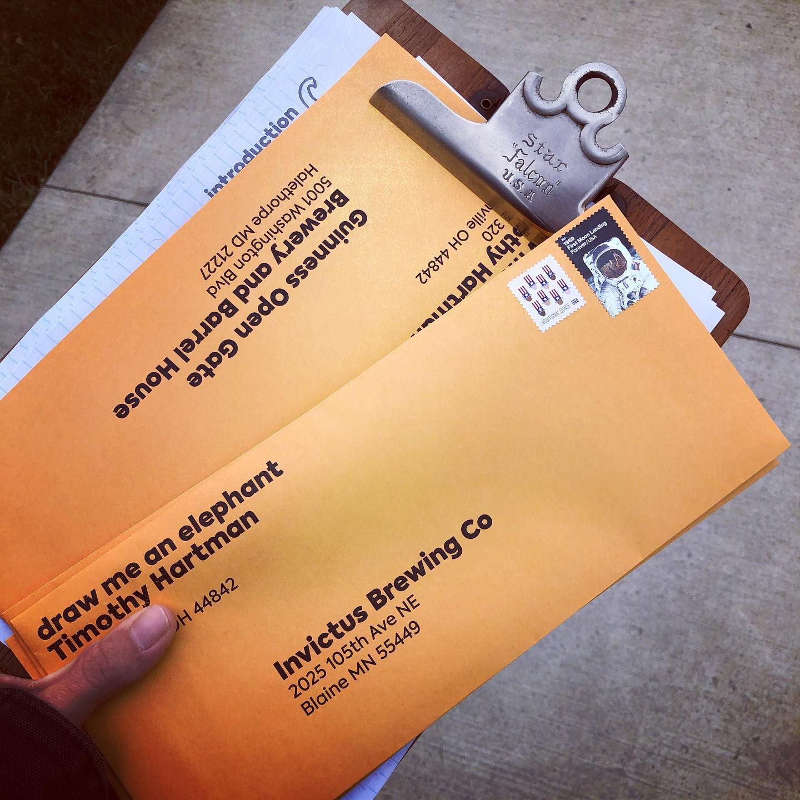
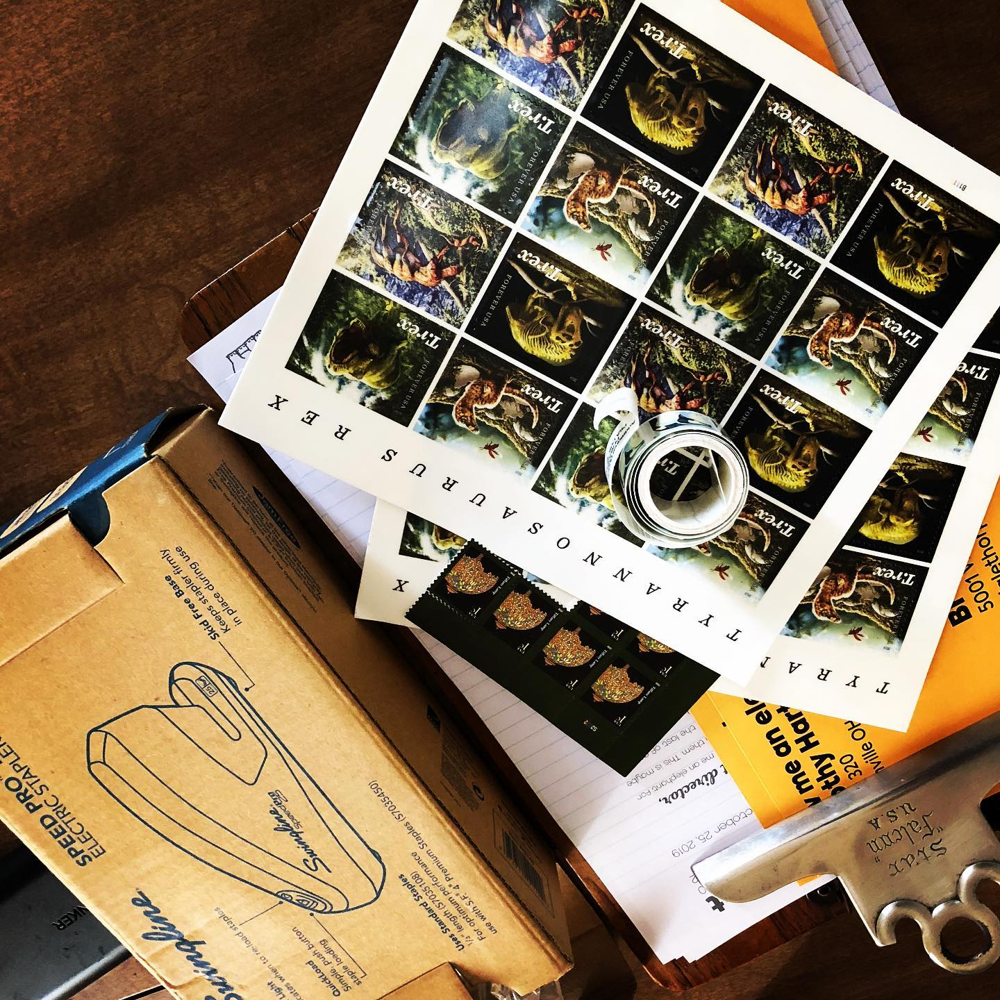
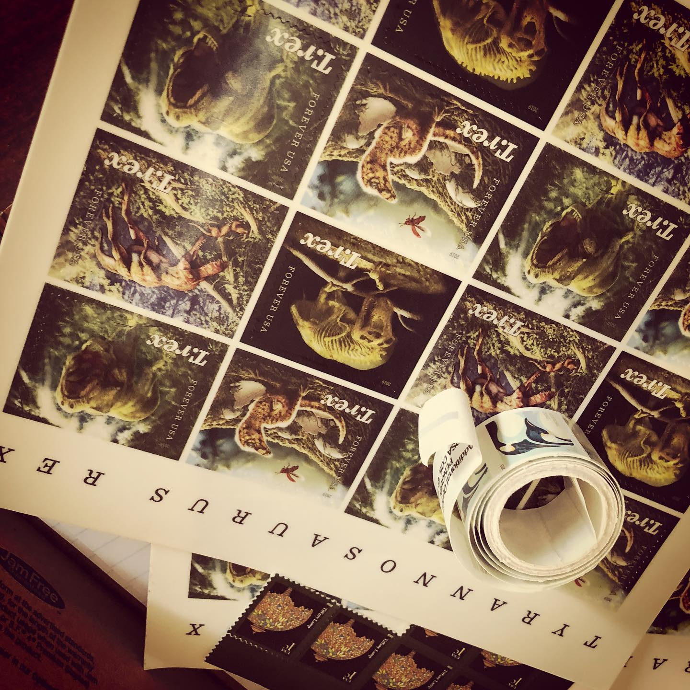

# Correspondence Part 1

> **Relationship:** Explicit satellite of [Invictus Brewing Co](breweries/invictus-brewing-co.html)
> **Source platform:** INSTAGRAM Export
> **Match Confidence:** 0.8 (via csv_name_inference)

### Caption / Correspondence Log:
```
Pretty slow couple weeks on elephants. Started mailing more large envelopes and got new #penguin and #danasaur stamps. My cost per elephant request went up about 16¢ but that's a small price to pay. 
Mailing out to Invictus who I saw in a @donosborn segment the other day among others.
```

### Artifact Scans & Drawings:







### Provenance & Audit:
* **Source Path:** `Unknown`
* **Original entity ID:** `instagram/post-5624015897631692246`
