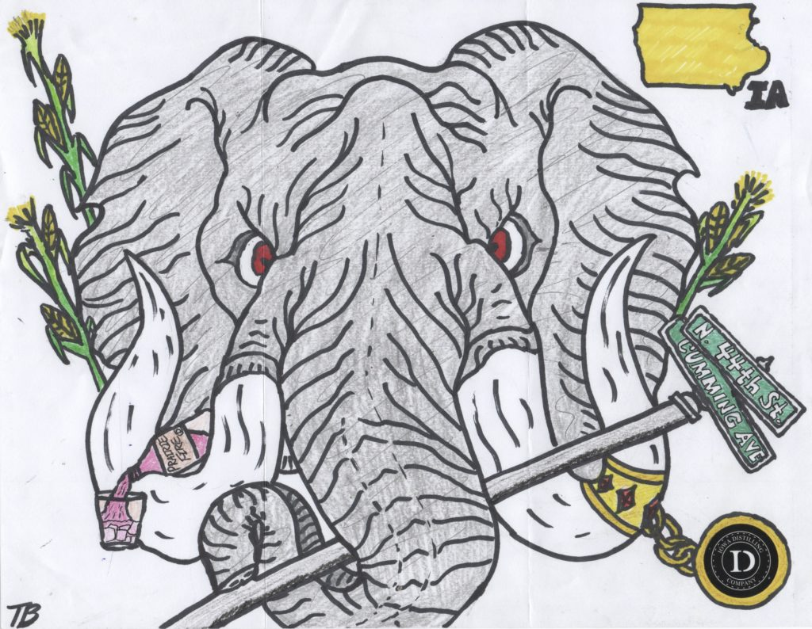

# Iowa Distilling Company

> [!NOTE]
> **Brewery Metadata**
> * **Location:** Cumming, IA 50061
> * **Address:** 4349 Cumming Ave
> * **Type:** Distillery
> * **Correspondence Date:** yes
> * **Response Received:** Yes

<!-- boris-migration-provenance
source_format: wordpress-wxr
source_export: DMAE/drawmeanelephant.WordPress.2026-07-20.xml
post_id: 95
post_type: page
guid: https://www.drawmeanelephant.com/?page_id=95
post_name: iowa-distilling-company
author: Timothy
post_date: 2019-06-28 17:57:48
link: https://www.drawmeanelephant.com/iowa-distilling-company/
conversion: human_review
-->

<figure class="wp-block-image"><figcaption>Elephant drawn by Iowa Distilling Company intern.</figcaption></figure>

I don't remember exactly when I wrote these guys but I think I was doing a series of letters to places in that area and they ended up getting thrown in to the mix. As with most of the place I've written the addresses are given to me so I never know what to expect or the size of the outfit I'm writing and [Iowa Distilling Company](http://www.iowadistilling.com) was no exception. I haven't got anything back from the others I wrote then and think this was pretty recent, but it's hard to say at this point as I haven't conquered my backlog.

This was one of the finest elephants I've seen yet and it came with a really nice letter explaining that they pawned the work off on an intern (wise move, I often encourage when writing just to pawn the work off as I will not know the difference) and some of the rationale, company stuff. Short note, but really effective and pretty much on the same level of effort I put in to my elephant request (low effort, highly thoughtful). It included [Prairie Fire](https://iowadistilling.com/spirits/), which is a cinnamon whiskey, which isn't my cup of tea but those go like crazy these days. It looks like they make a pretty decent number of boozes and I'd be curious about their bourbon a little bit, but I always was pretty set on some fancy bourbons so that could be a letdown. It would appear they have a 150 proof Rocket Fuel which I assume is some kind of corn moonshine type of concoction since they also have moonshine. Not sure what it is about moonshine but it never tastes the same to me when it's legal and honestly Tennessee moonshine is the only kind I've ever cared for.

#### Why am I rambling about booze?

The elephant is really well done and features their street, their booze, some corn (which I assume is a nod to Iowa as well as it being the most important grain they distill from), a little bling showing off the distillery logo as a sticker, and the shape of the state of Iowa and it's abbreviation, which is pretty handy as I'm going to mistake Iowa for whatever state is nearby and somewhat rectangular. The only differences I can tell you between Iowa and Idaho are corn vs potatoes and Iowa has the best school in the country for psychology. I only know that part because my brother went to the second best school in the country for psychology which had a big perk of being not in Iowa.

## Nice people

Gave these guys a call to thank them for drawing me an elephant, which I do sometimes. I often write a thank you letter but I usually try to give a call around 11 a.m. assuming they say they open at noon or sooner just so it's not catching them when they have to deal with the public. Most of the places I write are more on the scale of the brewery is also where the bulk of the product is consumed so I don't want to get in the way of that. With distilleries probably not so much but I still do the same. These guys were fairly super nice on the phone and I hate phones anyway. It's maybe something to just skip but I still do it. I've called places that have sent me elephants and they have had no clue what I'm talking about, which is sort of weird embarrassing. Dude listened to me ramble for five minutes and seemed like a nice guy and fully aware of the elephant situation, so that was a big plus.

## Satellites & Correspondence

{{children}}

### Correspondence Links

*   📁 [Iowa Distilling Company Correspondence Part 1](iowa-distilling-company/instagram-1.html)
*   📁 [Iowa Distilling Company Correspondence Part 2](iowa-distilling-company/instagram-2.html)

