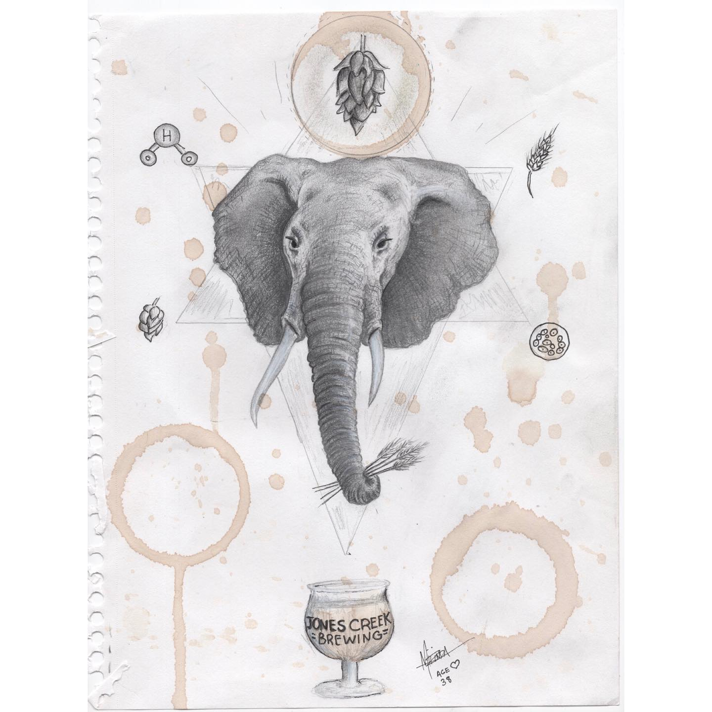
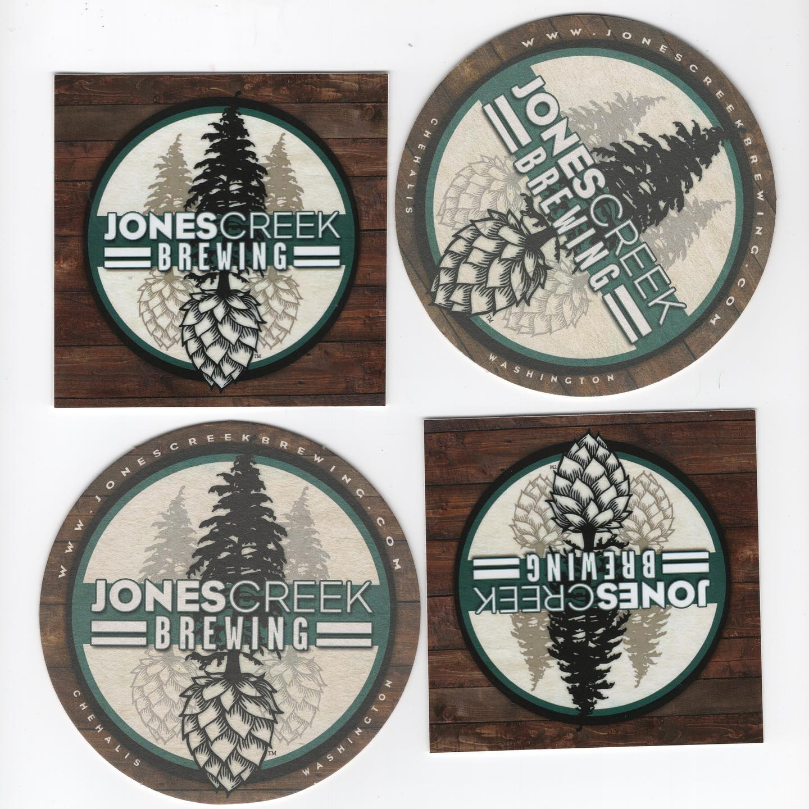

# Correspondence Part 1

> **Relationship:** Explicit satellite of [Jones Brewing Co](breweries/jones-brewing-co.html)
> **Source platform:** INSTAGRAM Export
> **Match Confidence:** 0.8 (via csv_name_inference)

### Caption / Correspondence Log:
```
@jonescreekbrewing makes #beermoochingelephants explain the whole process of brewing beer in order to get free drinks. Elephants are naturally quite adept at explaining saccharide chains (and really more over any carbohydrate), so they added some geometry. There’s no stopping elephants from mooching beers and once this elephant explains the crystal malt in its trunk that beer has a new home. #drawmeanelephant #jonescreekbrewing #washingtonstate #washingtonbeer #nameandage
```

### Artifact Scans & Drawings:





### Provenance & Audit:
* **Source Path:** `Unknown`
* **Original entity ID:** `instagram/post-7428028673424375198`
