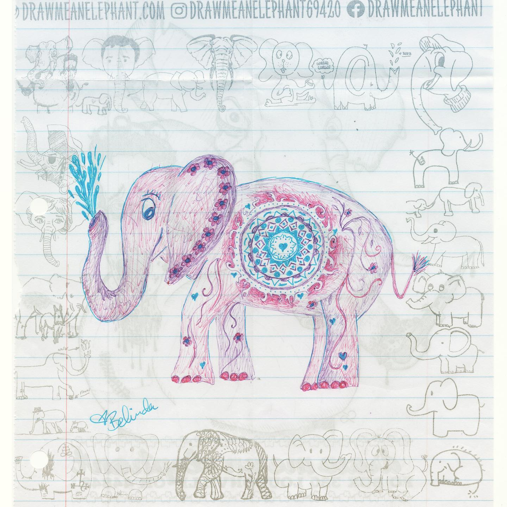
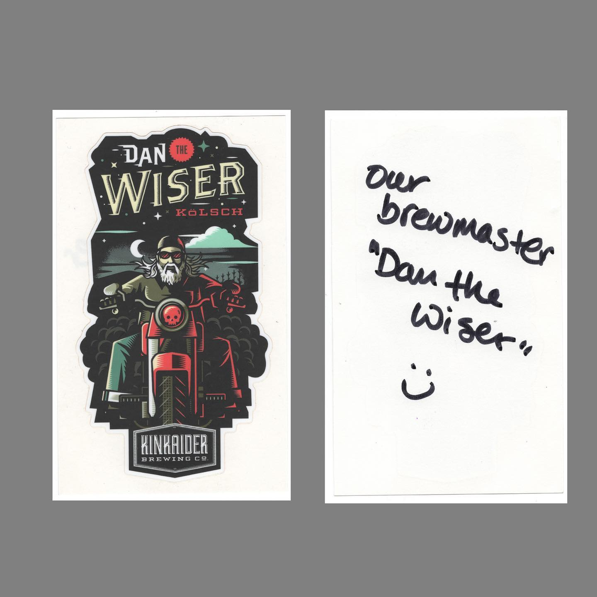

# Correspondence Part 1

> **Relationship:** Explicit satellite of [Kinkaider Brewing Co](/breweries/kinkaider-brewing-co.html)
> **Source platform:** INSTAGRAM Export
> **Match Confidence:** 0.8 (via csv_name_inference)

### Caption / Correspondence Log:
```
Every filter I try on this thing doesn't give it justice for cuteness. Belinda from @kinkaiderbrewing drew this elephant in like a hundred dozen pens and if that sounds like an implausible amount I already didn't count. It's a super #psychadelephant and they also included a sticker which has their brewmaster looking super badass on a motorcycle with an appropriate amount of beard, exhaust, skull, on what appears to be a late night exit from a cemetery. I'm not sure if the red is to indicate some sort of badass explosion that Dan is obviously not looking at as #coolguysdontlookatexplosions #coolguysdontlookatexplosionstheyblowthingsupandthenwalkaway #drawmeanelephant #nocluehowhashtagsworkandatthispointimtoaffraidtoask #kinkaiderbrewing
```

### Artifact Scans & Drawings:





### Provenance & Audit:
* **Source Path:** `Unknown`
* **Original entity ID:** `instagram/post-7733090025389600888`
