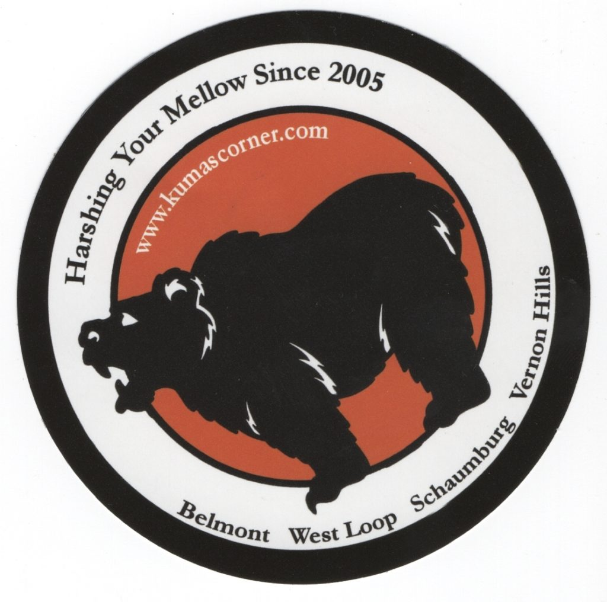

# Kuma's Corner

<!-- boris-migration-provenance
source_format: wordpress-wxr
source_export: DMAE/drawmeanelephant.WordPress.2026-07-20.xml
post_id: 79
post_type: page
guid: https://www.drawmeanelephant.com/?page_id=79
post_name: kumas-corner
author: Timothy
post_date: 2019-06-23 14:15:24
link: https://www.drawmeanelephant.com/kumas-corner/
conversion: human_review
-->

<figure class="wp-block-image"><figcaption>Elephant drawn by Kuma's Corner Chicago location</figcaption></figure>

Got this elephant recently from Kuma's Corner out of Chicago. I'm really bad at context and there could be a lot of questions that end up coming up that would arise from how I was going to approach explaining this one and I feel like maybe that will have to turn into a FAQ section. So my person who picks out the breweries I've wrote for maybe a couple months picked out a fairly lengthy (maybe 20 places) series of what were probably like bars, clubs, or restaurant type places that were not breweries. I don't really  know the basis for where they came from or the point but it's really all the same when you're asking them to draw you an elephant. This was ones of those addresses.

Kuma's Corner I looked up after the fact and is apparently a multiple location restaurant who appears to have some pretty fancy burger type stuff, like super duper fancy. They sent a kickass sticker with it too, which is a huge plus. Most of the time it is just elephant and that's fine, but a sticker also rules. People always ask if places send me shirts or mugs or swag because they are stupid and think asking questions is going to improve the conversation. It's generally frustrating for me because the conversation goes off the rails into some free swag Dreamland that simply isn't the way things work. Plus I'm not writing places saying hey give me free shirts and I wear a medium, which would be an important detail if the world was a bunch of unicorns who farted out $20 bills and you could just say "Sweet, some rando from Ohio just asked me to draw them and elephant, let's go harvest some unicorn farts and send some t-shirts. I'm glad that our brewing business is supplemented by unicorn farts and not sales like a normal person who doesn't think like an idiot would assume.". Fortunately that's not the case as I'd probably have to regift a bunch of shirts since most of them wouldn't fit and that would just be a series of disappointing gifts.

Kuma's delivered though with a pretty typical style. Most common replies are elephant only and elephant with sticker. I've got letters before but that's super rare. I think I've maybe got three places to send more than one complete sentence and that's fine. The focus is the elephant and who boy howdy did Kuma's deliver. It's kind of metal and a new style of elephant that looked like it was done with maybe a gel pen or some sort of hybrid ink. Pretty saturated and a pretty decent pen, though not a personal preference of mine. I'd wager it's a work pen and I'm not gonna ramble too much more on that as I have a lot of these to put up and it's not Kuma-specific. So a pretty phenomenal metal sort of elephant and their sticker had a tagline about harshing mellows, which is an expression I've been a fan of for years as I had a coworker who used it for the better part of 15 years and that rubs off on you.

<figure class="aligncenter is-resized"><figcaption>I didn't do a very good job of rotating this.</figcaption></figure>

So the sticker was spot on also, which really brought the whole thing together. I'd say this is the perfect amount of reply for me. Whoever did the elephant did a great job and it was over the top only on quality of elephant drawing.

I'll try to add some links to their stuff as I go but I really need to get caught up on elephants. I'm told that is a Leviathan Cross on the ear, the Sigil of Lillith on its butt, and an inverted pentagram on the nose.

## Satellites & Correspondence

{{children}}

### Correspondence Links

*   📁 [Kuma's Corner Correspondence Part 1](kumas-corner/instagram-1.html)
*   📁 [Kuma's Corner Correspondence Part 2](kumas-corner/instagram-2.html)
*   📁 [Kuma's Corner Correspondence Part 3](kumas-corner/instagram-3.html)

