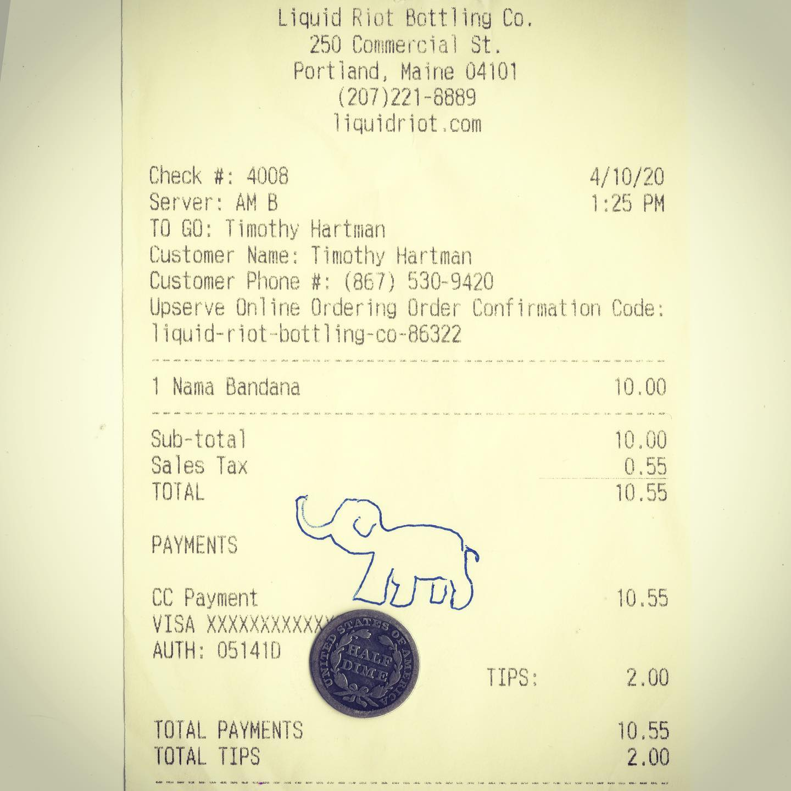
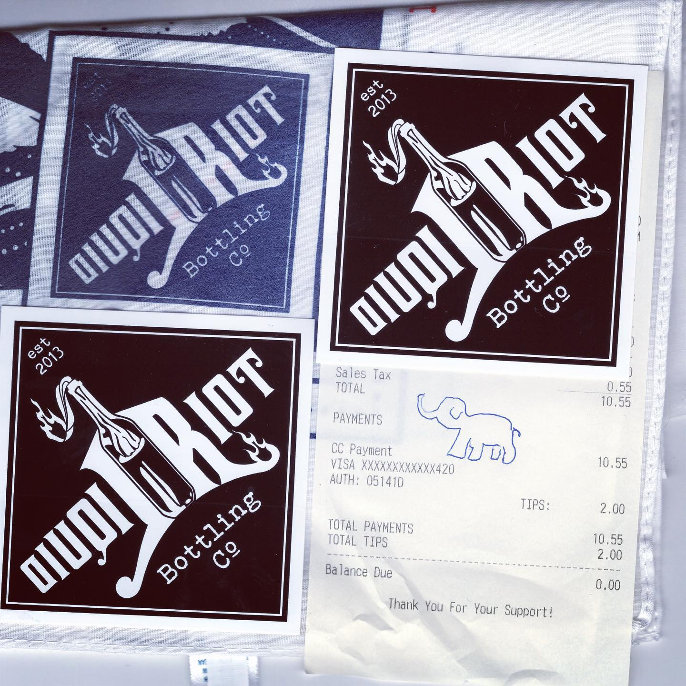

# Correspondence Part 1

> **Relationship:** Explicit satellite of [Liquid Riot Bottling](/breweries/liquid-riot-bottling.html)
> **Source platform:** INSTAGRAM Export
> **Match Confidence:** 0.85 (via csv_hashtag)

### Caption / Correspondence Log:
```
Okay so @liquid_riot did a smol elephant last time. This one is absolutely mammoth in comparison to this half dime for scale. #drawmeanelephant #liquidriotbottlingcompany #mammothislikeanelephantiswhatiwasgetttingat #doublentendre #notmyrealphonenumber  #nocluehowhashtagsworkandatthispointimtoaffraidtoask
```

### Artifact Scans & Drawings:





### Provenance & Audit:
* **Source Path:** `Unknown`
* **Original entity ID:** `instagram/post-1412397751802853537`
