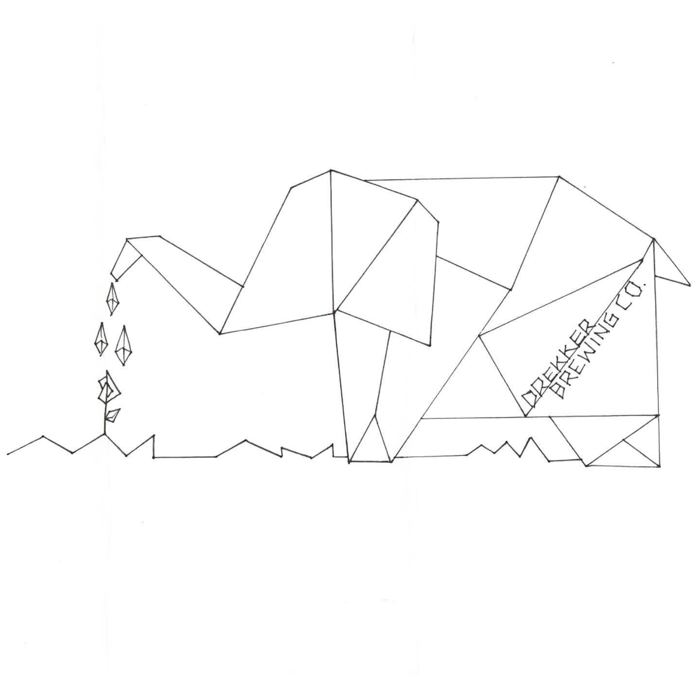
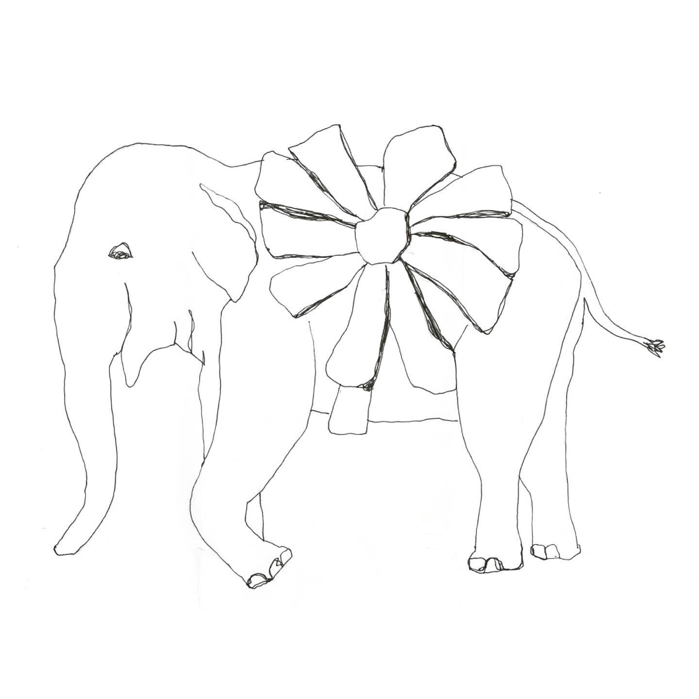
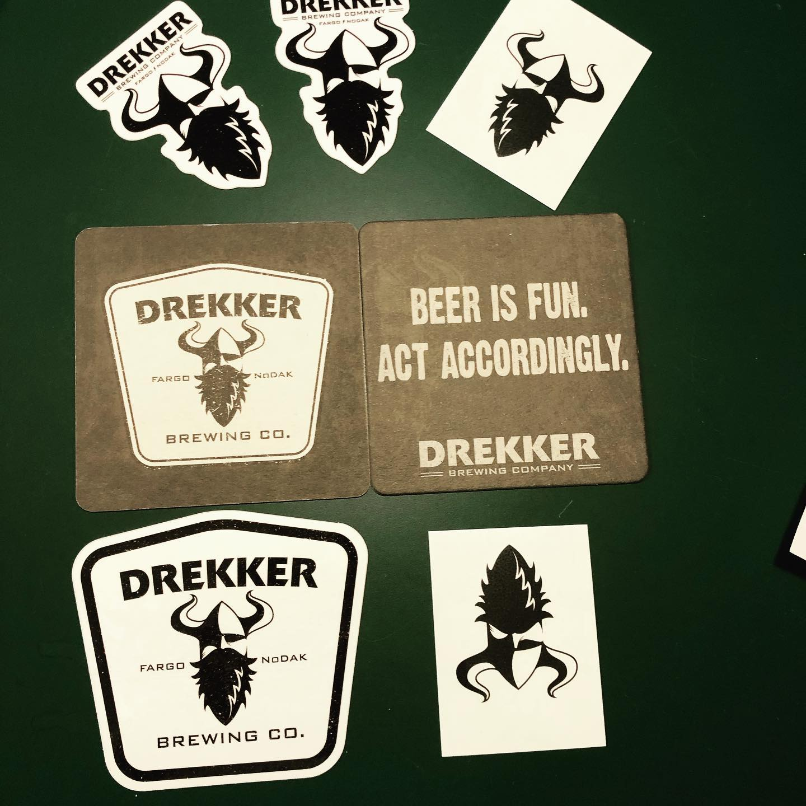

# Correspondence Part 2

> **Relationship:** Explicit satellite of [Metric Brewing Company](breweries/metric-brewing-company.html)
> **Source platform:** INSTAGRAM Export
> **Match Confidence:** 0.8 (via csv_name_inference)

### Caption / Correspondence Log:
```
@drekkerbrewing drew two fantastic elephants. One took a geometric shape and has more of an origami feel to it and if I had my "marketing hat" on I'd use origami as some sort of a metaphor for limitless possibilities paper holds and then segue into an analogy about brewing having fundamentally simple ingredients like paper and similarly limitless possibilities. I'd make it sound all flowery. I love analogies because they start out with anal and end in "oh geez". The other elephant has some sort of giant flower attached much like other harnesses or banners have been attached to previous works. I showed this to a friend and he postulated that the chick who drew it was probably pretty hot, which wasn't very 2019 of him. 
Lastly a pile of swag. Stickers, coasters, and a temporary tattoo you can bet your sweet ass I'm going to pawn off on my SO's granddaughter like I did the @usacehq life jacket safety dog's temp tattoo. This is already too long but if anyone is paying attention this is how you put a hop cone in a logo. Masterfully done and I would most definitely switch the beard shape to different hop cone shapes to match on the branding of individual beer pulls. Lot of options there. #drawmeanelephant
```

### Artifact Scans & Drawings:







### Provenance & Audit:
* **Source Path:** `Unknown`
* **Original entity ID:** `instagram/post-3251428148593577753`
