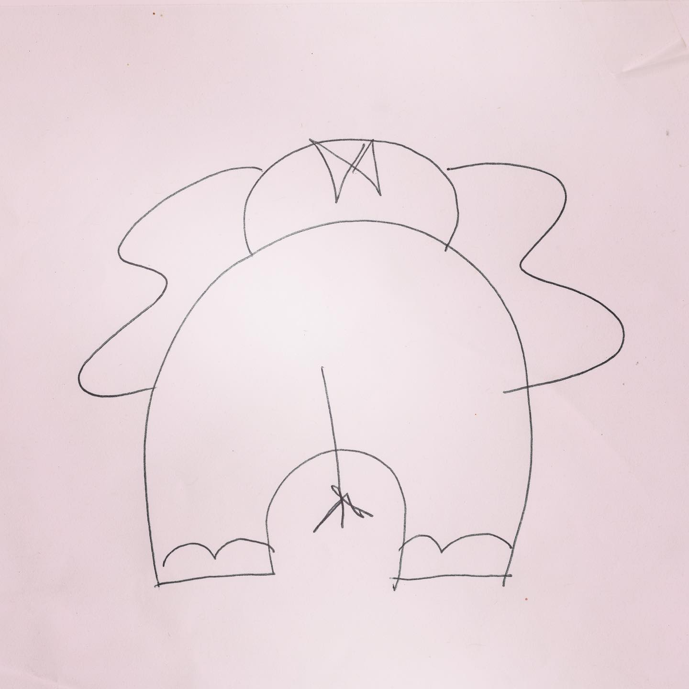
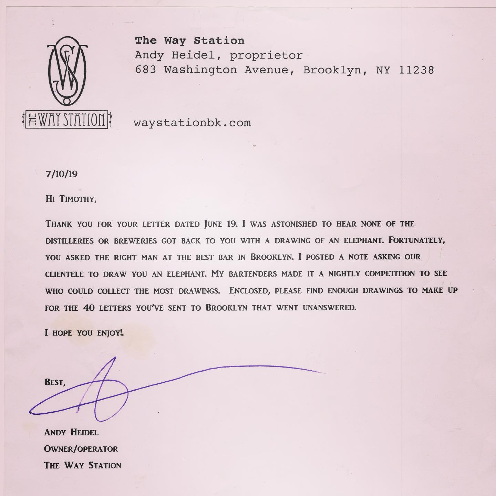
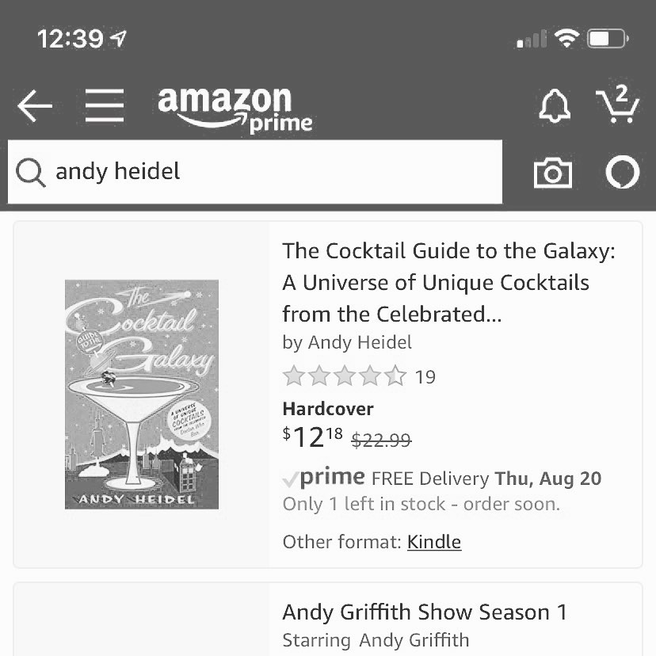

# Correspondence Part 3

> **Relationship:** Explicit satellite of [Metric Brewing Company](breweries/metric-brewing-company.html)
> **Source platform:** INSTAGRAM Export
> **Match Confidence:** 0.8 (via csv_name_inference)

### Caption / Correspondence Log:
```
So I got to thinking about #elephantbutts and saw this one from @thewaystation and was talking about finding any of the 100+ they did that I may have missed. So I'm just gonna post one daily as #thewaystationdaystation and pretend like it is charming rather than lazy. So I have all my #elephantbutts tagged and I may make something more dedicated. #andyheidel did probably the most legendary job and as I probably said a hundred times it is probably the most famous person to #drawmeanelephant and does a book called #cocktailguidetothegalaxy that is supposed to be amazing but I can't read and I heard rumors some of it was in metric and that's a hard pass for me. Totally just bought the book and if there is an address anywhere in that book you can be damned certain I'll write it. Also, when I saw #only1leftinstock I figured I better get it since I already got got his #autograph and #elephantdrawingsarejustautographs #hundredreposts
```

### Artifact Scans & Drawings:







### Provenance & Audit:
* **Source Path:** `Unknown`
* **Original entity ID:** `instagram/post-4029185903977851647`
