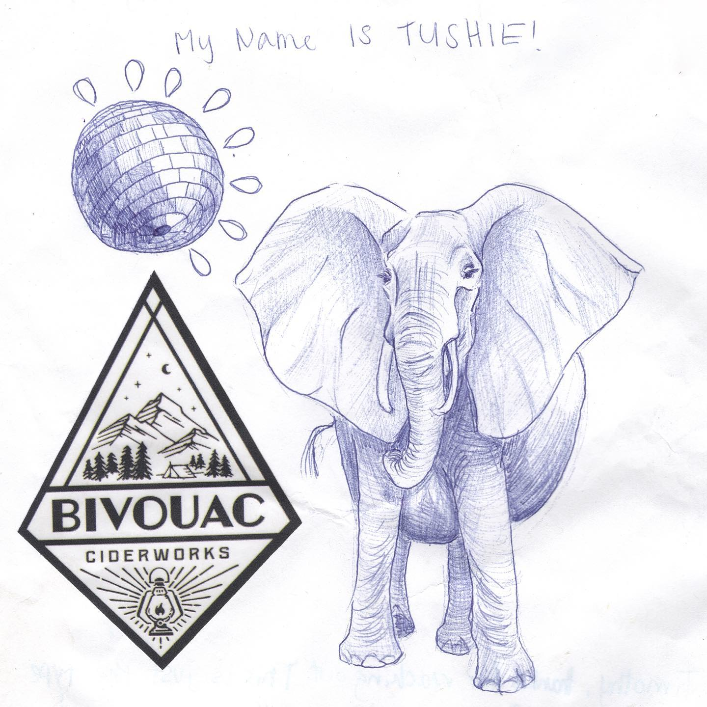
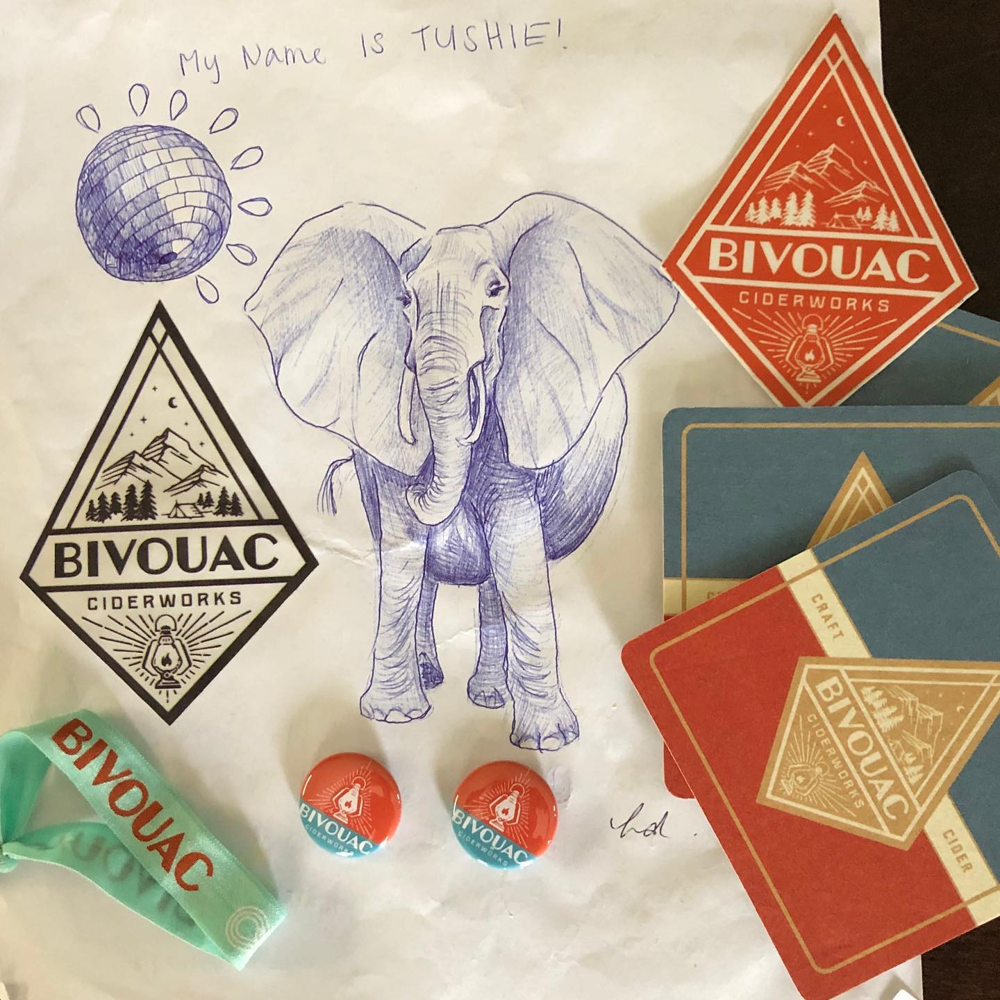

# Correspondence Part 2

> **Relationship:** Explicit satellite of [Mission Brewery](/breweries/mission-brewery.html)
> **Source platform:** INSTAGRAM Export
> **Match Confidence:** 0.8 (via csv_name_inference)

### Caption / Correspondence Log:
```
Holy heck @bivouaccider hit a grand slam here. Elephant is fantastic by @hollydicecco who they claim is a resident artist but I have to imagine they hired just for this project. I saw an episode of Cheers like that once. 
Part of the whole grand slam bit as to differentiate between me using the term “knock it out of the ballpark” which I overuse after an ex would use that expression every time I did something really disappointing. When you hear something enough you start saying it yourself. 
Either way they also included some coasters, buttons, a sticker, and I think something that maybe goes on a bottle but could make a hair tie. Not quite sure what that is, but yay to extra stuff that fits in a flat envelope under $1.50 postage. They also did a note and included who the artist was. It was pretty much everything and if Tom Hamilton from Cleveland Indians radio was calling this effort he would be losing his shit with excitement. Absolutely flawless submission. #drawmeanelephant
```

### Artifact Scans & Drawings:





### Provenance & Audit:
* **Source Path:** `Unknown`
* **Original entity ID:** `instagram/post-1179758268116763494`
