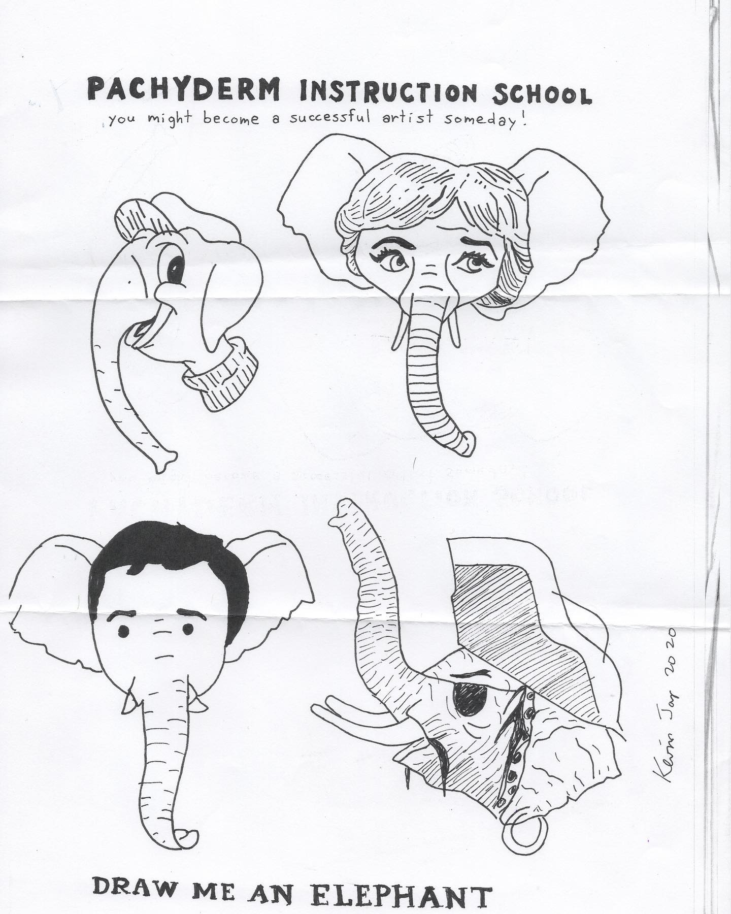
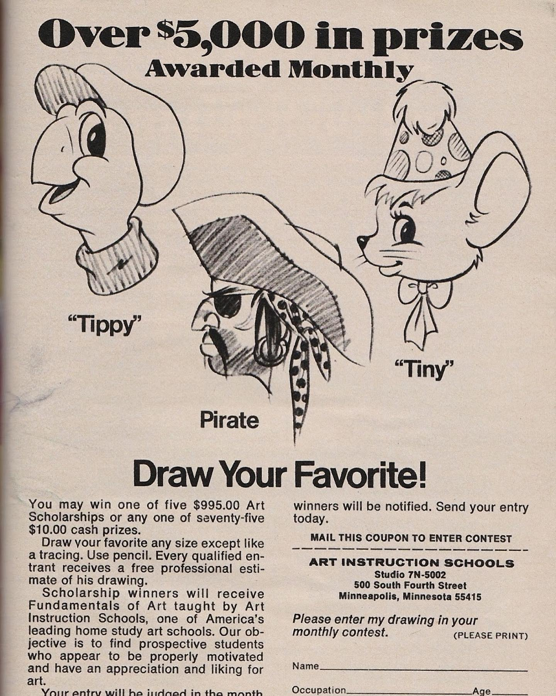
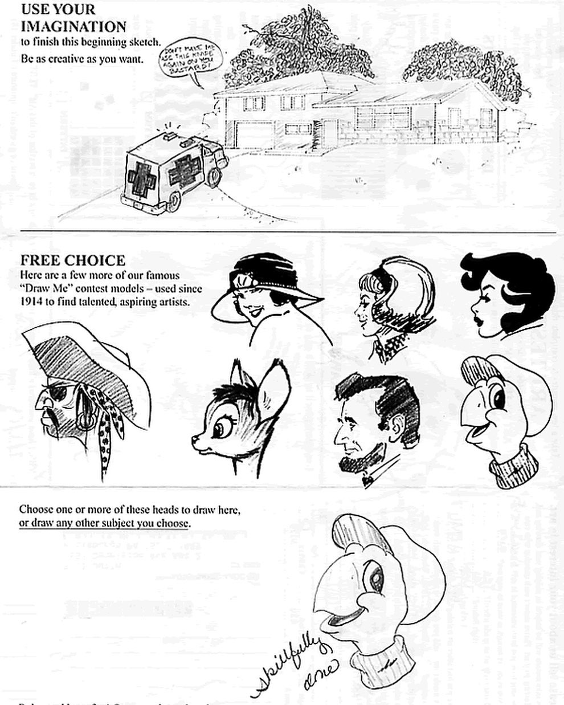

# Correspondence Part 4

> **Relationship:** Explicit satellite of [Mission Brewery](breweries/mission-brewery.html)
> **Source platform:** INSTAGRAM Export
> **Match Confidence:** 0.8 (via csv_name_inference)

### Caption / Correspondence Log:
```
Okay so when I saw this one my ears immediately shit their pants it was so brilliant. I'd talked about doing a form like the Art Instruction Schools with a friend before and I really feel like I'm going to leverage some graphical equity from this piece. This was the proper submission from @trafficjamdetroit out of Detroit and also @k.evin.j.oy on the pen. Totally crushed it. #drawmeanelephant
```

### Artifact Scans & Drawings:







### Provenance & Audit:
* **Source Path:** `Unknown`
* **Original entity ID:** `instagram/post-2332941854624521810`
