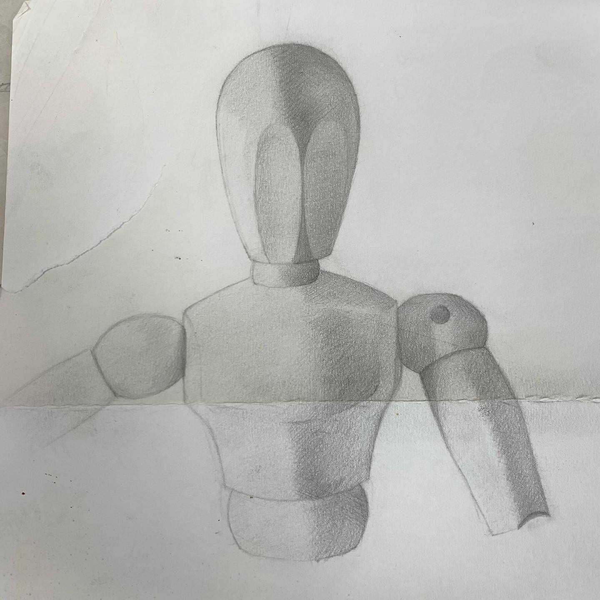
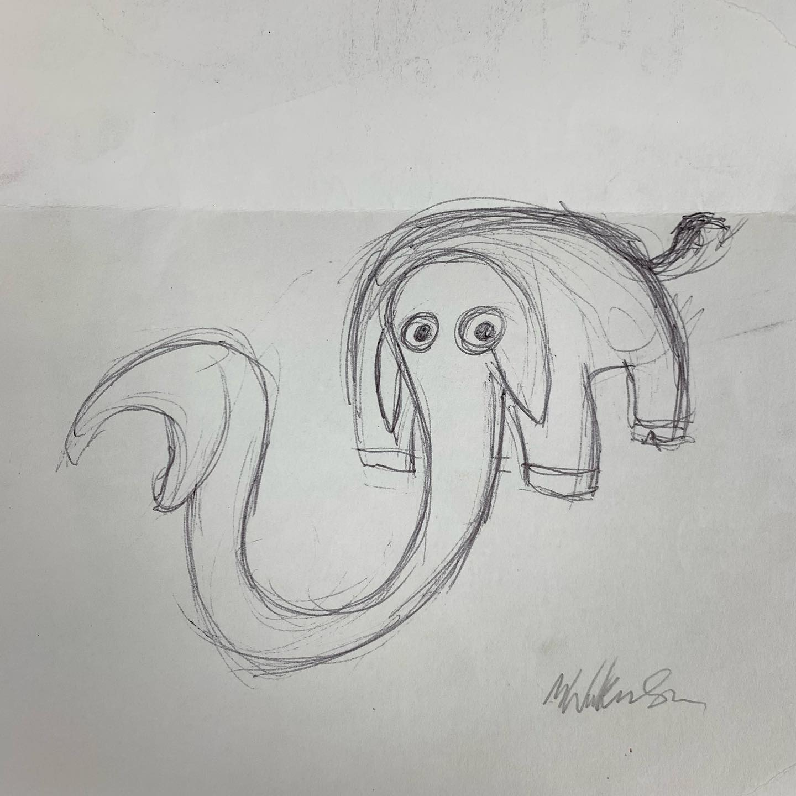

# Correspondence Part 7

> **Relationship:** Explicit satellite of [Mission Brewery](/breweries/mission-brewery.html)
> **Source platform:** INSTAGRAM Export
> **Match Confidence:** 0.8 (via csv_name_inference)

### Caption / Correspondence Log:
```
I didn't think this was any good on account of it looking nothing like an elephant until I noticed there was an elephant on the back. Very thrifty use of paper and another environmentally friendly submission from a friend of a New Zealand unicyclist. #drawmeanelephant
```

### Artifact Scans & Drawings:





### Provenance & Audit:
* **Source Path:** `Unknown`
* **Original entity ID:** `instagram/post-419368545998383564`
