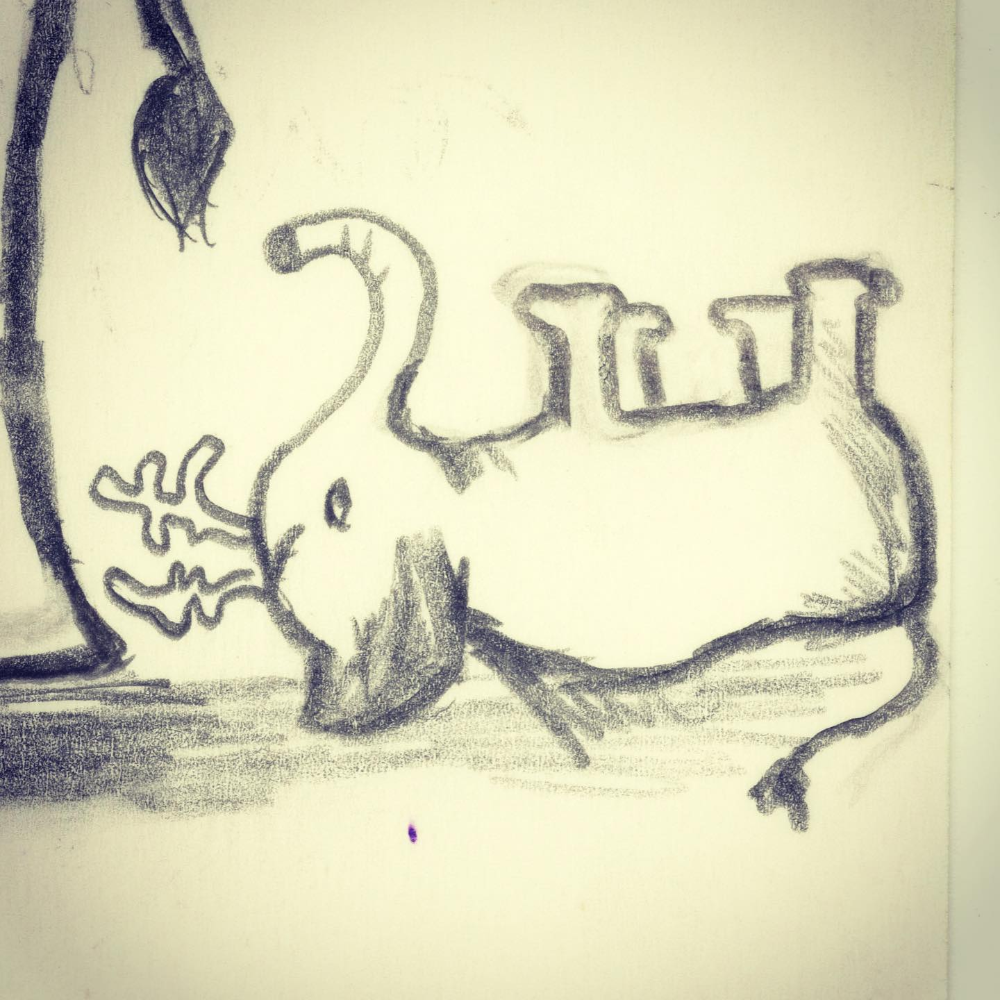
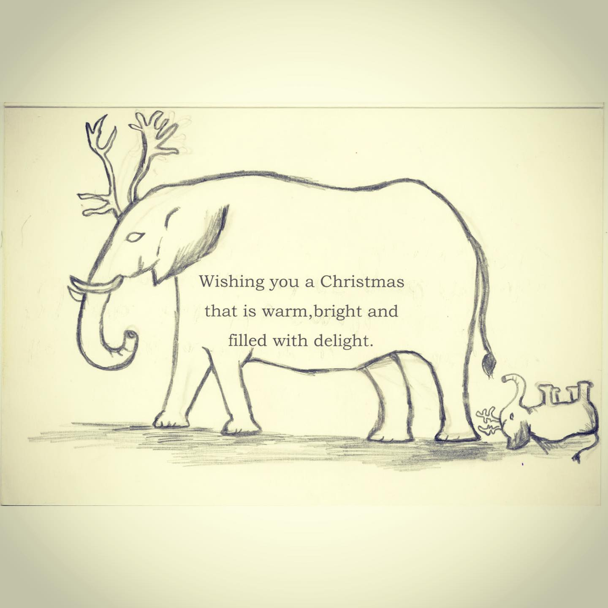
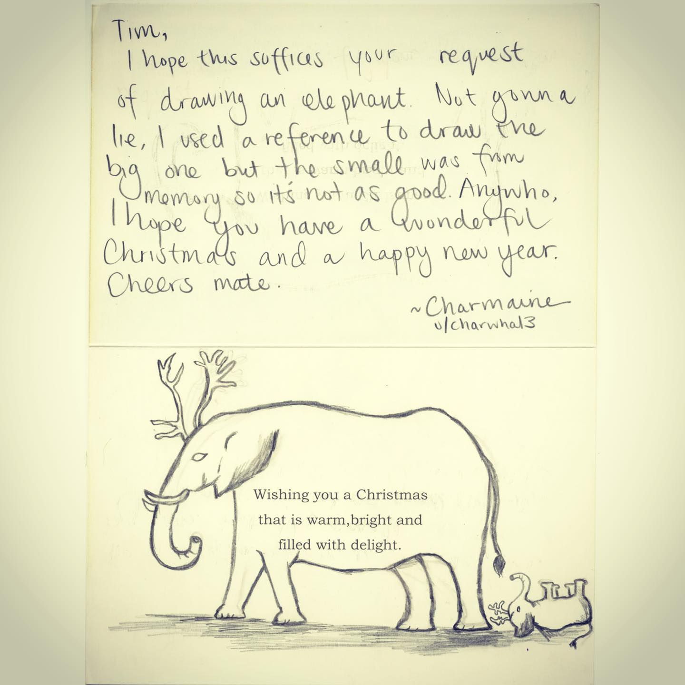

# Correspondence Part 9

> **Relationship:** Explicit satellite of [Mission Brewery](/breweries/mission-brewery.html)
> **Source platform:** INSTAGRAM Export
> **Match Confidence:** 0.8 (via csv_name_inference)

### Caption / Correspondence Log:
```
Ellie crashed and needs a reboot. @r.randomactsofcards person here drew me two elephants, but having seen the admission that the baby elephant was the only original I feel the need to focus on it. That and it's absolutely adorable. #drawmeanelephant
```

### Artifact Scans & Drawings:







### Provenance & Audit:
* **Source Path:** `Unknown`
* **Original entity ID:** `instagram/post-8399032954874431283`
