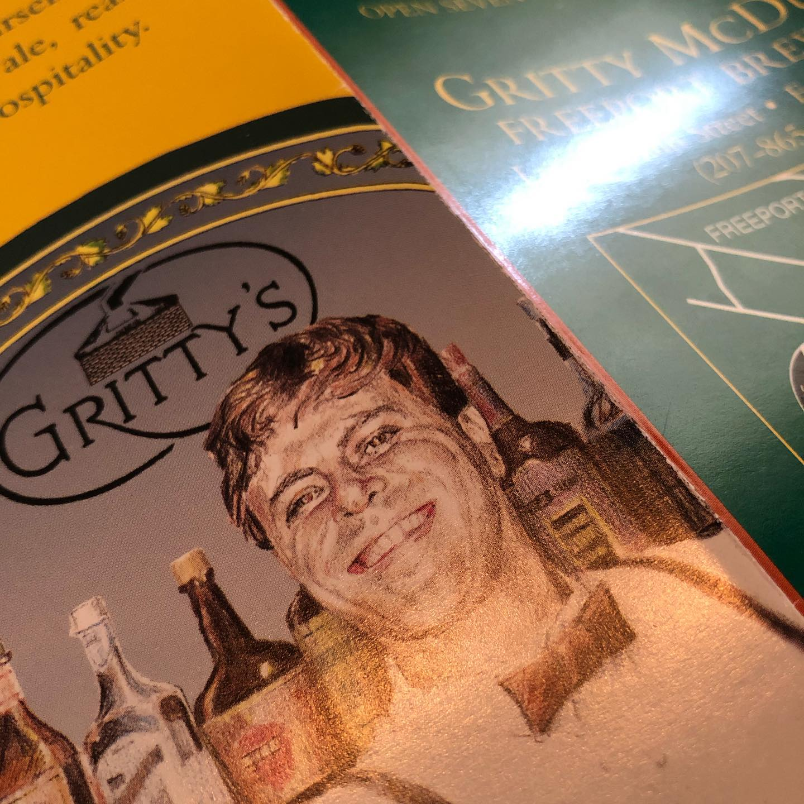
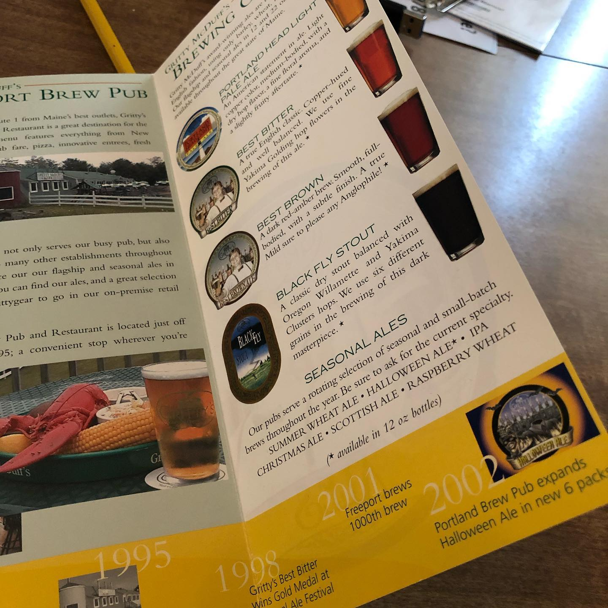

# Correspondence Part 1

> **Relationship:** Explicit satellite of [Modern Brewery](/breweries/modern-brewery.html)
> **Source platform:** INSTAGRAM Export
> **Match Confidence:** 0.8 (via csv_name_inference)

### Caption / Correspondence Log:
```
Okay so usually it's just elephants but @grittymcduffs sent me a traditional offset trifold (they call them trifolds but there are only two folds) that was scored and whoever designed it accounted for wrap on the fold. Masterfully done printed piece and pretty old. As most people know the current Gritty is more of an Adonis type with huge pectoral muscles after taking the cue from St. Pauli making their image a little more attractive to a modern audience. 
Really nice piece and I think the first decent offset thing I've seen out of a brewery that wasn't packaging. 
I'm negotiating release of their elephant. I was presented a photocopy 😪 #drawmeanelephant
```

### Artifact Scans & Drawings:





### Provenance & Audit:
* **Source Path:** `Unknown`
* **Original entity ID:** `instagram/post-3960575418077781264`
