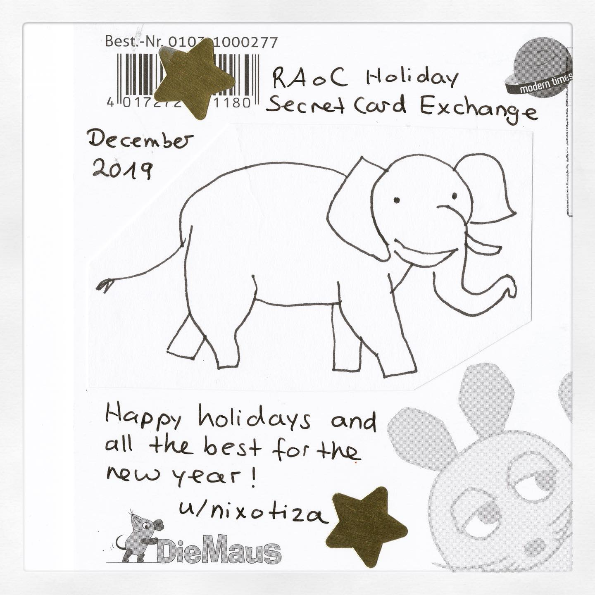
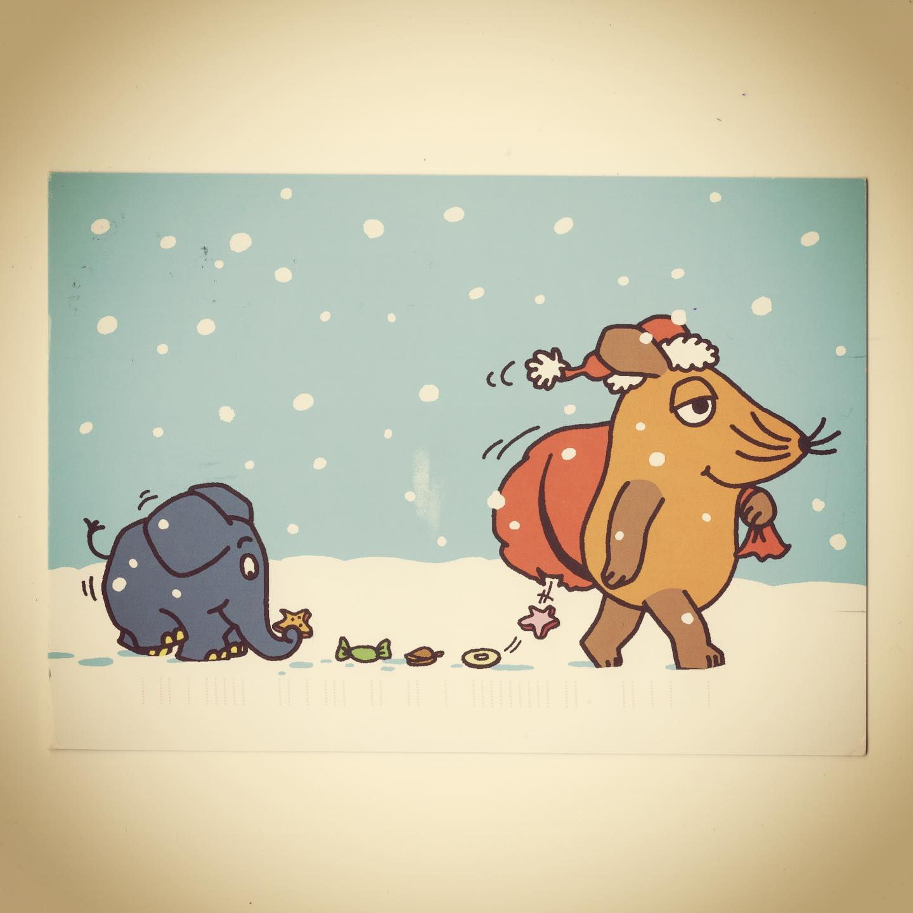

# Correspondence Part 1

> **Relationship:** Explicit satellite of [National Brewing Company](breweries/national-brewing-company.html)
> **Source platform:** INSTAGRAM Export
> **Match Confidence:** 0.8 (via csv_name_inference)

### Caption / Correspondence Log:
```
So this one came all the way from Germany from a @r.randomactsofcards person. You may recall me saying that I took German instead of Spanish and I had zero problems reading this one as a result. I know it was already written in English but I mentally pronounced December as "date somber" on some @middleclassfancy international vibe with my 600 word German vocabulary. I did not have to Google what @diemaus meant either as both words were already in the 600. 
Great card and they picked one with an elephant (or elefant if you're im Deutschland und sprechen keine Englisch) and features an elephant drawn on sticker paper and transplanted to the card. Nothing wrong with playing it safe (or spielen it whatever the word is for safe in German).
```

### Artifact Scans & Drawings:





### Provenance & Audit:
* **Source Path:** `Unknown`
* **Original entity ID:** `instagram/post-1637355936993419359`
