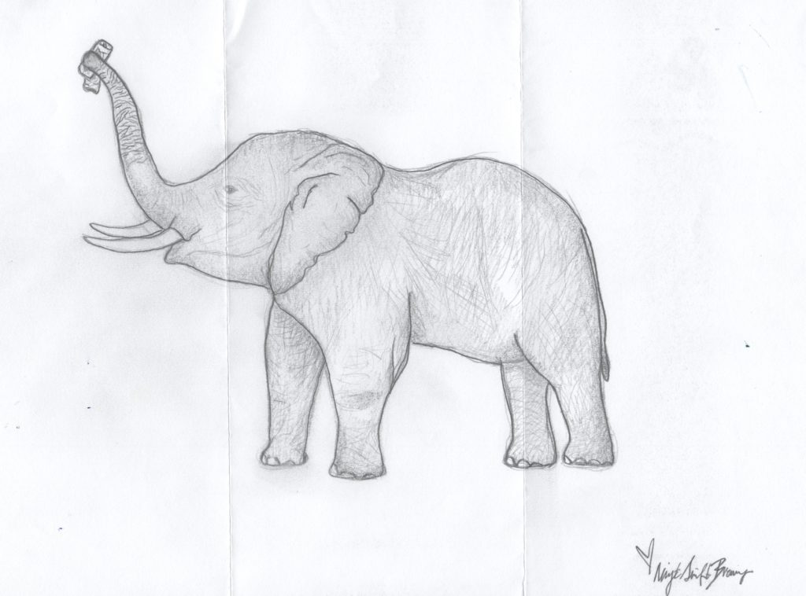

# Night Shift Brewing

> [!NOTE]
> **Brewery Metadata**
> * **Location:** Boston, MA 02114
> * **Address:** 1 Lovejoy Wharf, Suite 101
> * **Type:** Brewpub
> * **Correspondence Date:** 2/1/2020
> * **Response Received:** Yes

<!-- boris-migration-provenance
source_format: wordpress-wxr
source_export: DMAE/drawmeanelephant.WordPress.2026-07-20.xml
post_id: 99
post_type: page
guid: https://www.drawmeanelephant.com/?page_id=99
post_name: night-shift-brewing
author: Timothy
post_date: 2019-06-28 21:05:26
link: https://www.drawmeanelephant.com/night-shift-brewing/
conversion: human_review
-->

<figure class="wp-block-image"></figure>

In the course of always wanting people to look up the addresses for places for me [Night Shift Brewing](https://nightshiftfamily.com/brewing/) ended up being one that I wrote along with maybe a half dozen others for that area. I got a really great bunch of elephants from [Outer Light Brewing](http://www.outerlightbrewing.com) around the same time you can find [here](https://www.drawmeanelephant.com/outer-light-brewery/) and think that's probably all I'll get out of those. Two for so few written is really good.

#### High Effort Submissions

This one was pretty high effort by elephant standards and came with some stickers that I don't have media to put up for. They had owls on their stickers and I believe gave me two of them. Black only printing on them and I think they were water resistant rather than paper stickers, but I could be wrong there. Decent stickers too, probably 4" tall which is a monster sticker. No letter with this one, but that's normal.

#### The Thank You

Like I've said on some of these I call and thank the people for their elephants and that is almost always weird because you don't have a person to talk to so you just introduce yourself as the guy who writes asking for elephants and thanks for the elephant. The whole thing is plenty awkward and this one was no exception. The phone system was stupidly labyrinthy and by the time I got to a human being it was a bartender who seemed to have no clue what I was talking about. It just struck me as odd because when I got my stuff from [Dogfish Head's](https://www.dogfish.com) main facility and called it was like a 50 second ordeal getting on the phone with someone who knew exactly what was up with the elephants and was offering to have the elephant artist call back. I mean Dogfish sold for like $300 million a few weeks back, maybe it was because they take the time to communicate to their staff of important things such as when some rando writes asking for an elephant. This place had a heck of a phone system.

#### Takeaway

Great elephant without any of the warm and fuzzy, but that's all good. Looked like a decent enough place but again I don't get too deep into the websites or researching it as putting these up is already killing my writing more breweries to see if they will draw me an elephant time.

## Satellites & Correspondence

{{children}}

### Correspondence Links

*   📁 [Night Shift Brewing Correspondence Part 1](night-shift-brewing/instagram-1.html)

