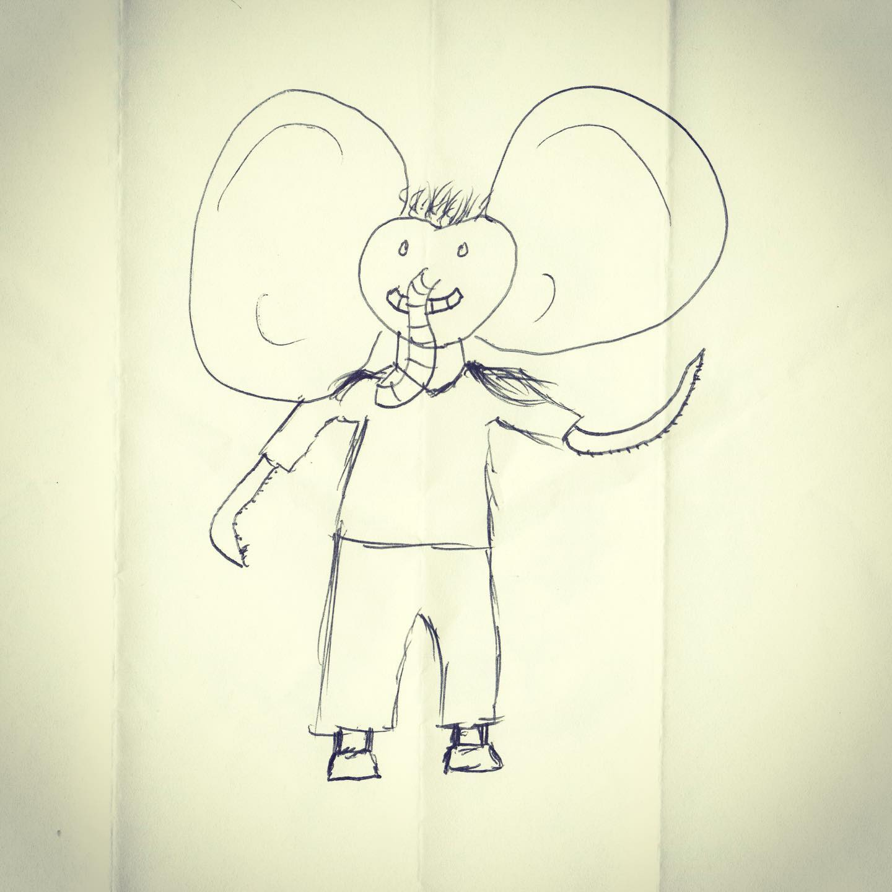
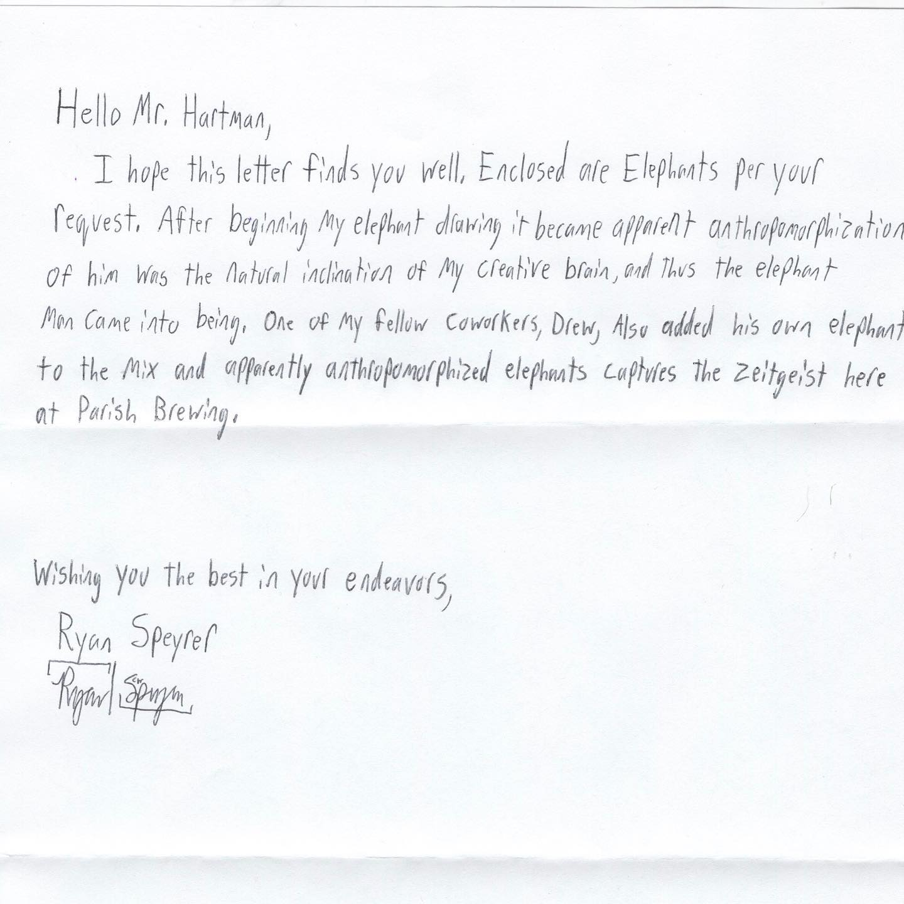

# Correspondence Part 1

> **Relationship:** Explicit satellite of [Ology Brewing Co](/breweries/ology-brewing-co.html)
> **Source platform:** INSTAGRAM Export
> **Match Confidence:** 0.8 (via csv_name_inference)

### Caption / Correspondence Log:
```
@parishbrewingco drew this tentacled armed elephant and said something about the author and used what felt like a little bit magniloquent of terminology. When I tried to reuse the words by saying I apparently anthropomorphized my natural inclination to capture the zeitgeist it had the opposite effect of making me look super smart in my brain compartment. It was a big gamble on my part and I had already lost on the choice of straight or boxed. #drawmeanelephant
```

### Artifact Scans & Drawings:





### Provenance & Audit:
* **Source Path:** `Unknown`
* **Original entity ID:** `instagram/post-2048269706760992187`
