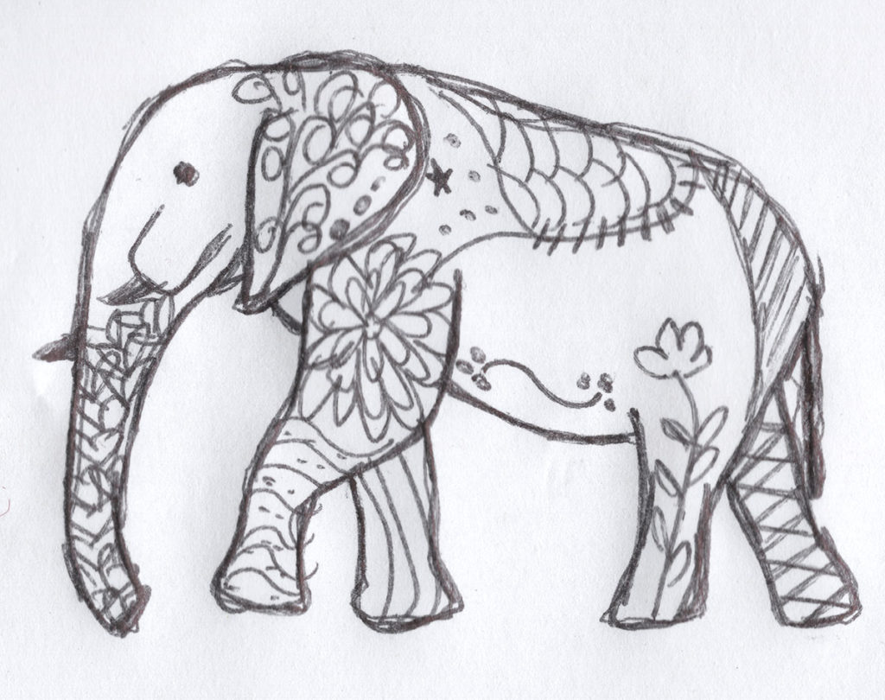
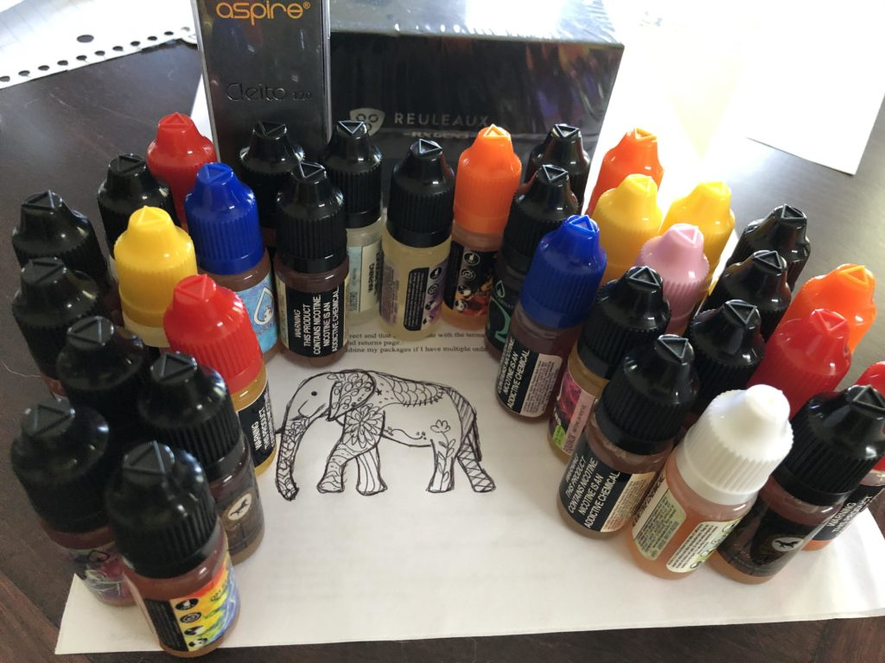

# OM Vapors

> [!NOTE]
> **Brewery Metadata**
> * **Location:** ,  
> * **Type:** eCig
> * **Correspondence Date:** yes
> * **Response Received:** Yes
> * **Website:** [https://www.omvapors.com/](https://www.omvapors.com/)

<!-- boris-migration-provenance
source_format: wordpress-wxr
source_export: DMAE/drawmeanelephant.WordPress.2026-07-20.xml
post_id: 137
post_type: page
guid: https://www.drawmeanelephant.com/?page_id=137
post_name: om-vapors
author: Timothy
post_date: 2019-07-19 14:54:47
link: https://www.drawmeanelephant.com/om-vapors/
conversion: human_review
-->

<figure class="wp-block-image"><figcaption>Elephant Drawn by OM Vapors</figcaption></figure>

I won a contest on reddit last month for [OM Vapors](https://www.omvapors.com) founder's day that consisted of a vape mod, tank, and a bunch of juices. Naturally I also asked them to draw me an elephant like I would with anything I order online, even free items. They sent back a pretty good elephant.

<figure class="wp-block-image"><figcaption>Vapemail haul from OM Vapors Giveaway</figcaption></figure>

They did a really good job with the elephant as well as the shipping and I promptly pawned all the juice off on a friend who also vapes and does in smaller quantities. I mostly vape salt or squonk big amounts of vape juice, so a 10ml sample is just a recipe for having to clean out gear. I tried a few flavors and I think they were better suited in different devices than what I was running, but were not in any way gross (and there is a lot of gross e-juice out there).

Someone on reddit mentioned that they would really like to color this in and while I normally think adult coloring is stupid because I've worked in the print industry and probably 40% of the country's adult coloring books are made here the charm is less there for me than others who don't have to work in the industry. Either way, I made a version that's good for coloring. JPEG at 8.5x11 and should print out nicely. Can be found [here (1.5mb JPEG)](om-vapors.assets/2019-07-19-0001-COLOR-ME-1.jpg).

## Satellites & Correspondence

{{children}}

### Correspondence Links

*   📁 [OM Vapors Correspondence Part 1](om-vapors/instagram-1.html)
*   📁 [OM Vapors Correspondence Part 2](om-vapors/instagram-2.html)

